::: objectives
-   Recognize the several important panes found in RStudio and be able
    to explain what each does.

-   Write complete, grammatical R commands (sentences).

-   List R's most common operators (punctuation marks).

-   Transition from communicating with R at the Console to communicating
    with R via script files.

-   Define what an R object is and explain how to assign one a name (and
    why you'd want to).

-   List several common R object and data types.

-   Use indices to look at (or change) specific values inside objects.

-   Define what an R function is and explain how to use (call) one to
    accomplish a specific task.

-   Install and turn on new R packages.

-   Define a working directory and explain how to choose one.

-   Save and load files.

-   Create an R Project folder and articulate the value of doing so.
:::

::: questions
-   Why bother learning R?
-   What is RStudio? Why use it instead of "base R?"
-   What am I looking at when I open RStudio?
-   How do I "talk to" R and ask it to do things?
-   What things can I make R *build*? What things can I make R *do*?
-   How do I speak "grammatically correct" R? What are its rules and
    punctuation marks?
-   How do I perform typical "project management" tasks in R, such as
    creating a project folder, saving and loading files, and managing
    packages?
:::

## Preface

**Important**: This course assumes you have **downloaded** *and*
**installed** the latest version of R ([go to this page and select the
link near the top-center of the page matching your operating
system](https://cran.rstudio.com/ "The CRAN website has download links for the latest version of R by operating system")).
You also need to have **downloaded** *and* **installed** the latest
version of RStudio ([go to this page and scroll down until you see a
table of links. Select the one matching your operating
system](https://posit.co/download/rstudio-desktop/ "Posit's website contains a set of links to download the latest version of RStudio according to your operating system")).
I[f you've not completed these tasks, stop and do so now]{.underline}.

RStudio is not strictly required for these lessons, but, while you *can*
use R without RStudio, it's a lot like writing a novel with quill and
ink. You *can* do it, but it's **definitely** not easier, so why would
you?As such, these lessons assume you're using RStudio. If you choose
not to use RStudio, you do so at your own risk!

By contrast, this course does **not** assume you have *any* experience
with coding in *any* programming language, including R. While prior
exposure to R or another programming language would give you a head
start, it's not expected. Our goal is to take you from "R Zero" to "R
Hero" as quickly but carefully as possible!

## Why R?

Every R instructor gives a different answer to this question.
Presumably, you're here because you *already* have reasons to learn R
(hopefully someone isn't forcing you to do it!), and you don't need
more. But in case you do, here are a few:

-   R is one of the most powerful statistics and data science platforms.
    Unlike many others, it's free and open-source; anyone can add more
    cool stuff to it at any time, and you'll never encounter a paywall.

-   R is HUGE. There are more than 10,000 add-on packages (think
    "expansions," "sequels," or "fan-fiction") for R that add an
    unbelievable volume of extra features and content, with more coming
    out every week.

-   R has a massive, global community of hundreds of millions of active
    users. There are forums, guides, user groups, and more you can tap
    into to level up your R skills and make connections.

-   R experience is in demand. Knowing R isn't just cool; it's
    lucrative!

-   If you need to make publication-quality graphs, or do research
    collaboratively with others, or talk with other programming
    languages, R has got you covered in all these respects and more.

Those are the more "boilerplate" reasons to learn R you'll hear most
places. Here are two additional ones, from UM R instructor Alex Bajcz:

-   <div>

    > R *changed my life*, literally! Until I got exposure to R as a
    > Ph.D. student, I'd ***never*** have said I had ***any*** interest
    > in programming or data science, let alone an interest in them as a
    > ***career***. Be on the computer all day? *Never*! I'm an
    > *ecologist*! I study *plants*–I'm meant to be *outside*! But, fast
    > forward ten years, and here I am—I'm a quantitative ecologist who
    > uses R *every day* who doesn't *want* to imagine things being any
    > other way! Thanks to R, I discovered a passion I never would've
    > known I had, and I'd have missed out on the best job I could
    > imagine having (even better, it turns out, than the job I'd
    > trained for!).
    >
    > R also makes me feel *powerful*. This isn't a macho or petty
    > thing; it's earnest. I *still* remember the first time I had R do
    > something for me that I didn't want to do myself (because it'd
    > have taken me hours to do in Microsoft Excel). Putting a computer
    > to work for you, and having it achieve something awesome for you,
    > perfectly, in a fraction of the time, is an *incredible* feeling.
    > Try it—you just might like it as much as I do!

    </div>

Hopefully, you'll leave these lessons with some new reasons to be
excited about R and, who knows, maybe learning R will change your life
too!

## How we'll roll

The attitude of these lessons can be summarize like this: Learning a
programming language (especially if you're not a trained programmer and
have no immediate interest in becoming one) should be treated like
learning a *human* language. Learning human languages is *hard*! It took
you many **years** to learn your first one, and I bet you still
sometimes make mistakes! We need to approach this process slowly,
gently, and methodically.

Granted, most programming languages (R included) are simpler than human
languages, but not by much. It's the steep learning curve that scares
most people off, and it's also why courses that teach R *plus* something
else (such as statistics) generally fail to successfully teach students
R—learning R *by itself* is hard *enough*!

So, in these lessons, we'll *only* teach you R; we won't cover
statistics, graphic design principles, or data science best practices.
You can pick those skills up *after* you feel confident with R!

::: objectives
-   Recognize the several important panes found in RStudio and be able
    to explain what each does.

-   Write complete, grammatical R commands (sentences).

-   List R's most common operators (punctuation marks).

-   Transition from communicating with R at the Console to communicating
    with R via script files.

-   Define what an R object is and explain how to assign one a name (and
    why you'd want to).

-   List several common R object and data types.

-   Use indices to look at (or change) specific values inside objects.

-   Define what an R function is and explain how to use (call) one to
    accomplish a specific task.

-   Install and turn on new R packages.

-   Define a working directory and explain how to choose one.

-   Save and load files.

-   Create an R Project folder and articulate the value of doing so.
:::

::: questions
-   Why bother learning R?
-   What is RStudio? Why use it instead of "base R?"
-   What am I looking at when I open RStudio?
-   How do I "talk to" R and ask it to do things?
-   What things can I make R *build*? What things can I make R *do*?
-   How do I speak "grammatically correct" R? What are its rules and
    punctuation marks?
-   How do I perform typical "project management" tasks in R, such as
    creating a project folder, saving and loading files, and managing
    packages?
:::

## Preface

**Important**: This course assumes you have **downloaded** *and*
**installed** the latest version of R ([go to this page and select the
link near the top-center of the page matching your operating
system](https://cran.rstudio.com/ "The CRAN website has download links for the latest version of R by operating system")).
You also need to have **downloaded** *and* **installed** the latest
version of RStudio ([go to this page and scroll down until you see a
table of links. Select the one matching your operating
system](https://posit.co/download/rstudio-desktop/ "Posit's website contains a set of links to download the latest version of RStudio according to your operating system")).
I[f you've not completed these tasks, stop and do so now]{.underline}.

RStudio is not strictly required for these lessons, but, while you *can*
use R without RStudio, it's a lot like writing a novel with quill and
ink. You *can* do it, but it's **definitely** not easier, so why would
you?As such, these lessons assume you're using RStudio. If you choose
not to use RStudio, you do so at your own risk!

By contrast, this course does **not** assume you have *any* experience
with coding in *any* programming language, including R. While prior
exposure to R or another programming language would give you a head
start, it's not expected. Our goal is to take you from "R Zero" to "R
Hero" as quickly but carefully as possible!

## Why R?

Every R instructor gives a different answer to this question.
Presumably, you're here because you *already* have reasons to learn R
(hopefully someone isn't forcing you to do it!), and you don't need
more. But in case you do, here are a few:

-   R is one of the most powerful statistics and data science platforms.
    Unlike many others, it's free and open-source; anyone can add more
    cool stuff to it at any time, and you'll never encounter a paywall.

-   R is HUGE. There are more than 10,000 add-on packages (think
    "expansions," "sequels," or "fan-fiction") for R that add an
    unbelievable volume of extra features and content, with more coming
    out every week.

-   R has a massive, global community of hundreds of millions of active
    users. There are forums, guides, user groups, and more you can tap
    into to level up your R skills and make connections.

-   R experience is in demand. Knowing R isn't just cool; it's
    lucrative!

-   If you need to make publication-quality graphs, or do research
    collaboratively with others, or talk with other programming
    languages, R has got you covered in all these respects and more.

Those are the more "boilerplate" reasons to learn R you'll hear most
places. Here are two additional ones, from UM R instructor Alex Bajcz:

-   <div>

    > R *changed my life*, literally! Until I got exposure to R as a
    > Ph.D. student, I'd ***never*** have said I had ***any*** interest
    > in programming or data science, let alone an interest in them as a
    > ***career***. Be on the computer all day? *Never*! I'm an
    > *ecologist*! I study *plants*–I'm meant to be *outside*! But, fast
    > forward ten years, and here I am—I'm a quantitative ecologist who
    > uses R *every day* who doesn't *want* to imagine things being any
    > other way! Thanks to R, I discovered a passion I never would've
    > known I had, and I'd have missed out on the best job I could
    > imagine having (even better, it turns out, than the job I'd
    > trained for!).
    >
    > R also makes me feel *powerful*. This isn't a macho or petty
    > thing; it's earnest. I *still* remember the first time I had R do
    > something for me that I didn't want to do myself (because it'd
    > have taken me hours to do by hand in Microsoft Excel). Putting a
    > computer to work for you and having it achieve something awesome
    > for you, perfectly, in a fraction of the time is an *incredible*
    > feeling. Try it—you just might like it as much as I do!

    </div>

I really do owe a great deal to R. More than I feel I can easily repay.
But these lessons are my way of trying! Hopefully, you'll leave with
some new reasons to be excited about R and, who knows, maybe learning R
will change your life too!

## How we'll roll

I *firmly* believe that learning a programming language (especially if
you're not a programmer by training and have no interest in becoming
one) needs to be treated the same way as learning a *human* language.
Learning human languages is *hard*! It took you many **years** to learn
your first one, and I bet you still sometimes make mistakes!

Granted, most programming languages (R included) are actually simpler
than most human languages, but not by a huge amount. It's this steep
learning curve that scares off so many from learning R. It's also why,
in my opinion, courses that teach R *plus* something else (such as
statistics) generally fail to establish most students as R
users—learning R *by itself* is already hard *enough*! Pair that with
learning something else too and you have a recipe for disaster.

So, in this set of lessons, I'm *only* going to teach you R. I'm not
going to cover any statistics, or graphic design principles, or data
science best practices. You can pick those skills up *after* you feel
confident with speaking R fluently!

We're also not going to focus much on general programming skills or best
practices. These are meant to be introductory lessons; you can learn
more advanced R programming skills in your *next* R class!

So, our entire focus here will be getting you comfortable and confident
with R. This means, among other things, helping you to:

-   Navigate RStudio.

-   Understand R's *vocabulary* (its nouns and verbs).

-   Understand R's *grammar* and *syntax* (what symbols to use and when,
    what is and isn't allowed, and what a correct "sentence" in R looks
    like).

-   Work with *data* in R (R, as a programming language, is *designed*
    around working with data—much more so than other similar languages).

And we'll teach you this stuff one baby step at a time. Speaking of
which...

## (Section #1) Baby steps

When you were very little, you learned things mostly through trial and
error. You did something, and you observed what happened. You
accumulated bits of understanding one by one until, eventually, you
could piece them together into something much greater.

We'll take a similar approach to learn R: we're often going to just *do*
something and see what happens. Then, we'll step back and discuss *why*
it happens. Each time, we'll be one step closer to not just being able
to *use* R but being able to *understand* R!

The first thing you need to do is find the pane called "**Console**" in
RStudio. It's often in the lower-left (but it could be elsewhere; when
you open RStudio for the first time, it might be the entire left-hand
side of your screen).

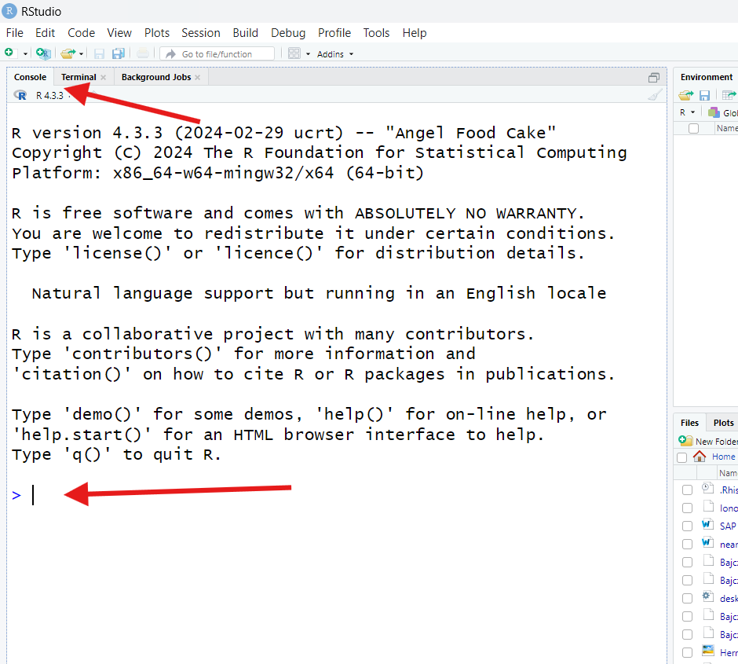

You'll know you've found it if you see a `>` symbol at the bottom and,
when you click near that symbol, a **cursor** (a blinking vertical line)
appears next to it.

Click near the `>` to receive the cursor. Then, type exactly this:

```{r adding, eval=F}
2 + 3
```

Then, press your enter/return key. What happens?

You should receive something looking like this:

```{r adding2, echo=F}
2 + 3
```

Since we know that two plys three is five, we can infer that R took the
values `2` and `3` and added them, given that R sent `5` back to us.
That must mean that `+` is the symbol (programmers would call it an
**operator**) R uses as a shorthand for the verb "add."

We've written our first R "sentence!" In programming, a complete,
functional sentence is called a **command** because, generally, it is us
*commanding* the computer to do something—here, add two values.

::: challenge
Next, type exactly `2+3` into the Console and hit enter/return. Then,
type exactly `2+ 3` and hit enter/return. What does R produce for us in
each case? What does this tell us?

::: solution
R doesn't produce anything new, hopefully! We should get `5` back both
times:

```{r nothing happens}
2+3
2+ 3
```

This teaches us our first R grammar (non-)rule—[*spaces* don't (usually)
matter in R]{.underline}. Whether we put spaces in between elements of
our command or not, R will read and act on (**execute**) them the same.

However, [spaces *do* help *humans* read commands]{.underline}. Since
you are a human (we assume!), it will probably help *you* read commands
more easily to use spaces, so that's what we'll do with all the code in
these lessons. Just know you don't *need* them because they *don't*
convey meaning.
:::
:::

### Math: The universal language

Next, type and run the following three commands at the Console (hit
enter/return between each):

```{r other math, eval=F}
2 - 3
2 * 3
2 / 3
```

What does R produce for you? What does this tell us?

Here's what you should have observed:

```{r other math2, echo=F}
2 - 3
2 * 3
2 / 3
```

What that must mean is that `-`, `*`, and `/` are the R **operators**
for subtraction, multiplication, and division, respectively.

[If nothing else, R is an extraordinary (if overpowered and
over-complicated) calculator]{.underline}, capable of doing pretty much
*any* math you might need! If you wanted, you could use it just for
doing math.

::: challenge
Next, try running exactly `(2 + 3) * 5`. Then, try running exactly
`2^2 + 3`. What does R produce in each case, and why?

::: solution
In the first case, you'll get `25` (and not 17, as you might have
expected). That's because parentheses are R's **operators** for "*order
of operations*." Remember those from grade school?? Things *inside*
parentheses will happen *before* things *outside* parentheses during
math operations.

So, `2` and `3` are added *before* any multiplication occurs (try
removing the parentheses and re-running the command to confirm this).

In the second case, you'll get back `7`, as though `2^2` is really `4`
somehow. This is because the caret operator `^` is used for *exponents*
in R. So, `2` gets raised to the power of `2` *before* any addition
occurs, just as order of operations dictate that it should.

These examples show that you can do any kind of math in R that you
learned in school!
:::
:::

So far, we've seen what R will do for us if we give it *complete*
**commands**. What happens if our command is *incomplete*?

At the Console, run exactly this:

```{r incomplete, eval = F}
2 +
```

What does R produce for you (or what changes)?

Your Console should now look something like this:

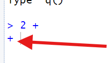

R has replaced the **ready prompt** `>` we normally see in the Console
with a `+` instead. This is R's **waiting prompt**, *i.e.*, it's waiting
for us to finish our previous command.

If we typed `3` and hit enter/return, we'd finish our command, and we'd
observe R return `5` and then switch back to its **ready prompt**. If,
however, we instead put in another complete command, or another
incomplete command that doesn't quite complete the previous command, R
will remain confused and continue giving us its waiting prompt. It's
easy to get "stuck" this way!

::: callout
If you ever can't figure out how to finish your command and get "stuck"
on R's waiting prompt, hit the "Esc" key on your keyboard *while your
cursor is active in the Console*. This will clear the current command
and restore the ready prompt.
:::

### No need to console me

By now, you might have realized that the **Console** is like a "chat
window" we can use to talk to R, and R is the "chatbot" on the other
side, sending us "answers" to our "questions" as quick as it can.

If we wanted, we could interact with R *entirely* through the Console
(and, in fact, "base R" is more or less *just* a Console!).

However, we *probably* shouldn't. Why not? For one thing, [the Console
is an impermanent record of our "chats]{.underline}." If we close R, the
contents of the Console get deleted. If we'd done important work, that
work would be lost! Plus, the Console actually has a line limit—if we
reach it, older lines get deleted to make room.

Sure, we *could* copy-paste the Consoles' contents into another document
on a regular basis, but that'd be a pain, and we might forget to do it
sometimes. Not good!

[In programming, the goal is to *never* lose important
work!]{.underline} The Console just isn't designed to prevent work loss.
Thankfully, we have a better option...

## Staying on-script

Let's open something called a **script file** (or "script" for short).
Go to "File" at the top of your RStudio window, select "New File," then
select "R Script File." Alternatively, you can click the button in the
top-left corner of the RStudio window that looks like a piece of paper
with a green plus sign, then select "R Script."

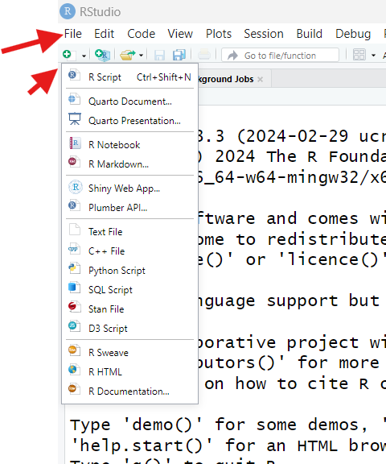

Either way, you should now see a screen like this:

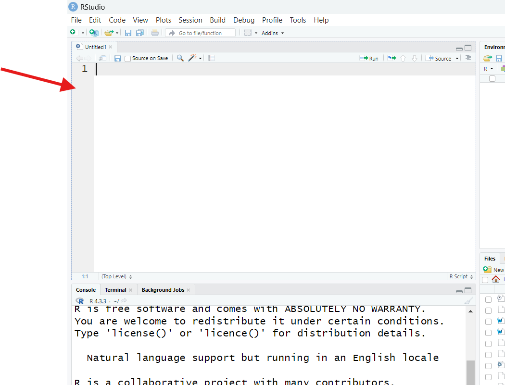

RStudio is displaying a blank script file. If you're new to programming,
a "script file" might sound scary, but [a script file is just a text
file]{.underline}, like one created in Microsoft Word or Google Docs,
but even more basic—you can't even format the text of one in any
meaningful way (such as making it bold or changing its size).

Specifically, a script is a text file in which we write **commands** we
are *considering* giving to R, like we're writing them down in a notepad
while we figure things out. Script files let us keep a permanent record
of the code we're crafting, plus whatever *else* we're thinking about,
so we can reference those notes later.

You might be wondering: "Why can't I just have a Word file open with my
code in it, then? Why bother with a *special, basic* text file?" The
answer: [In RStudio, script files get "plugged into" R's Console,
allowing us to pass commands from our script *directly* to the Console
*without* copy-pasting]{.underline}.

Let's see it! In your **script file**, type the following, then hit
enter/return on your keyboard:

```{r trying scripts, eval = F}
2 + 3
```

What happens in the *Console*?

The answer, you'll discover, is nothing! Nothing new print to the
Console. In our script, meanwhile, our cursor will move to a new line,
just like in would in a word processor. This shows us that [the "enter"
key *doesn't* trigger code to run in a script file, like it would at the
Console]{.underline}.

Put your cursor back on the same line as `2 + 3` in your script by
clicking anywhere on that line, then find the button that says "Run" in
the upper-right corner of your Script pane (it looks like a piece of
paper with a green arrow through it pointing right).

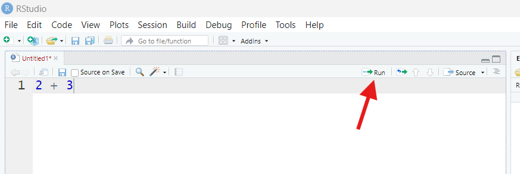

Once you find that button, press it.

What happens? This time, we observe our command and R's response appear
in the Console, as though we'd typed and ran the command there (but we
*didn't*!).

When we hit the "Run" button, R copied our command from our script file
to the Console for us, then executed it.

This is the magic of script files:

1.  They serve as a permanent record of our code.
2.  They give us a place to "tinker" because we can decide if and when
    we run any code we put in one. Half the code in a script could be
    "experimental junk" and that's ok, so long as you don't personally
    find that confusing.
3.  You can run whichever commands from your script file whenever you
    want to, no copy-pasting necessary.
4.  When your commands get longer (wait until you see how long some
    `ggplot2` commands get!), it's easier to write them out and then
    format them to be human readable in a script file than it would be
    at the Console.

So, few everyday R users code exclusively at the Console these days.
Instead, they code in scripts, letting R "teleport" relevant commands to
the Console when they're ready. As such, we encourage you to code
entirely from a script for the rest of these lessons.

### Leaving a legacy

You may have noticed that, when you first typed something in your script
file, its name (found in the tab above it), turned red and got an
asterisk placed next to it:

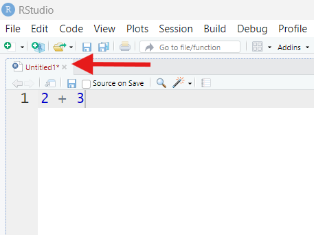

This means our script has unsaved changes. To fix that, go to "File",
then select "Save." Or, you can hit Control+S on your keyboard, or press
the blue "disk" button in the top-left corner of the Script pane (just
below the arrowhead in the picture above).

If your script already has a name, doing any of these will save the
file. If it doesn't have a name, you'll be prompted to give it one as
you save it. [R scripts get the file extension ".R" to indicate that
they are "special."]

::: callout
[One of programming's cardinal rules is "save often!"]{.underline} Your
script file is only a permanent record of your work if you remember to
save your work regularly!
:::

::: challenge
Scripts may permanently save your code, but not everything in a script
needs to be code!

Type and run the following from a script : `#2 + 5`.

What happens in the Console? What does this teach us?

::: solution
In this case, R will print your command in the Console, but it won't
produce any **output**. That is because `#` is R's **comment operator**.
A comment is anything that follows a `#` in the same coding "line."
[When R encounters a comment while executing code, it skips
it.]{.underline}

This means that you can leave yourself notes that R will ignore, even if
they are interspersed between functional commands!
:::
:::

::: callout
Writing comments explaining your code (what it's for, how it works, what
it requires, *etc*.) is called **annotating**. [Annotating code is a
*really* good idea]{.underline}! It helps you (and others) understand
your code, which is *particularly* valuable when you're still learning.
As we proceed through these lessons, we *highly* recommend you leave
yourself as many helpful comments as you can—it'll make your script a
learning resource in addition to a permanent record!
:::

## (Section #2) Objects of our affection

At this point, we know several fundamental R concepts:

-   Spaces don't (generally) matter (except that they make code easier
    for us humans to read).

-   Line breaks (made with the enter key) *do* matter (if they make a
    command *incomplete*).

-   Commands can be complete or incomplete, just like sentences can be
    complete or incomplete. If we try to execute an incomplete command,
    R expects us to finish it before it'll move on.

-   R has a number of symbols (**operators**) with particular meanings,
    such as `#` and `*`.

-   R will ignore **comments** (anything on a line following a `#`), and
    **annotating** our code with comments is good.

-   Writing code in **scripts** is also good.

We've taken our first steps towards R fluency! But, just as it would be
for a human language, the next step is a big one: We need to start
learning R's *nouns*.

### Assignment and our environment

In your script, run `5` [Note: besides hitting the "Run" button, you can
press control/command+enter on your keyboard to run commands from a
script].

```{r just 5}
5
```

R just repeats `5` back. Why? Because we didn't tell R to *do* anything
with `5`; it could only assume we wanted `5` returned as a result.

**Important:** This is, in a nutshell, how our relationship with R
works—it assumes we are giving **commands** ("orders") for which we'll
provide **inputs** R should use to carry out those "orders" (in this
case, our input was `5`). R will then *execute* those commands by doing
some work and returning some **outputs** (in this case, the output was
also `5`).

In broad strokes, any single input we give R, or any single output we
receive from R, is a "noun" in the R language—these nouns are called
**objects** (or, sometimes, **variables**).

The `5`s we've just seen are "temporary," or *unnamed*, objects. They
exist only as long as it takes R to work with or yield them, after which
R promptly forgets they exist (it's like R has *extreme* short-term
memory loss!).

However, if we don't want R to forget a noun, we can prevent it. In your
script, run the following:

```{r assignment}
x = 5
```

What happens in the Console when this command runs? Do you notice
anything different or new in your RStudio window?

At first, it might seem like nothing's happened; R reports our command
in the Console but no outputs, just like when we ran a comment.

However, find the pane labeled "Environment" (it's most likely in the
upper-right, though it could be somewhere else). Once you've found it,
if it says "Grid" in the top-right corner, good! If it says "List"
instead, click that button and switch it to "Grid."

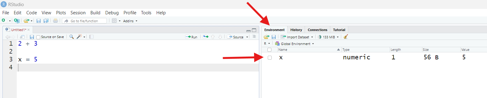

Before now, this pane may have said "Environment is empty." Now, it
should instead list something with the Name `x`, a Value of `5`, a
Length of `1`, and a Type of `numeric`.

What's happened? Let's experiment! In your script, run:

```{r playing with objects, eval = F}
x + 4
```

R will return:

```{r playing with objects2, echo = F}
x + 4
```

This is interesting. In English, adding `4` to a letter is non-sensical.
However, R not only does it (under these circumstances, anyway!), but we
get a specific answer back. It's as if R now knows, when it *sees* `x`,
that what it should *think* is `5`.

That's because that's exactly what's happening! Earlier, with our
`x = 5` command, we effectively taught R a new "word," `x`, by
**assigning** a value of `5` to a new **object** by that name (`=` is
R's **assignment operator**). Now, whenever R sees `x`, it will swap it
out for 5 *before* doing any operations.

`x` is called a **named object**. When we create named objects, they go
into our **Global Environment** (or "environment" for short). To
understand what our *environment* is, imagine that, when you start up R,
it puts you inside a completely empty room.

As we create or load objects and assign them names, R will start filling
this room with bins and shelves and crates full of stuff, each labeled
with the names we gave those things when we had R create them. R can
then use those labels to find the stuff we're referencing when we use
those names.

At any time, we can view this "room" and all the named objects in it:
That's what the **Environment pane** does.

Once we have named an object, that object will exist in our Environment
and will be recognized by R as a "word" until we either:

-   Remove it, which we could do using the `rm()` function (more on
    functions later) or by using the "clear objects" button in the
    Environment pane (it looks like a broom).

-   We close R ([R erases our environment every time we exit, by
    default]{.underline}).

The fact that our entire environment is lost every time we close R may
sound undesirable (and, when you're learning, it often is!), but the
alternative would be that our "room" (environment) just gets more and
more clogged with stuff. That'd create problems too!

::: callout
Besides, the point of working in a script is that we can keep all the
code we need to *remake* all our needed named objects, so we should
never have to truly "start over from scratch!"
:::

Besides looking at your environment, if you want to see the contents of
a named object (hereafter, we'll just call these "objects"), you can
have R show you its contents by asking R to *print* that object. You can
do this using the `print()` function or simply by executing only the
object's name as a command:

```{r printing}
print(x)
x
```

Naming an object may not seem like much of a "feature" to you now (it's
not like `5` is harder to type than `x`!), but an entire 30,000 row data
set could also be a *single object* in R. Imagine typing that whole
thing out every time you want to reference it! So, being able to give an
input/output, no matter its size or complexity, a brief "nickname" is
actually *very* handy.

### Naming rules and conventions

Let's talk about the process of naming objects (**assignment**) in more
detail.

In your script, type the following, but *don't* execute it just yet:

```{r more on assignment, eval = F}
y = 8 + 5
```

Guess what R will do when you provide it with this command. Then,
execute the command and see if you were right!

You should see `y` appear in your environment. What "Value" does it
have? Is that what you thought it would be?

```{r y}
y = 8 + 5
y
```

We get back a Value of `13` for `y`. What this tells us is that, when R
executed our command, it did so in a particular way:

1.  It *first* did the stuff we've asked it to do on the right-hand side
    of the `=` operator (it added two numbers).

2.  *Then* it created an object called `y` and stuffed it with the
    *result* of that operation. This is why our `y` has a value of `13`
    and not `8 + 5`.

This may seem strange, but, [at least for assignment, R *kind of* reads
right to left]{.underline} in that it assumes we want to store the
*result* of operations inside objects, not the operations themselves. As
we'll see, this is not the only way that R reads a command differently
than you or I might read text.

Time for our next experiment. Execute the following command:

```{r experiment2}
y = 100
```

What happens, according to your Environment pane? Is that what you
expected to happen?

If you look in your environment, there will still be one (and only one)
object named `y`, but it's Value will have changed to `100`. This
demonstrates two things about how assignment works in R:

-   [Object names in R must be unique]{.underline}—you can have only one
    object by a specific name at a time.

-   If you try to create a new object using an existing object's name,
    you will *overwrite* the first object with the second; the first
    will be *permanently* lost!

This is why it's *really* important to pick good names for your
objects—more on that in a second.

Next, type and run the following:

```{r casesensitivity}
Y = 47
```

What does the Environment pane report now? Is that what you expected?

You should see an object called `Y` appear in your environment.
Meanwhile, `y` is also there, and it's value hasn't changed. What
gives—didn't we *just* establish that names had to be unique??

Well, they do! But [R is a case-sensitive programming
language.]{.underline} This means that, to R, `Y` is different from `y`.
So, `Y` and `y` are completely different "words," as far as R is
concerned!

::: callout
[For beginning programmers, forgetting about case sensitivity is the
number-one source of errors and frustration!]{.underline} If you learn
absolutely nothing else from these lessons, learn that you can't be
"casual" about upper- versus lowercase letters when you are coding!
:::

Let's continue experimenting. Run the following two commands:

```{r numbers in names, eval = F}
z1 = 2
1z = 4
```

What happens? What does this experiment teach us?

The first command runs fine—we get a new object named `z1` in our
environment. This teaches us that [including numbers in object names in
R is ok]{.underline}.

#### I am error

However, the second command does *not* result in a new object called
`1z`. Instead, R returns an **error** message in the Console. Uh oh!
[Error messages are R's way of saying that we've formed an invalid
command]{.underline}.

To be completely frank, R's error messages are generally *profoundly*
unhelpful when you're still learning. This one, for example, says
`Error: unexpected symbol in "1z"` . What the heck does that even mean?!

Well, to translate, it's R's way of saying that while numbers *are*
allowed in object names, your [object names can't *start* with
numbers]{.underline}. So, the `1` at the beginning is an "unexpected
symbol."

When you get error messages in R, you might get frustrated because you
will know you did *something* wrong but you may not be able to figure
out *what* that something was. Just know this will improve with time and
experience.

::: callout
In the meantime, though, here are two things you should *always* try
when you get an error message and don't immediately know what your
mistake was:

1.  **Check for typos**. [95% of error messages are R's cryptic way of
    saying "I'm not 100% sure that I know which object(s) you're
    referring to."]{.underline} For example, as we saw earlier,
    `variable1` would be a different word than `Variable1` or even
    `varible1`, so start troubleshooting by making sure you didn't mix
    up capital and lowercase letters or add or remove characters.

2.  Try Googling the exact error message. It's likely one of the first
    results will have an explanation of what may cause that particular
    error. (An even better option these days might be asking a
    derivative AI program like ChatGPT to explain the error to you, if
    you also provide the code that caused it!)
:::

Errors are an inevitable consequence of coding. Don't fear them; try to
learn from them!

As you use R, you will also encounter **warnings**. Warnings are also
messages that R prints in the Console when you run certain commands.
It's important to stress, though, that [warnings are *not*
errors]{.underline}. [An error means R *knew* it *couldn't* perform the
operation you asked for, so it gave up; a warning means R *did* perform
*an* operation, but it's unsure if it did the *right* one, and it wants
you to check.]{.underline}

A quick way to see a warning is to try "illogical math," like logging a
negative number:

```{r log neg}
log(-1)
```

Here, R did *something*, but it might not have been the something we
*wanted* [`NaN` is a special value meaning "not a number," which is R's
way of saying "the math you just had me do doesn't really make sense!"].

The line between commands *so* invalid that they produce errors and
commands just not invalid *enough* to produce warnings is thin, so
you're likely to encounter both fairly often.

#### Going back to our "room"

Anyhow, let's return to objects: Try the following commands:

```{r symbols allowed, eval = F}
object_1 = 50
object 2 = 45
```

What happens? What does this teach us?

The first command runs fine; we see `object_1` appear in our
environment. This tells us that *some* symbols are allowed in R object
names. Specifically, [the two allowable symbols are underscores `_` and
periods `.`]{.underline}.

The second command returns an **error**, though. This tells us that
[spaces are **not** allowed in R object names.]{.underline}

Here's one last experiment—Type out the following commands, consider
what each one will do, then execute them:

```{r no linkage}
x = 10
y = 2
z = x * y
y = -1000
z
```

What is `z`'s Value once these commands have run? What did you *expect*
its Value to be? What does this teach us?

Here, we created an object called `z` in the third command by using two
other objects, `x` and `y` in the assignment command. We then
*overwrote* the previous `y`'s Value with a new one of `-1000`. However,
`z` still equals `20`, which is what it was before we overwrote `y`.

This example shows us that, [in R, making objects using other objects
**doesn't** "link" those objects]{.underline}. Just because we made `z`
using `y` doesn't mean `z` and `y` are now "linked" and `z` will
automatically change when `y` does. If we change `y` and want `z` to
change too, we have to *re-run* any commands used to create `z`.

This is actually a *super* important R programming concept: R's objects
*never* change unless you run a command that explicitly changes them. If
you want an R object to "update," a command must trigger that!

It's natural to think as though computers will know what we want and
automate certain tasks, like updating objects, for us, but R is actually
quite "lazy." It only does exactly what you tell it to do and nothing
more, and this is one very good example.

#### What's in a name?

We've learned how we *can/can't* name objects in R. That brings us to
how we *should/shouldn't* name them.

[In programming, it's good practice to adopt a **naming
convention**.]{.underline} Whenever we name objects, we should do it
using a system we use every single time.

Why? Well, among other reasons, it:

1.  Prevents mistakes—you'll be less likely to mess up or forget names.

2.  Saves time because coming up with new names will be easier and
    remembering old names will be faster because they're predictable.

3.  Makes your code more readable, digestible, and shareable.

[Our goal should be to create object names that are unique, descriptive,
and not easily confused with one another but, at the same time, aren't a
chore to type or inconsistent with respect to symbols, numbers, letter
cases.]{.underline}

So, by this logic, `y` is a *terrible* name! It doesn't tell us anything
about what this object stores, so we're *very* likely to accidentally
overwrite it or confuse it with other objects.

However, `rainfall_Amounts_in_centimetersPerYear.2018x` is also a
*terrible* name. Sure, it's descriptive and unique, and we wouldn't
easily mix it up with others object, but it'd be a pain to type! And
with the inconsistencies in symbol and capital letter usage, we'd typo
it a lot.

Here are some example rules from a naming convention, so you can see
what a better way to do things might look like:

-   All names consist of 2-3 human "words" (or abbreviations).

-   All are either in all caps `LIKETHIS` or all lowercase `likethis`,
    or if capitals are used, they're only used in specific, predictable
    circumstances (such as proper nouns).

-   Words are separated to make them more readable.

    -   Some common ways to do this include using so-called
        **snake_case**, where words are separated by underscores,
        **dot.case**, which is the same using periods, or **camelCase**,
        where one capital is used after where a space would have been.

-   Numbers are used only when they convey meaning (such as to indicate
    a year), not to "serially number" objects like `data1`, `data2` ,
    `data3`, *etc.* (such names are too easy to confuse and aren't
    descriptive).

-   Only well-known abbreviations are used, such as `wgt` for "weight."

Making mistakes in *any* language is frustrating, but they can be more
frustrating when you're learning a *programming* language! It may seem
like a hassle, but using a naming convention will prevent a *lot* of
frustrating mistakes.

::: discussion
Pause and jot down several rules for your own personal **naming
convention**.

::: solution
There are no "right answers" here. Instead, I'll give you a couple of
rules from my own personal naming convention.

First, generally speaking, column names in data sets are written in
ALLCAPS. If I need to separate words, I do so using underscores. My
comments are also written in ALL CAPS to make them stand out from the
rest of my code.

Meanwhile, I only use numbers at the ends of names, and I never use
periods.

Lastly, I use snake_case for function names (more on functions in a
bit), but I use camelCase for object names.
:::
:::

One last thing about **assignment**: R actually has a *second*
**assignment operator**, the arrow `<-`. If you use the arrow instead of
`=` in an assignment command, you'll get the same result! In fact, `<-`
is the *original* assignment operator; `=` was added recently to make R
a bit more like other common programming languages.

In help documents and tutorials, you will often see `<-` because it's
what a lot of long-time R users are used to. Also, `=` is used for not
one but *several* other purposes in R (as we'll see!), so some beginners
find it confusing to use `=` for assignment also.

Throughout, these lessons use `=` for assignment because it's faster to
type (and what the instructors are used to). However, if you would
prefer to use `<-`, go for it! Just recognize that both are out there,
and you are likely to encounter both as you consume more R content.

### Just typical

Earlier, when we made `x` and assigned it a value of `5`, R reported its
Type as `numeric` in our environment. What does "Type" mean?

Computers, when they store objects in their "heads," have particular
ways of doing so, usually based on how detailed the info being stored is
and how this info could later be used.

*Numeric data* (numbers with potential decimals) are quite detailed, and
they can be used in math operation. As such, R stores these data in a
specific way acknowledging these two facts.

Let's see some other ways R might store data. In your script, run the
following commands, *paying close attention to punctuation and
capitalization*:

```{r other types, eval = F}
wordString = "I'm words" #Note the use of camelCase for these object names :)
logicalVal = FALSE
```

You should get two new objects in your environment. The first should
have a Type of `character`. This is how R stores *text data*.

::: discussion
Note we had to wrap our text data in quotes **operators** `" "` in the
command above. [Text data must *always* be quoted in R]{.underline}.
Why? What would happen if we tried to run `x = data` instead of
`x = "data"`, for example?

::: solution
As we have seen, [R thinks unquoted text represents a potential object
name]{.underline}. So, to make it clear that we are writing textual data
and *not* an object name, we quote the text.

In our hypothetical example, if we tried to run `x = "data"`, we'd store
the value of `"data"` in an object called `x`. If, instead, we ran
`x = data`, R would look for an object called `data` to work with
instead. If such an object exists, its current value inside a second
object called `x`. But, if no such object existed, R would instead
return an error, saying it couldn't find an object named `data`.

Forgetting to quote text is an *extremely* common mistake when learning
R, so pay close attention to the contexts in which quotes are used in
these lessons!
:::
:::

Text data can also be detailed (a whole book could be a single text
object!) but they *can't* be used for math, so it makes sense R uses a
different Type to store such data.

The second object above (`logicalVal`) has a Type of `logical`. Logical
data are "Yes/No" data. Instead of storing these data as "Yes" or "No,"
though, a computer stores them as `TRUE` or `FALSE` (or, behind the
scenes, as `1` or `0`). These data are not detailed compared to others
we've seen, so it makes sense there's another type for storing them.
We'll see what logical data are for in a later section.

You can think of types as R's "adjectives:" They describe what *kinds*
of objects we're working with and what can and can't be done with them.

There are several more object Types we'll meet, but before we can, we
need to take our next big step: we need to learn about R's *verbs*.

## (Section #3) Function junction

Earlier, we established that our relationship with R is one in which we
provide R with inputs (**objects**) and **commands** ("orders") and it
responds by doing things (**operations**) and producing **outputs**
(more objects). But how does R "*do* things?"

Just as with a human language, when we're talking actions, we're talking
*verbs*. R's verbs are called **functions**. Functions are bundles of
one (or more) pre-programmed commands R will perform using whatever
inputs it's given.

We've actually met an (unusual) R function already: `+`. This symbol
tells R to add two values (those on either side of it). So, a command
like `2 + 2` is really a bundling together of our inputs (`2` and `2`)
and an R verb ("add").

Most R verbs look different from `+`, though. In your script, run the
following:

```{r sum, eval = F}
sum(2, 5)
```

What did R do? What does this teach us?

We've just successfully used `sum()`, R's more conventional, general
verb for "add the provided stuff," and it is a good example of how
functions work in R:

-   Every **function** has a **name** that goes *first* when we're
    trying to use that function.

-   Then, we add to the name a set of parentheses `( )`. [Yes, this is a
    second, *different* use of parentheses in R!]

-   Then, any **inputs** we want that function to use get put inside the
    parentheses. Here, the inputs were `2` and `5`. Because we wanted to
    provide two inputs and not just one, we had to separate them into
    distinct "slots" using commas `,`.

If we omit or mess up *any* of those three parts, we might get an
unexpected result or even an error! Just like any language, [R has
**firm** rules, and if we don't follow them, we won't get the outcome we
want]{.underline}.

Side-note: In programming, using a function is referred to as *calling*
it, like it's a friend you're calling up on the phone to ask for a
favor. So, the command `sum(2, 5)` is a *call* to the `sum()` function.

::: challenge
As we've seen, R is a powerful calculator. As such, it has many math
functions, such as `exp()`, `sqrt()`, `abs()`, `sin()`, and `round()`.
Try each and see what they do!

::: solution
`exp()` raises the constant `e` to the power of the provided number:

```{r exp}
exp(3)
```

`sqrt()` takes the square root of the provided number:

```{r}
sqrt(65)
```

`abs()` determines the absolute value of the provided number:

```{r abs}
abs(-64)
```

`sin()` calculates the sine of the provided number:

```{r sin}
sin(80)

```

`round()` rounds the provided number to the nearest whole number:

```{r round}
round(4.24)
```
:::
:::

### Pro-to types

R also has several functions for making objects, including some
important object types we haven't met yet! Run the following command:

```{r integer}
justANumber = as.integer(42.4)
```

This command produces an object of Type `integer`. The integer type is
for numbers that can't/don't have decimals, so any data after the
decimal point in the value we provided gets lost, making this new
object's Value `42`, not `42.4`.

Next, run:

```{r c}
numberSet = c(3, 4, 5)
```

This produces an object containing three Values (`3`, `4`, and `5`) and
is of Type `numeric`, so it maybe doesn't look all that special at
first.

The product of a `c()` function call *is* special though—this function
**c**ombine (or ***c**oncatenates*) individual values into a unified
thing called a **vector**. [A vector is a set of values grouped together
into one object.]{.underline} We can confirm R thinks `numberSet` is a
vector by running the following:

```{r is vec}
is.vector(numberSet)
```

To which R responds `TRUE` (which means "Yes").

If a single value (also called a *scalar*) is a single point in space
(it has "zero dimensions"), then a vector is a line (it has "one
dimension)". In that way, our vector *is* different from every other
object we've made until now! That's important because most R users
engage with vectors *all the time*—they're one of R's most-used object
types. For example, a single row or column in data set is a vector.

One reason that vectors matter is that many functions in R are
*vectorized*, meaning they operate on every entry inside a vector
separately by default

To see what I mean, run the following:

```{r vectorized}
numberSet - 3
```

What did we receive? What did this teach us?

R returns a vector of the same length as `numberSet` but containing `0`,
`1`, and `2`, which are what you'd get if you had subtracted `3` from
each entry in `numberSet` separately. That's vectorization! More on that
in a later lesson.

So, most R functions are designed to work not just on lone values but on
vectors, and some even *expect* their inputs to be vectors. A good
example is `mean()`, which takes the average of the provided inputs.
Yes, you *could* take the average of just one value, but it'd be pretty
pointless! So it makes sense this function expects a vector and not a
scalar as an input.

Let's try it. Run:

```{r mean}
mean(numberSet)
```

Vectors can hold non-numeric data too. For example, (carefully) type and
run the following:

```{r charset}
charSet = c("A", "B", "B", "C")
```

This will create a *character vector*. If we check our environment, we
will notice it has a Length of `4`, due to its four entries. If you ever
want to see the length of a vector, you can use the length function:

```{r length}
length(charSet)
```

#### Timeout for factors

We can use `charSet` to discover another, special R object Type. Run:

```{r factors}
factorSet = as.factor(charSet)
```

If you check your environment after this command, you'll see we've made
an object of Type `factor`. What's a factor??

[Factors are a special way R can store **categorical data**]{.underline}
(data that belong to different, discrete categories that cannot be
represented meaningfully with numbers, such as "male", "female", and
"neuter").

To create a factor, R:

1.  Finds all the unique categories (here, that's `A`, `B`, and `C`).

2.  Picks a "first" category. By default, it does this alphanumerically,
    so `A` is "first."

3.  It turns each category, starting with the first, into a "level," and
    it swaps that category out for an integer starting at `1`. So, `A`
    becomes level `1`, `B` becomes level `2`, and so on.

This means that, under the hood, R is actually now storing these text
data as numbers and not as text. However, it *also* stores which
categories goes with which numbers. That way, at any time, it can
"translate" between the numbers it's storing and the text values in the
original data. So, whenever it makes sense to treat these data as text,
R can do that, and whenever it'd be easier for them to be "numbers"
(such as when making a graph), R can do that too!

We can see all this underlying structure using the structure function,
`str()`:

```{r asnumeric}
str(factorSet)
```

This will show that R now thinks of our `A, B, B, C` data as
`1, 2, 2, 3`, but it hasn't forgotten that `2` really means `B`.

For certain operations, factors are *very* convenient. Part of why R
became so beloved by statisticians was because of factors!

However, if you think factors are weird, you're right—they are. If you
don't want to use them, increasingly, you don't have to; they are sort
of falling out of favor these days, truth be told. But they are still
common enough that it pays to be aware of them.

#### 2D or not 2D

Moving on, we have another two important objects to meet: **Matrices**
and **data frames**. Type (carefully) and run the following:

```{r matrix}
smallMatrix = matrix(c(1, 2, "3", "4"))
```

This command demonstrates another fundamental concept: [In R, you can
stuff functions calls *inside* other function calls]{.underline}. This
is called *nesting*.

[When we nest, R reads our command from the "inside out,"]{.underline}
evaluating inner operations first before tackling outer ones. So, here,
R *first* creates a vector containing the values `1`, `2`, `"3"`, and
`"4"`. It *then* provides that vector to the `matrix()` function, which
expects to be given a vector of values it can arrange into a matrix
format.

As such, we don't *have* to stop and name *every* object we want to
use—we can choose to use or create unnamed objects if that's our
preference.

However, for many beginners, reading nested code can be tricky, and not
saving "intermediate objects" feels wrong! If you'd prefer, you can
always write commands one at a time rather than nest them; it'll take
more time and space, but you might find it more readable. For example,
here, you could have instead done something like this:

```{r not nested}
smallMatrixVec = c(1, 2, "3", "4")
smallMatrix = matrix(smallMatrixVec)
```

Anyhow, we can see our matrix by running just its name as a command.
When we do that, we see this:

```{r our matrix}
smallMatrix
```

If a vector is a one-dimensional set of values, then [a matrix is a
two-dimensional set of values, arranged in rows and
columns]{.underline}. Here, we created a matrix with one column (marked
at the top with `[,1]`) and four rows (marked along the left side with
`[1,]`, `[2,]`, and so on).

::: discussion
Notice that all values in our matrix are now text (they are surrounded
by `"`s), even the `1` and `2` we originally entered as numbers. Why do
you think this happens?

::: solution
[Vectors and matrices (most objects, really!) in R can only hold values
of a single Type]{.underline}. If we try to put multiple value types
into one object, R will change (or *coerce*) the more complex/versatile
type(s) into the simpler/less versatile type(s). In this case, it turned
our numeric data (which can be used for math) into character data (which
can't be used for math).

Why does R coerce dara? Well, remember—many operations in R are
*vectorized*, meaning they happen to *all* values in an object
simultaneously and separately. This means we could run a command like
`smallMatrix + 4` to try to add `4` to *all* values in our matrix. This
would make sense for our numbers but not for our text!

Rather than giving us the opportunity to make mistakes like that, R
"reduces" all values in an object to the "simplest" available type so
that we never try to do "more" with an object's values than we should be
able to.
:::
:::

So data coercion makes sense, when you think about it. However, what if
you have a data set that contains *both* text and numeric data? R has
you covered, so long as those data are in different columns! Run the
following:

```{r data frame}
smallDF = data.frame(c(1,2), c("3", "4"))
```

Follow this with `smallDF` as a command to see the result:

```{r see DF}
smallDF
```

This time, we get an object of Type `data.frame`. Data frames are
another special R object type! [Like a matrix, a data frame is a 2D
arrangement of values]{.underline}, with rows and columns (albeit marked
differently than those in our matrix).

However, this time, when we look at our new data frame in the Console,
it *looks* like R has done the opposite—it looks like it has turned our
text into numbers!

But, actually, it hasn't. To prove it, we can use the structure
function, `str()`, to look under the hood at `smallDF`. Type and run the
following:

```{r str}
str(smallDF)
```

You should get output like this:

```{r str out, echo = F}
str(smallDF)
```

On the left-hand side of the output is a list of all the columns in our
data frame and their names (they're weird here because of how we made
our data frame!).

On the right-hand side is a list of the Types of each column and the
first few values in each one. Here, we see that, actually, the second is
still of Type `character` ("chr" for short). The quotes operators just
don't print when we look at a data frame.

The `str()` output shows that we have, in the same object, two columns
with different data types. It's this property that makes data frames
special, and it's why most R users engage with data frames all the
time—they are the default object type for storing data sets.

Note that [every column can still only contain a single data
type]{.underline}, so you can't mix text and numbers in the same column
without coercion happening.

Another object type R users encounter often is **lists**. Lists are
useful but also weird; we're not going to cover them here, but, if
you're curious, [you can check out this resource to become better
acquainted with
them](https://rstudio.github.io/r-manuals/r-intro/Lists-and-data-frames.html "Lists are a useful object type but they are tricky to learn and teach, so we're going to skip them for now unless you want to use this other resource to learn about them now").
There are also objects that can hold data in 3 (or more) dimensions,
called **arrays**, but we won't cover them here either because most
users won't need to use them much, if ever.

### For argument's sake

Earlier, we saw that functions get inputs inside their parentheses `( )`
and, if we are giving a function multiple inputs, we separate them using
commas `,`. This helps R know when one input ends and another begins.

You can think of these commas as creating "slots," with each slot
receiving one input. These "slots" may feel like things we, the users,
create as we call functions, but they actually aren't!

When a programmer creates a function, they need to ensure that the user
knows what inputs they are expected to provide (so we're not providing
illogical types of inputs or an inadequate number of them). Meanwhile, R
needs to know what it's supposed to do with those inputs, so it needs to
be able to keep them straight.

The programmer solves these two programs by designing each function to
have a certain number of input slots (these are called **parameters**).
Each slot is meant to receive an input (formally called an **argument**)
of a particular type, and each slot has its own *name* so R knows which
slot is which.

...This'll make much more sense with an example! Let's consider
`round()` again. Run the following:

```{r round again, eval = T}
round(4.243)
```

We get back `4`, which tells us that `round()` rounds our input to the
nearest whole number by default. But what if we didn't want to round
quite so much? Could we round to the nearest tenth instead?

Well, `round()`, like most R functions, has more than one input slot
(*parameter*); we can give it not only numbers for it to round but
instructions on *how* to do that.

`round()`'s first parameter (named `x`) is the slot for the number(s) to
be rounded—that's the slot we've already been providing inputs to. Its
*second* parameter slot (named `digits`), meanwhile, can receive a
number of decimal places to round those other inputs to.

By default, `digits` is set to `0` (*i.e.*, don't round to any decimal
place; just give back whole numbers). However, we can change that
default if we want. Run the following:

```{r round once more, eval = T}
round(4.243, 1)
```

By placing a `1` in that second input slot, we've asked R to round our
first input to the nearest tenth instead.

::: challenge
We can learn more about how functions work with some experiments. Type
the following into your script, but don't run it yet:

```{r round experiment 1, eval=F}
round(1, 4.243)
```

This is the exact same inputs we gave `round()` before, just reversed.
Do you think R will generate the same output? Why or why not? Try it and
observe what you get.

::: solution
```{r round answer, echo = T}
round(1, 4.243)
```

You get back `1`, which is not the same answer as we got before. Why?

We essentially just asked R to round `1` to `4.243` decimal places.
Since that doesn't really make sense, R assumes we meant "round to 4
decimal places." However, since `1` is already fully rounded, there's no
need to round it further.
:::
:::

The experiment in the exercise above shows that, [for R functions, input
order matters]{.underline}. That is, specific slots are in specific
places inside a function's parentheses, and you can't just put inputs
into slots all willy-nilly!

...Or *maybe* you can, if you're a *little* more thoughtful about it.
Try this instead:

```{r naming args, eval = F}
round(digits = 1, x = 4.243)
```

This time, you should get back `4.2`, like we did the first time.

```{r naming args2, echo = F}
round(digits = 1, x = 4.243)
```

This is because we have used the parameter names (to the left of the
`=`s) to match up our inputs (to the right of the `=`s) with the
specific slots we want them to go into. Even though we provided the
inputs in the "wrong" order, as far as how `round()` was programmed, we
gave R enough information that it could reorder our inputs for us
*before* doing continuing.

When in doubt, [always "name" your arguments (inputs)]{.underline} in
this way, and you'll never have to worry about specifying them in the
wrong order!

Note—we've just seen a second use for the `=` operator. Until now, we've
only used `=` to create new *named* *objects* (**assignment**). Here,
we're matching up inputs with input slots (we're **naming** our
**arguments**). In both cases, names are involved, but, in the latter,
nothing new is actually being created or added to R's vocabulary.

::: challenge
I mentioned that some folks find it confusing that `=` has multiple
different uses. Let's see if you might be one of those people. Consider
the following command:

```{r confusing, eval=F}
newVar = round(x = 4.243, digits = 4)
```

Can you explain what this command does?

::: solution
First off, we could have written this same command this way instead:

```{r less confusing, eval = F}
newVar <- round(x = 4.243, digits = 4)
```

We're asking R to create a new **named object** called `newVar`; that
new object will contain the result of a *call* to `round()`. This
assignment task is facilitated by the `=` operator (but could just as
easily have been facilitated by the `<-` operator).

For our `round()` call, we've provided two inputs, an `x` (a value to
round) and a number of `digits` to round that value to. We've ensured R
knows which input is which by naming the slots we want each to go into.
This input-slot matching is facilitated by the `=` operator also (the
`<-` operator would NOT work for this purpose).

If it feels harder to read and understand commands that use the same
operator (`=`) for two different purposes, that's ok! Just switch to
`<-` for assignment.
:::
:::

Notice that we can *call* `round()` with or without giving it anything
for its `digits` *parameter*. It's as though that slot is "optional."

That's because it is! [Some input slots have default values their
designers gave them]{.underline}. If we're ok with those defaults, we
don't need to mess with their slots at all. Many optional inputs are
there if you want to tweak how R performs a more basic operation. In
that way, they are kind of like R's *adverbs*, if you think about it!

By contrast, try this command:

```{r no default, eval = F}
round(digits = 1)
```

You'll get an error. What is this error telling us?

The error will say `Error: argument "x" is missing, with no default.`
This is actually a pretty informative error, for a change! We know, now,
that the number(s) we want to round go in a slot named `x`. In the
example above, we know we didn't provide any inputs for `x`, so our `x`
input is indeed "missing."

It makes sense this would be a problem—understandably, `round()` has no
default for `x`. How could it? Are we expecting R to somehow guess what
value(s) we are hoping to round, out of *all* possible values?? That
would be an **insane** expectation!

So, [while *some* function inputs might be optional, others are required
because they have no defaults.]{.underline} If you try to *call* a
function *without* specifying *all* required inputs, you'll usually get
an error.

Next, let's try this command:

```{r round text, eval = F}
round(x = "Yay!")
```

This will also trigger an error, with another error message you should
hopefully be able to decode!

The error says
`Error in round: non-numeric argument to mathematical function`.
Basically, it's saying "Hey! You just tried to get me to do math on
something that is *clearly* not a number!"

This shows that [each input probably needs to be of a specific form or
Type]{.underline} so that a function's operations are more likely to
work as planned.

### Getting help

By this point, you might be wondering: "But how would I know what input
slots a function has? Or what types or forms of inputs I should be
providing? Or what what those slots are named? Or what order those slots
are in? Or which slots are required?"

These are all **super** good questions! Thankfully, there's an easy
answer to them all—we can look them up! Run the following command:

```{r help, eval=F}
?round #You can run this with or without ()s
```

This command should trigger your RStudio to show its **Help pane**,
generally found in the bottom-right corner (though it could be somewhere
else).

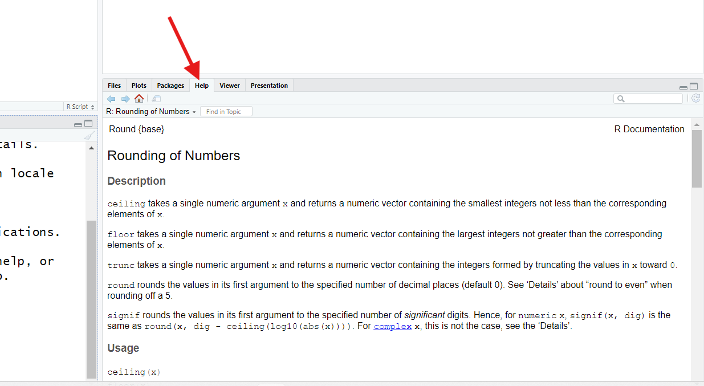

The `?` operator, when used in front of a function's name, will bring up
the **help page** for that function.

Fair warning: These are *not* always the easiest pages to read! In
general, they are pages written *by* programmers *for* programmers, and
it shows.

However, already, you *might* discover you understand more of this
page's contents than might think. Here's what to look for when reading a
function's help page:

-   The function's name is at the top, along with the name of the
    *package* it's from in braces `{ }`. `round` is in the `base`
    package, which means it comes with "base R."

-   The `Description` section describes (hopefully clearly!) what the
    function's purpose is, generally. If a number of related functions
    can logically share the same help page (as is the case here), those
    other functions will be listed and described here too.

-   [The `Usage` and `Arguments` sections show the input slots for this
    function, their names, and the order they're expected
    in]{.underline}. You should see, in the `Usage` section, that `x`
    and `digits` are the first and second inputs for `round()`.

-   In the `Arguments` section, you can read more about what each input
    slot is for (they are also listed in order). If there are any form
    or type requirements for an input, those will (hopefully) be noted
    here.

-   The `Details` section is one you can generally skip; it typically
    holds technical details and discusses quirky edge cases. But, if a
    function seems to be misbehaving, it's possible `Details` will
    explain why.

-   At the bottom, the `Examples` section shows some code you could run
    to see a function in action. These are often technical in nature,
    but they are sometimes fun. For example, you might find it
    interesting to consider the first example listed for `round()`. See
    if you can guess why it produces the results it does!

[A function's help page should hopefully contain all the answers to your
questions and more]{.underline}, if it's written well. It just might
take practice to extract those answers successfully.

...But, if you're starting out, how would you even know what functions
*exist*? That's a good question! One without a single, easy answer, but
here are some ideas to get you started:

-   If you have a goal, search online for an example of how someone else
    has accomplished a similar goal. When you find an example, note
    which functions were used (you should be able to recognize them
    now!).

-   You can also search online for a **Cheat Sheet** for a given
    *package* or task in R. Many fantastic Cheat Sheets exist,
    [including this one for base
    R](https://iqss.github.io/dss-workshops/R/Rintro/base-r-cheat-sheet.pdf "Cheat sheets are an incredible resource to pin up at your desk as they tend to cover all of the common use cases for a set of tools in a very svelte format"),
    which covers everything this lesson also covers (and more!), so
    it'll be a great resource for you.

-   **Vignettes** are pre-built examples and workflows that come with R
    packages. You can browse all the Vignettes available for packages
    you've installed using the `browseVignettes()` function.

-   You can use the `help.search()` function to look for a specific
    keyword across all help pages of all functions your R installation
    currently has. For example, `help.search("rounding of numbers")`
    will bring up a list that includes the help page for `ceiling()`,
    which shares `round()`'s help page. You may need to try several
    different search terms to find exactly what you are looking for,
    though.

## (Section #4) Preparing for takeoff

By this point, we've covered many of the basics of R's verbs, nouns,
adverbs, rules, and punctuation! You have *almost* all the knowledge you
need to level up your R skills. This last section covers the last few
ideas, in rapid-fire fashion, we think you'll want to know if you plan
to use R regularly.

### Missing out

By now, we know *almost* everything we need to know about functions.
However, for the next concept, we need a toy object to work with that
has a specific characteristic. Run the following:

```{r NAs, eval = T}
testVector = c(1, 8, 10, NA) #Make sure to type this exactly!
```

`NA` is a special value in R, like `TRUE` and `FALSE` and `NaN`. It
means "not applicable," which is a fancy way of saying "this data point
is *missing* and we're not sure what it's value *really* is."

When we load data sets into R, any empty cells will automatically get
filled with `NA`s, and `NA`s get created in many other ways beyond that,
so regular R users encounter `NA` a *lot*.

Let's see what happens when we encounter `NA` in the course of doing
other work. Run:

```{r mean NAs, eval = F}
mean(testVector)
```

The `mean()` function should return the average (mean) of a set of
numbers. What's it return when used on `testVector`?

```{r show mean, echo = F}
mean(testVector)
```

Hmm. It returns `NA`. This actually makes sense, if you think about it.
R was asked to take the mean of a set of values that includes a value
that essentially is "who even knows?" That's a pretty *insane* request
on our part!

Additionally, R might wonder if you even know you're missing data. By
returning `NA`, R lets us know both that you're missing data *and* that
it doesn't know how to do what you've asked.

But what if you *did* know you were missing data and you just wanted R
to calculate the average of the *non-missing* data you provided?

Maybe there's an optional parameter for that? Let's check by pulling up
`mean()`'s help page:

```{r mean help, eval = F}
?mean
```

When we do, we discover that `mean()` has an optional input, `na.rm`,
that defaults to `FALSE`, which means "don't *remove* (rm) NAs when
going to calculate a mean."

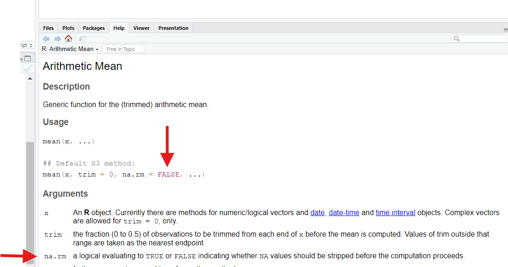

If we set this parameter to `TRUE`, `mean()` will do what we want—it
will strip out `NA`s *before* trying calculating the average.

::: challenge
However, if we try to do that like this, we get an error:

```{r mean error, eval = F}
mean(testVector, TRUE)
```

Why doesn't that command work?

::: solution
We get an error that discusses `trim`. What even is that?!

If we re-consult the function's help page, we might discover that,
actually, `mean()` has *three* input slots, and `na.rm` is the *third*
one; the *second* one is named `trim`.

Because we only provided two inputs to `mean()`, R assumed we wanted
those two inputs to go into the *first two* input slots. So, we provided
our `na.rm` input to the `trim` parameter by mistake!
:::
:::

To avoid this, we *could* provide a suitable value for `trim` also, such
as it's default value of `0`, like this:

```{r improved mean, eval = F}
mean(testVector, 0, TRUE)
```

This works, but we could also just match up our inputs with their target
slots using the slots' names, as we learned to do earlier:

```{r improved mean2, eval = F}
mean(x = testVector, na.rm = TRUE)
```

Doing this allows us to skip over `trim` entirely (since it's an
optional input)! That makes this approach easier.

::: callout
This is another good reason to *always* name your function inputs. Some
functions have *dozens* of input slots. If you only want to engage with
the last few, *e.g.*, using the parameter names to match up your inputs
with those slots is the only sensible option!
:::

### Sequences

One thing regular R users find themselves needing to make surprisingly
often is a **sequence**, which is a vector containing values in a
specific pattern.

If we just want a **simple sequence**, from some number to some number
counting by one, we can use the `:` **operator**:

```{r colon}
-3:7
```

If we want to *repeat* a value multiple times, we can use the `rep()`
function:

```{r rep}
rep(x = 3, times = 5)
```

`rep()` can also be used to repeat entire vectors of values:

```{r rep2}
rep(x = -3:7, times = 5)
```

If we want to create a more complicated sequence, we can use the `seq()`
function:

```{r seq}

```

::: challenge
Both `rep()` and `seq()` have interesting optional parameters to play
with!

For example, what happens if you provide a vector (such as `c(1, 5)`) to
`rep()` for `x`? What happens if you swap `each` in for `times` in the
command `rep(x = -3:7, times = 5)`? What happens if you swap
`length.out` in for `by` in the command
`seq(from = 8, to = 438, by = 52)`? Try it and see!

::: solution
If we switch to `each` instead of `times`, we instead repeat each value
inside our vector that many times *before* moving on to the next value:

```{r rep each}
rep(x = c(1,5), each = 5)
```

For `seq()`, when we specify a `by`, we are telling R how large the step
length should be between each new entry. When our next entry would go
past our `to` value, R stops making new entries.

When we switch to using `length.out`, we tell R to instead divide the
gap between our `from` and our `to` into that many slices and find the
*exact* values needed to divide up that gap evenly:

```{r seq length}
seq(from = 100, to = 150, length.out = 12)
```

This results in an equally spaced sequence, but the numbers may be
decimals. Using `by`, however, may cause our last interval to be shorter
than all others, if we hit our `to` value before we hit our `by` value
again.
:::
:::

### Logical tests

Just like a human language, R has *question* sentences. We call such
commands **logical tests** (or **logical comparisons**). For example,
run:

```{r logical1}
x = 5 # Create x and set its value
x == 5 #Is x *exactly* equal to 5?
```

Above, we create an object called `x` and set its value to `5`. We then
ask R, using the **logical operator** `==`, if `x` is "exactly equal" to
`5`? It responds with yes (`TRUE`), which we know is correct.

[Yes, this a third, distinct use for the `=` symbol in R (although,
here, we *have* to use two; *one won't work*!).]

There are other logical operators we can use to ask different or more
complicated questions. Let's create a more interesting object to use
them on:

```{r other logicals, eval=T}
logicVec = c(-100, 0.1, 0, 50.5, 2000)
```

::: challenge
Then, try each of the commands below, one at a time. Based on the
answers you receive, what questions do you think we've asked?

```{r each logical, eval = F}
logicVec != 0
logicVec > 0.1
logicVec <= 50.5
logicVec %in% c(-100, 2000)
```

::: solution
First, let's see the answers we receive:

```{r each logical2, echo = T}
logicVec != 0
logicVec > 0.1
logicVec <= 50.5
logicVec %in% c(-100, 2000)
```

As you can see, **logical tests** are *vectorized*, meaning we compare
each entry in our vector separately to the value(s) provided in the
question, to the right of the logical operator.

For the first test of `logicVec != 0`, we get back only one `FALSE`, for
the third entry. Why? Well, that's the only entry whose value is exactly
`0`. If `==` is the **logical operator** for "is equal to," `!=` must be
the **logical operator** for "is *not* equal to."

For the second test of `logicVec > 0.1`, we get back four `TRUE`s. This
one hopefully makes intuitive sense; we've asked which values are
*strictly greater than* `0.1`, and since all but `-100` are, we get four
"yeses."

For the third test of `logicVec <= 50.5`, we get back four "yeses" as
well because four values are either less than (`<)` or equal to (`=)` a
value of `50.5`.

As you might guess, `<` and `>=` are also **logical operators**; we just
didn't use them in these examples!

The last example is a bit weirder. The `%in%` **logical operator** is
also called the **match operator**. It asks "is each thing on the left
also found in the thing on the right?" That is, it is looking for
matches between the left and right inputs and, when it finds a match, we
get `TRUE`. "Is *each* thing on the left equal to *anything* on the
right?"

Here, we get back two matches, for the first and last entries in
`logicVec`, which makes sense because `-100` and `2000` are indeed found
in both vectors we've provided.
:::
:::

We can also ask R "multi-part" questions. For example, type and run the
following:

```{r and question, eval = F}
logicVec > 0 & logicVec < 50
```

The `&` operator is the **"and" logical operator**. So, here, we've
asked R *two* questions that must both be true for a value to get back a
"yes." Only two of our five entries satisfy *both* questions we've
posed, so we get back two `TRUE`s.

Note that *both questions need to be complete commands*! You can't
write, for example, just `logicVec > 0 & < 50`, even though this would
seem both sensible and tempting.

Also, note that there is an operator for "or": `|`. That's the "pipe"
character, located over by your enter/return key. If you connect two
**logical tests** with `|`, so long as *either* test passes for an
entry, that entry will return `TRUE`.

It may not be *immediately* clear what logical tests are good for, but
we'll see several use cases for them in later lessons.

### Subsetting and indexing

We've seen both 1D (**vectors**) and 2D (**matrices** and **data
frames**) objects, which contain more than one value and might contain
*millions*! If these objects are big enough, printing them to the
Console to see their contents would be impractical. How can we carefully
and targetedly "look inside" an object?

We can use **indexing**. This is using a **label** (*e.g.*, a column
name) or **index value** (*e.g.*, a row number) to "target" a specific
value (or multiple values) inside an object.

For example, if we want to see just the *first* value inside of the
`logicVec` vector we built earlier, we could do this:

```{r index1}
logicVec[1]
```

The indexing operators, the square brackets `[ ]`, are keys you might
not often use. If it helps you to remember what they're for, remember
that they look like little "iron sights" you use to "aim" at specific
entries inside objects!

In the command above, we placed the index value `1` inside our brackets
and attached those brackets to the object we wanted to peer inside.

An index value of `1` will ask R to retrieve the first value. Logically,
if we used an index value of `4` instead, we'd get back the fourth
entry:

```{r index2}
logicVec[4]
```

::: challenge
What happens if we use index values that make less sense? What if we ask
for the 8th value, even there is no 8th entry? What if we ask for the
"0th" entry? What if we ask for a "negative" entry? Run the following
commands to find out:

```{r index3}
logicVec[8]
logicVec[0]
logicVec[-3]
```

::: solution
Each of these commands teaches us something different about how indexing
works in R.

In the first, we ask for a non-existent 8th entry. R does *not* respond
with an **error** or **warning**, as we might expect. Instead, it
responds `NA`. Essentially, it responds as though an 8th entry *could*
exist; it just doesn't know what it's *value* would be because that
value is currently missing (which could *technically* be true). We
mentioned earlier that many operations produce `NA`s; this is one.

In the second command, we ask for a non-sensical "0th" entry. Again, R
does *not* respond with an error or warning. Instead, it responds with a
strange value: `numeric(0)`. This is R's way of saying "your result is a
numeric vector with `0` contents." Uh...sure!

What's important here is that this command proves R is different than
many other programming languages. In Python, for example, asking for the
zeroth entry is *actually* how you ask for the *first* entry—Python is a
**zero-indexed language**, which means it starts counting positions at 0
instead of at 1. Row 0 is the *first* row!

Meanwhile, [R is a one-indexed language]{.underline}—if you want the
first row or entry, you use an index value of `1`, not `0`. Even though
that's probably more intuitive, R is actually uncommon; most common
languages are zero-indexed.

In the third command, we ask for the "negative third entry." We get back
*every* entry *but* the third. That's because the `-` operator, when
used in indexing, excludes values at certain positions rather than
targeting them.
:::
:::

You can also use **sequences** as index values, if you want to peek at
multiple values inside an object. Run the following commands to see two
examples:

```{r indexviasequence}
logicVec[2:4] #2nd thru 4th values
logicVec[c(1, 5)] #The first and fifth value.
```

Indexing allows us to peek at specific values inside an object; what if
we don't like the values we see when we do that?

For example, in the `testVector` object we made earlier, the fourth
entry is `NA`, which caused problems. We can combine **indexing** with
**assignment** to **overwrite** (replace) values inside objects. Here's
how we'd replace that `NA` with `100`:

```{r overwritingindex}
testVector[4] = 100 #Replace the 4th value in testVector with 100.
testVector
```

If you provide an *equal* *number* of replacement values, you can
replace multiple values at once:

```{r overwritingindex2}
testVector[c(2,4)] = c(-5, 32) #If indexing two values, must provide two replacements.
testVector
```

What if we want to have a smaller object than the one we currently have?
We can also combine **indexing** and **assignment** to create
**subsets** (smaller versions) of an object. Here's how we'd create a
new object containing just the first and third entries of `logicVec`:

```{r subsettingindex}
newVec = logicVec[c(1,3)]
newVec
```

This is how indexing works for **vectors**. It works a *little*
differently with 2D objects. Let's create a **matrix** and a **data
frame** to experiment with:

```{r matanddf}
mat1 = matrix(4:-4, ncol=3)
df1 = data.frame(x = 1:5, y = letters[1:5])
mat1
df1
```

For vectors, our index values were the positions of the entries we were
interested in (position 1, position 2, etc.). Single values make less
sense for a 2D object—what's the 6th position in a 3x3 matrix, for
example? Is it the value in the 2nd row and 3rd column? In the 3rd row
and 2nd column? Something else? Let's see what R thinks:

```{r position6}
mat1[6]
```

`-1` is the value in the 3rd row and 2nd column. Is that the value you'd
have picked? This shows us that R reads (and fills) matrices top to
bottom and *then* left to right (unlike how English speakers would
probably read them).

Since that's maybe confusing, it'd be easier to use *two* position
values to index a matrix, one for the row number(s) we're interested in
and one for the column number(s) we're interested in. We can separate
these values inside our brackets using a comma, just like we do with
inputs inside a function call.

For example, here's how we'd get back the value from the 2nd row and 3rd
column instead:

```{r indexmat}
mat1[2, 3] #Second row, third column
```

When indexing using two index values like this, [you *always* provide
row information first and column information second.]{.underline} It's
just like in the game "Battleship," in which you guess spots on a grid
by saying their row identifier first.

What if we wanted back an *entire* row or column? We *could* do
something like this:

```{r allrow}
mat1[1:3, 2] #The whole second column
```

This works, but there's an easier way. If we use a comma to create a
slot, but we leave that slot blank, R interprets that blank slot as
"give back all of these." For example, if we run this command:

```{r allrow2}
mat1[ , 2]
```

We also get back the whole second column. By leaving the slot for rows
blank, we're telling R we want back all available rows.

Indexing works mostly the same way for data frames as it does for
matrices, but there are a couple notable differences. For example,
consider this command:

```{r dfsingleval}
df1[2]
```

This command returns the entire second column of our data frame instead
of giving us just the second value in it, like it would have for a
matrix. This is because data frames are designed to hold data sets, and
columns play a really important row in working with data sets, so R
"favors" columns when indexing data frames.

Another sign of this is the existence of the `$` operator. We can use
`$` to index columns of a data frame by their names instead of their
positions:

```{r dfcolname}
df1$y #Whole y column
```

This "shortcut" doesn't work on matrices, even ones with named columns.

Notice how the two commands we've just run produce different-looking
outputs—the first produces a data frame as an output, while the second
produces a vector. This is a good example of how there are often
multiple ways in R to produce similar (but also distinct) results.

We can index/subset objects using **logical tests** too. For example,
the following command would return only rows with values in column 3 of
our matrix that are greater than `-4`:

```{r subsettingtests}
mat1[mat1[,3] > -4, ]
```

This is another **nested** **command**, so let's break it down. Because
R reads these from the inside out, we will too. We've *first* asked R to
determine which values in the third column of `mat1` are greater than
`-4`:

```{r breakdown1}
mat1[,3] > -4 #The inside command above
```

We get TRUE for the first two values and FALSE for the last value.

*Then*, we ask R to only keep rows in `mat1` that are TRUE and exclude
all rows that are `FALSE`, according to that rule (and we keep all
columns by leaving the column slot blank):

```{r breakdown2}
mat1[c(TRUE, TRUE, FALSE), ] #Basically what we did.
```

In this way, we've created a subset of our matrix that passes a test we
care about—something we *often* want to do with our data sets! We'll see
even fancier ways to create subsets like this when we learn the `dplyr`
package later. Speaking of which...

### Installing and loading packages

Much earlier on, we noted there are *thousands* of add-on packages for
R. Because there are so many, it makes sense R does not come installed
with all these. That would be a *lot* of files!

So, [if we want to use these other packages (and we do), we'll have to
download and install them first]{.underline}. This is, thankfully, easy
( assuming we know the name of the package we want).

In a later lesson, for example, we'll use the `dplyr` (pronounced
"Dee-Plier", or "Dee-Ply-Ar", or "Dipply-Er") package, which contains an
*amazing* set of tools for cleaning and manipulating data sets; many R
users use `dplyr`'s tools *every day*. Let's use `dplyr` as our example
package here.

First, we have to download and install `dplyr`; the following command
will do that:

```{r installing, eval=F}
install.packages("dplyr")
```

In just a few moments, you should get confirmation that `dplyr` has
installed (assuming you have an internet connection!).

However, [by default, R does not assume you want to actually *use* all
the packages you have installed]{.underline}. Thinking back to our
"room" analogy, if we had hundreds of packages on, each one full of
tools and other stuff, dumping all that stuff into our "room" would make
it *very* cluttered!

So, [every time we start R, we have to *manually* turn on any packages
we want to use]{.underline}. To do this, we use the `library()`
function:

```{r turning on, eval=F}
library(dplyr)
```

This will turn on `dplyr` and make all its tools and stuff accessible.

Note we needed to *quote* `"dplyr"` in `install.packages()`, but we
didn't need to in `library()`. There's not really a good reason for
this—to some degree, you have to memorize when quotes are needed (or
check help pages).

Later, if we we want to turn a package off, we can use the `detach()`
function:

```{r detach, eval=F}
detach(dplyr)
```

We can also check to see if packages are already on/off, install or
update packages, or turn packages on/off on the Packages pane, typically
found in the lower-right (though it could be elsewhere):

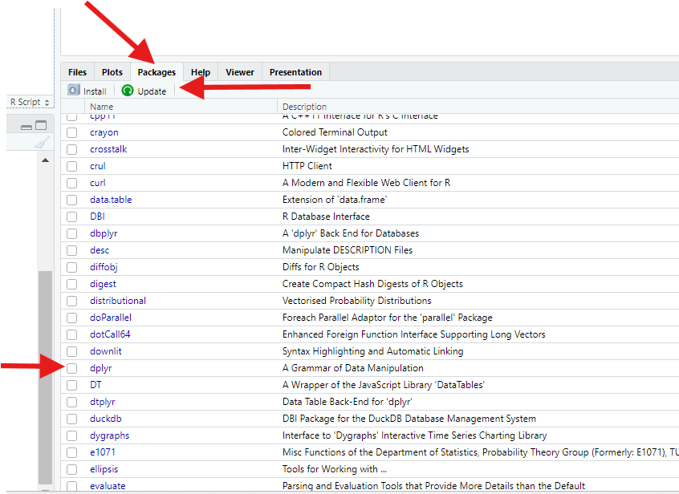

Here, you can use the "Install" and "Update" buttons at the top to
install or update packages. In the table, meanwhile, you'll find an
alphabetized list of every package you have installed. If the checkbox
next to a package's name is checked, that package is on. Checking the
checkbox will turn the package on; unchecking it will turn it off.

Many beginners find the Packages pane to be an easier way to deal with
packages than using function calls.

::: callout
Note that while you have to turn packages on every time you open R, [you
only have to *install* a package once]{.underline}! For this reason,
[don't include `install.package()`*calls* in your scripts]{.underline};
they are almost always unnecessary, and sometimes, they take a long time
to run!
:::

::: challenge
To practice managing packages, download and install the other packages
we'll need for these lessons: `gapminder`, `ggplot2`, and `tidyr`. Then,
turn them on.

::: solution
First, you'd use `install.packages()` to download and install each
package. We can actually put all the packages into a single call if we
want, so long as we separate them with commas. We also have to quote
each package name:

```{r install many pacs, eval=F}
install.packages("gapminder", "ggplot2", "tidyr")
```

Then, we use `library()` to turn each package on. Unlike with
installation, we don't have to **quote** the package names, but we also
can't stuff all the packages into a single **call** either, so turning
on multiple packages is tedious:

```{r many pacs on, eval =F, message=F}
library(gapminder)
library(ggplot2)
library(tidyr)
```

We could just as easily do all this with the Packages pane instead, but
that'd be harder to show here.
:::
:::

### Managing your working directory

In the next section (the last in this lesson), we'll talk about loading
files into R and saving files from R. Those are things you'll probably
do often if you use R regularly!

*Before* that, though, we need to explain a quirky R concept: your
**working directory**.

When you start R, R assumes that, for that session, there is a "home
base" on your computer it should interact with. This "home base" is
called your **working directory** (a "directory" is another name for a
"folder").

To figure out what your **working directory** is, use the `getwd()`
function:

```{r working dir, eval=F}
getwd()
```

We can also figure out our working directory by clicking the "right
arrow" at the top of the Console:

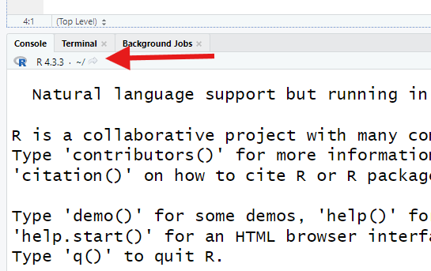

This opens our **working directory** in the Files pane, typically found
in the bottom-right (though it could be elsewhere).

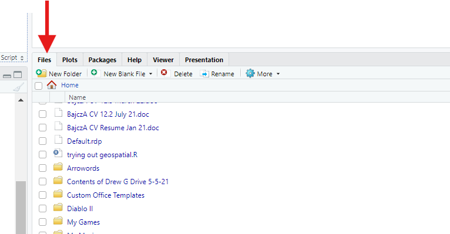

[If we try to load a file into R, unless we specify otherwise, R assumes
it's in our **working directory**. If we save a file from R, unless we
specify otherwise, R assumes it should save it into our **working
directory**]{.underline}. So, it matters which folder this is!

If we want to *change* our **working directory**, we can specify a new
directory by providing a ***file path*** to the `setwd()` function:

```{r setwd, eval=F}
setwd("some/path/to/a/different_folder")
```

However, for beginners, file paths can be tricky, so thankfully there's
an easier way. Find "Session" at the top of your screen. There, select
"Set Working Directory." Then, click "Choose Directory...". This'll
bring up a "file picker" on your computer, allowing you to navigate to
the folder you want to choose. Much easier!

### Loading and saving files

How exactly you load or save files in R depends on what exactly you are
trying to load or save, understandably!

However, [*in general*, you will use a `read` function of some kind to
load files.]{.underline} For example, `read.csv()` will read data a .csv
("comma-separated values") file, `readRDS()` will read an .rds ("R data
structure") format, and so on. Other packages add additional options;
for example, the `readxl` package adds the `read_excel()` function for
loading Microsoft Excel files.

To demonstrate how to load files into R, we need a file to load. So,
let's first make an object we can save to demonstrate how saving works.
Run:

```{r sample df, eval=T}
#Thoughtfully placed line breaks can help us see the separations between inputs in our function calls!
sampleData = data.frame(x = c(1, 2, 3), 
                        y = c("A", "B", "C"))
```

This command creates a **data frame** with two columns (named `x` and
`y`), each with three values, so the result has three rows. [Sidenote:
We have *yet another*, distinct use of `=` here! Here, we're using it to
give *names* to the columns we're creating. This is its job
insidecertain functions, like `data.frame`.]

Now, we can save this data frame as a simple .csv file using
`write.csv()`, which has two required inputs:

1.  The R **object** we want to save, and

2.  The name we want to give the file, which should end in ".csv". This
    input must be **quoted**.

So, run:

```{r writing, eval=F}
write.csv(x = sampleData,
          file = "sample.csv")
```

So long as that command worked, you should see your new file in your
Files pane (you may need to "Refresh" the pane first using the circular
arrow button in the pane's top-right corner).

Now that we have that file, we can read it into R using `read.csv()`,
which takes just one required input: the name (or path) of the file
we're loading. However, to actually make the data set we're loading
permanent, we need to combine it with an assignment command to give the
new object a name as well:

```{r reading, eval=F}
sample_data = read.csv("sample.csv")
```

In other words, we almost always pair a `read` function with an
**assignment command** to save what we're reading as a **named object**
so R won't forget it as soon as it's done reading it.

RStudio offers a second way to load data that some may find easier,
though it's harder to explain here. In your Environment pane, find the
"Import Dataset" button, then select the appropriate option for the
format of data you want to import.

A large window will then open:

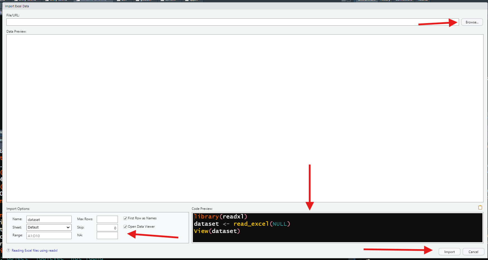

This window allows you to select the file you want to load using a file
picker (towards the top). A preview of the data you've loaded is then
provided in the center.

At the bottom-left, you'll see options to adjust which rows to import
and whether the top row should be treated as column names. You can also
name your new data set **object** here. If you're curious, the code
needed to achieve the same outcome is displayed in the bottom-right.
When you're satisfied, hit the "Import" button.

### Creating an R Project folder

We've seen that, when working in R, managing your **environment** is
important, managing your **working directory** is important, and loading
and saving files is important. All these are made easier by having an
**R Project folder**.

When you make one, R adds a .rproj file to a folder on your computer.
When you then launch R by opening this .rproj file, or when you use the
"File" menu to open this file or project, [R will use the contents of
this .rproj file to restore your environment, package statuses, and open
files to whatever they were the last time you worked on your
project.]{.underline}

This means that, for large or complicated projects, you can "save your
progress" between R sessions! Furthermore, R will assume your **working
directory** is your project folder, which means saving and loading
project files is easier (assuming you store them in your project folder,
of course)!

To make an R Project folder, go to "File," then select "New Project." A
menu will pop up; there, select "New Directory," then select "New
Project."

On the next screen, use the file picker to select a location for your
new project folder on your computer, then give it a name. Also, check
the box that says "Open in New Session." When you're ready, press
"Create Project." This will open a new session of RStudio centered
around your new Project.

::: keypoints
-   R is an incredibly powerful tool; knowing how to use it is an
    *incredibly* valuable skill. However, to learn it takes the same
    diligence as learning a human language does.
-   R is a very capable calculator; you can use it to do math.
-   R, like human languages, has punctuation marks (**operators**) that
    have specific meanings and usage rules.
-   R "sentences" are called **commands**. They include inputs as well
    as instructions for operations we want R to perform for us.
-   Script files are text files that allow us to write and store code
    and annotations and then "teleport" this code to the Console when
    we're ready.
-   "Nouns" in R are called **objects**. These are impermanent until we
    use **assignment commands** to name them, in which case they persist
    until we overwrite them or close R.
-   Our **environment** is everything we have named since starting our R
    session.
-   There are rules about what we can and can't (and should and
    shouldn't) name objects in R.
-   R is case-sensitive, so capital and lowercase letters are distinct.
-   It's good to have a naming convention to name objects.
-   Objects in R take many different shapes, and the values they store
    can be of many different types (the "adjectives" of the R language).
-   In R, "verbs" are called **functions**. Functions take inputs,
    perform operations, and produce outputs. Some functions do math;
    others might create new objects.
-   Functions have slots for specific inputs. These slots are called
    **parameters**, and they have names. The inputs we provide to these
    slots are called **arguments**. Arguments should be given in a
    specific order, and they should be of specific types.
-   Some function inputs are optional; others are required. Optional
    inputs are like R's "adverbs" in that they often control *how* R
    performs a specific operation.
-   If we want help with a function, we can use the `?` operator to open
    its help page.
-   The `=` symbol has many different uses in R, which can be confusing.
    As such, consider using `<-` for assignment.
-   **Logical tests** are like "questions" in R. There are many
    different **logical operators** to ask a variety of questions.
-   Use the square bracket operators `[ ]`to peek inside objects in
    **indexing** commands. Indexing commands can also be used to update
    or subset objects, and their format differs for 1D vs. 2D object
    types.
-   Installing packages is necessary to have access to them, but even
    then, packages must be turned on to use their features.
-   Your **working directory** is the folder R assumes it should
    interact with on your computer when loading/saving files.
-   R Project folders are handy for keeping organized when working on a
    large, important, or complex project.
-   Loading files in R typically requires a `read` function; saving
    files typically requires a `write` function.
:::
