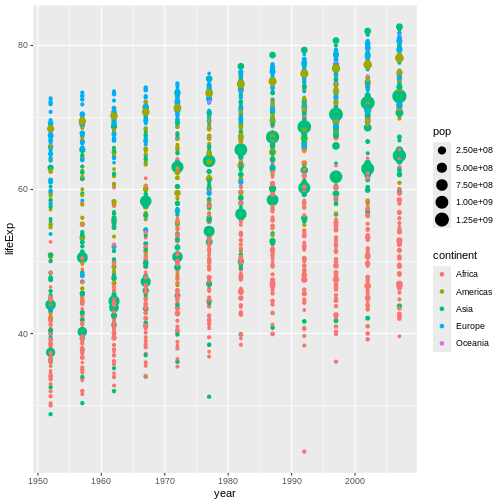
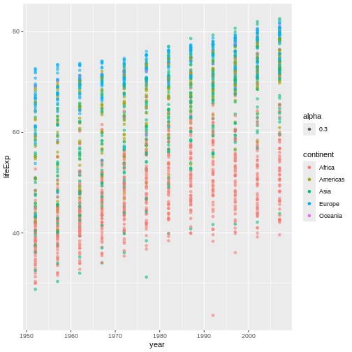
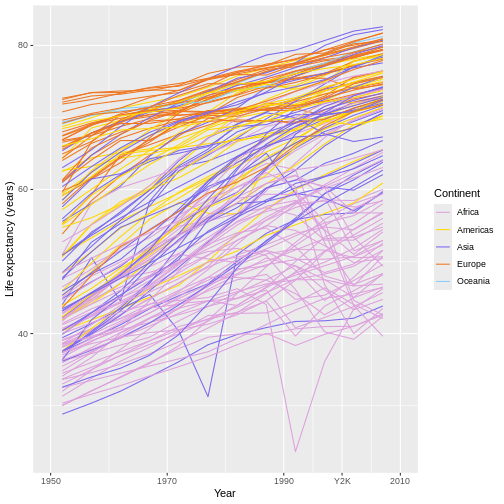
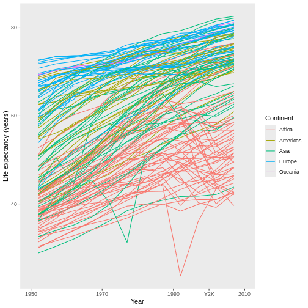
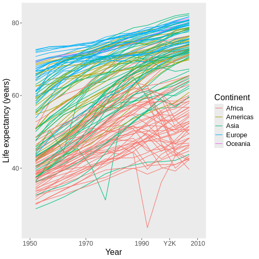
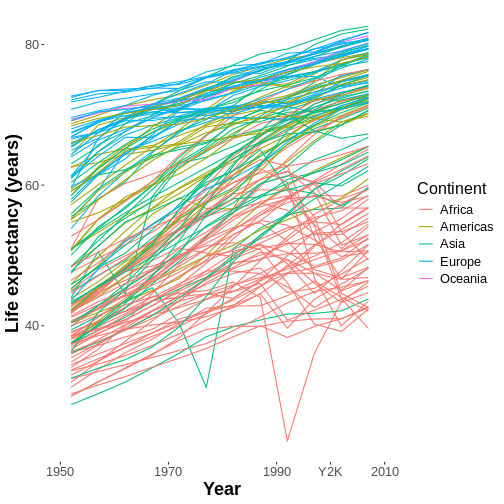
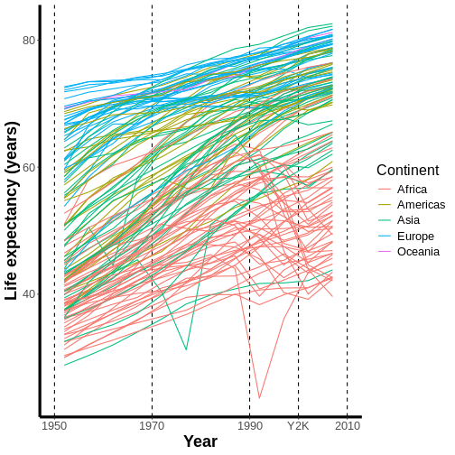
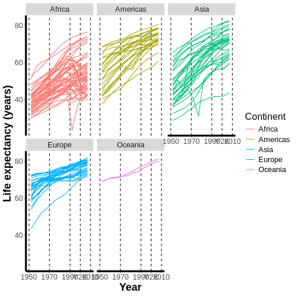

::: objectives
-   **Subset** a data set to a smaller, targeted set of rows and/or columns.
-   **Sort** or **rename** columns.
-   **Make new columns** using old columns as inputs.
-   Generate **summaries** of a data set.
-   Use **pipes** to string multiple operations on the same data set together into a "paragraph."
:::

::: questions
-   What are the most common types of operations someone might perform on a data frame in R?
-   How can you perform these operations clearly and efficiently?
:::

## Preparation and setup

Note: These lessons uses the **gapminder data set**. This data set can be accessed using the following commands:


``` r
install.packages("gapminder") #ONLY RUN THIS COMMAND IF YOU HAVE NOT ALREADY INSTALLED THIS PACKAGE.
```

``` output
The following package(s) will be installed:
- gapminder [1.0.0]
These packages will be installed into "~/work/r-novice-gapminder/r-novice-gapminder/renv/profiles/lesson-requirements/renv/library/linux-ubuntu-jammy/R-4.4/x86_64-pc-linux-gnu".

# Installing packages --------------------------------------------------------
- Installing gapminder ...                      OK [linked from cache]
Successfully installed 1 package in 6.6 milliseconds.
```

``` r
library(gapminder) #TURN THE PACKAGE ON
gap = as.data.frame(gapminder) #CREATE A VERSION OF THE DATA SET NAMED gap FOR CONVENIENCE
```

These lessons revolve around the packages in the so-called "tidyverse"—a suite array of R packages containing *extremely* useful tools that are all designed to look similar and work well together. Many of these tools allow you to do operations more efficiently, clearly, or quickly than you can in "base R." As such, most things we'll do in these lessons can be done in "base R" too, but it won't (typically) be as efficient, clear, or fast! As such, the `tidyverse` packages can be viewed as a modern "dialect" of R that many (though not all!) R users use in place of (or in concert with) base R in their day-to-day workflows.

`dplyr`, `ggplot2`, and `tidyr`, the specific packages we'll use in these lessons, are like many add-on packages for R in that they do **not** come pre-installed with R. We can install them using this command:


``` r
install.packages(c("dplyr", "ggplot2", "tidyr")) #ONLY RUN THIS COMMAND IF YOU HAVEN'T ALREADY INSTALLED THESE PACKAGES.
```

You only need to install a package once (just like you only need to install a program once), so there's no need to run the above command more than once. [However, packages are updated occasionally. When updates are available, you can re-install new versions using the same `install.packages()` function.]

When you launch R or RStudio, none of the add-on packages you have installed with be "turned on" by default. either So, to turn on `dplyr` so that we can access its features, we use a `library()` call:


``` r
library(dplyr) #RUN EACH TIME YOU START UP R AND WANT TO USE THIS PACKAGE'S FEATURES.
library(ggplot2)
library(tidyr)
```

The above command must be run every time you start up R and want to access these packages' features.

## Data Frame Manipulation with dplyr

R is designed for working with data and data sets. Because data frames (and tibbles, their `tidyverse` equivalents) are the primary object types for holding data sets in R, R users work with data frames (and tibbles) A LOT...like, *a lot a lot*.

When working with data sets stores as data frames (or tibbles), we *very often* find ourselves needing to perform certain actions, such as cutting certain rows or columns out of these objects, renaming columns, or transforming columns into new ones.

We can do ALL of those things in "base R" if we wanted to. In fact, [our "Welcome to R!" lessons](https://umn-dash.github.io/r-novice-gapminder/welcome-to-r.html) demonstrated how to do some of these actions in base R. However, `dplyr` makes doing all these things easier, more concise, AND more intuitive. It does this by adding new verbs (functions) to the R language that all use a consistent syntax and structure (and have intuitive names), allowing us to write code in connected "paragraphs" that do more than commands usually can while also, somehow, being *easier* to read.

In this lesson, we'll go through the most common `dplyr` verbs, showing off their uses.

### SELECT and RENAME

What if we wanted to create a subset of our current data set (a version lacking some rows and/or columns)? When it comes to subsetting by columns, the `dplyr` verb corresponding to this desire is `select()`.

::: callout
**Important**: I said above that one of the strengths of `dplyr` is that all its verbs share a similar structure. Every major `dplyr` verb, including `select()`, takes as its first input the data frame (or tibble) you're trying to manipulate.

After that first input, every *subsequent* input you provide becomes another "thing" you want the function to do to that data frame.
:::

What I mean by that last part will become clearer via an example. Suppose I want a new, smaller version of the `gapminder` data set that is *only* the `country` and `year` columns from the original. I could use `select()` to achieve that desire like this:


``` r
gap_shrunk = select(gap, #1ST INPUT IS ALWAYS THE DATA FRAME TO BE MANIPULATED
               country, year) #EACH SUBSEQUENT INPUT IS "ANOTHER THING TO DO" TO THAT DATA FRAME. HERE, IT'S THE COLUMNS WE WANT TO KEEP IN OUR SUBSET.
head(gap_shrunk)
```

``` output
      country year
1 Afghanistan 1952
2 Afghanistan 1957
3 Afghanistan 1962
4 Afghanistan 1967
5 Afghanistan 1972
6 Afghanistan 1977
```

In the example above, I provided my data frame as the first input to `select()` and then all the columns I wanted to *select* as subsequent inputs. As a result, I ended up with a shrunken version of the original data set, one containing only those two columns.

::: callout
Notice that, in the `tidyverse` packages, column names are often **unquoted** when used as inputs.
:::

[In our subsetting and indexing lesson](https://umn-dash.github.io/r-novice-gapminder/welcome-to-r.html#subsetting-and-indexing), we learned some "tricks" for subsetting objects in R. Many of those tricks with `select()` too. For example, you can select a sequence of consecutive columns by using the `:` operator and the names of the first and last columns in that sequence:


``` r
gap_sequence = select(gap, 
                      pop:lifeExp) #SELECT ALL COLUMNS FROM pop TO lifeExp
head(gap_sequence)
```

``` output
       pop lifeExp
1  8425333  28.801
2  9240934  30.332
3 10267083  31.997
4 11537966  34.020
5 13079460  36.088
6 14880372  38.438
```

We can also use the `-` operator to specify columns we want to *reject* instead of keep. For example, to retain every column *except* `year`, we could do this:


``` r
gap_noyear = select(gap, 
                    -year) #EXCLUDE YEAR FROM THE SUBSET
head(gap_noyear)
```

``` output
      country continent lifeExp      pop gdpPercap
1 Afghanistan      Asia  28.801  8425333  779.4453
2 Afghanistan      Asia  30.332  9240934  820.8530
3 Afghanistan      Asia  31.997 10267083  853.1007
4 Afghanistan      Asia  34.020 11537966  836.1971
5 Afghanistan      Asia  36.088 13079460  739.9811
6 Afghanistan      Asia  38.438 14880372  786.1134
```

We can also use `select()` to *rearrange* columns by specifying the column names in the new order we want them in:


``` r
gap_reordered = select(gap, 
                       year, country) #THE ORDER HERE SPECIFIES THE ORDER IN THE SUBSET
head(gap_reordered)
```

``` output
  year     country
1 1952 Afghanistan
2 1957 Afghanistan
3 1962 Afghanistan
4 1967 Afghanistan
5 1972 Afghanistan
6 1977 Afghanistan
```

#### Renaming

What if wanted to rename some of our columns? The `dplyr` verb corresponding to this desire is, fittingly, `rename()`.

As with `select()` (and *all* `dplyr` verbs!), `rename()`'s first input is the data frame we're manipulating. Each subsequent input is an "instructions list" for how to do that renaming, with the new name to give to a column to the left of an `=` operator and the old name of that column to the right of it (what I like to call **new = old format**).

For example, to rename the `pop` column to "population," which I would *personally* find to be more informative, we would do the following:


``` r
gap_renamed = rename(gap, 
                     population = pop) #NEW = OLD FORMAT TO RENAME COLUMNS
head(gap_renamed)
```

``` output
      country continent year lifeExp population gdpPercap
1 Afghanistan      Asia 1952  28.801    8425333  779.4453
2 Afghanistan      Asia 1957  30.332    9240934  820.8530
3 Afghanistan      Asia 1962  31.997   10267083  853.1007
4 Afghanistan      Asia 1967  34.020   11537966  836.1971
5 Afghanistan      Asia 1972  36.088   13079460  739.9811
6 Afghanistan      Asia 1977  38.438   14880372  786.1134
```

It's as simple as that! If we wanted to rename multiple columns at once, we could add more inputs to the same `rename()` call.

### Magical pipes

::: challenge
What if I wanted to *first* eliminate some columns and *then* rename some of the remaining columns? How would you accomplish that goal, based on what I've taught you so far?

::: solution
Your *first* impulse might be to do this in two commands, saving **intermediate objects** at each step, like so:


``` r
gap_selected = select(gap, 
                      country:pop) #FIRST, CREATE OUR SUBSET, AND SAVE AN INTERMEDIATE OBJECT CALLED gap_selected.

gap_remonikered = rename(gap_selected, 
               population = pop) #USE THAT OBJECT IN THE RENAMING COMMAND.

head(gap_remonikered)
```

``` output
      country continent year lifeExp population
1 Afghanistan      Asia 1952  28.801    8425333
2 Afghanistan      Asia 1957  30.332    9240934
3 Afghanistan      Asia 1962  31.997   10267083
4 Afghanistan      Asia 1967  34.020   11537966
5 Afghanistan      Asia 1972  36.088   13079460
6 Afghanistan      Asia 1977  38.438   14880372
```
:::
:::

There's **nothing** *wrong* with this approach, but it's...tedious. Plus, if you don't pick *really* good names for each intermediate object, it can get confusing for you and others to read.

I hope you're thinking "I bet there's a better way." And there is! We can combine these two discrete "sentences" into one, easy-to-read "paragraph." The only catch is we have to use a strange operator called a **pipe** to do it.

`dplyr` pipes look like this: `%>%`. On Windows, the hotkey to render a pipe is Control + shift + m! On Mac, it's similar: Command + shift + m.

::: callout
Pipes may look a *little* funny, but they do something *really* cool. They take the "thing" produced on their left (once all operations over there are complete) and "pump" that thing into the operations on their right automatically, *specifically into the first available input slot*.
:::

This is easier to explain with an example, so let's see how to use pipes to perform the two operations we did above in a single command:


``` r
gap.final = gap %>% #START WITH OUR RAW DATA SET, THEN PIPE IT INTO...
  select(country:pop) %>% #OUR SELECT CALL, THEN PIPE THE RESULT INTO...
  rename(population = pop) #OUR RENAME CALL. PIPES ALWAYS PLACE THEIR "BURDENS" IN THE FIRST AVAILABLE INPUT SLOT, WHICH IS WHERE dplyr VERBS EXPECT THE DATA FRAME TO GO ANYWAY!
head(gap.final)
```

``` output
      country continent year lifeExp population
1 Afghanistan      Asia 1952  28.801    8425333
2 Afghanistan      Asia 1957  30.332    9240934
3 Afghanistan      Asia 1962  31.997   10267083
4 Afghanistan      Asia 1967  34.020   11537966
5 Afghanistan      Asia 1972  36.088   13079460
6 Afghanistan      Asia 1977  38.438   14880372
```

The command above says: "Take the raw `gapminder` data set and pump it into `select()`'s first input slot (where it belongs anyway). Then, do `select()`'s operations (which yield a new, subsetted data set) and pump *that* into `rename()`'s first input slot. Then, when that function is done, save the result into an object called `gap.final`."

Hopefully, you can see how "`dplyr` paragraphs" like this one could be easier to read and follow along with but more code-efficient too! The existence of pipes also explains why every `dplyr` verb's first input slot is the data frame to be manipulated—it makes every verb ready to receive "upstream" inputs via a pipe!

Pipes are so useful to writing clean, efficient `tidyverse` code that few `tidyverse` users eschew them. So, we'll be using them for the rest of this lesson and the ones beyond, so you'll get plenty of practice with them!

### FILTER, ARRANGE, and MUTATE

What if we only wanted to look at data from a specific continent or a specific time frame (*i.e.*, we wanted to subset by rows instead)? The `dplyr` verb corresponding to this desire is `filter()` (see, I said `dplyr` verbs have intuitive names!).

Each input given to `filter()` past the first (which is ALWAYS the data frame to be manipulated, as we've established!) is [a **logical test**, a construction we've seen before](https://umn-dash.github.io/r-novice-gapminder/welcome-to-r.html#logical-tests). Each **logical test**here willconsist of the name of the column we'll check the values of, a **logical operator** (like `==` for "is equal to" or `<=` for "is less than or equal to"), and a "threshold" to check the values in that column against.

If *all* the logical tests pass for a particular row, we keep that row. Otherwise, we remove that row from the new, subsetted data frame we create.

For example, here's how we'd filter our data set to just rows where the value in the `continent` column is *exactly* `"Europe"`:


``` r
gap_europe = gap %>% 
  filter(continent == "Europe") #THE COLUMN TO CHECK VALUES IN, AN OPERATOR, THEN THE THRESHOLD VALUE TO CHECK THEM AGAINST. 

head(gap_europe)
```

``` output
  country continent year lifeExp     pop gdpPercap
1 Albania    Europe 1952   55.23 1282697  1601.056
2 Albania    Europe 1957   59.28 1476505  1942.284
3 Albania    Europe 1962   64.82 1728137  2312.889
4 Albania    Europe 1967   66.22 1984060  2760.197
5 Albania    Europe 1972   67.69 2263554  3313.422
6 Albania    Europe 1977   68.93 2509048  3533.004
```

As another example, here's how we'd filter our data set to just rows with data from before the year `1975`:


``` r
gap_pre1975 = gap %>% 
  filter(year < 1975)

head(gap_pre1975)
```

``` output
      country continent year lifeExp      pop gdpPercap
1 Afghanistan      Asia 1952  28.801  8425333  779.4453
2 Afghanistan      Asia 1957  30.332  9240934  820.8530
3 Afghanistan      Asia 1962  31.997 10267083  853.1007
4 Afghanistan      Asia 1967  34.020 11537966  836.1971
5 Afghanistan      Asia 1972  36.088 13079460  739.9811
6     Albania    Europe 1952  55.230  1282697 1601.0561
```

::: challenge
What if we wanted data only from *between* the years 1970 and 1979? How would you achieve this goal using `filter()`? Hint: There are *at least* three valid ways you should be able to think of to do this!

::: solution
The first solution is to use `&` (R's "AND" operator) to specify two rules a value in the `year` column must satisfy to pass:


``` r
and_option = gap %>% 
  filter(year > 1969 & 
           year < 1980) #YOU COULD USE LESS THAN OR EQUAL TO OPERATORS HERE ALSO, BUT DIFFERENT YEAR VALUES WOULD BE NEEDED.
```

However, I said earlier that every input to `filter()` past the first is another **logical test** a row *must* satisfy to pass. So, just specifying two **logical tests**here, with a comma in between, has the same effect:


``` r
comma_option = gap %>% 
  filter(year > 1969, 
         year < 1980)
```

Of course, if you prefer, you can use multiple `filter()` calls back to back, each containing just one rule:


``` r
stacked_option = gap %>% 
  filter(year > 1969) %>% 
  filter(year < 1980)
```

None of these approaches is "right" or "wrong," so you can decide which ones you prefer!
:::
:::

::: challenge
**Important**: When chaining `dplyr` verbs together in "paragraphs" via **pipes**, order matters! Why does the following code trigger an **error** when executed?


``` r
this_will_fail = gap %>% 
  select(pop:lifeExp) %>% 
  filter(year < 1975)
```

::: solution
Recall that the `year` column is *not* one of the columns between the `pop` and `lifeExp` columns. So, the `year` column gets cuts by the `select()` call here *before* we get to the `filter()` call that tries to use it as an input, so the `filter()` call fails to find that column.

Considering that `dplyr` "paragraphs" can get long and complicated, remember to be thoughtful about the order you specify actions in!
:::
:::

#### Sorting

What if we wanted to *sort* our data set by the values in one (or more) columns? The `dplyr` verb corresponding to this desire is `arrange()`.

Every input past the first given to `arrange()` is a column we want to sort by, with earlier columns taking "precedence" over later ones.

For example, here's how we'd sort our data set by the `lifeExp` column (in *ascending* order):


``` r
gap_sorted = gap %>% 
  arrange(lifeExp)

head(gap_sorted)
```

``` output
       country continent year lifeExp     pop gdpPercap
1       Rwanda    Africa 1992  23.599 7290203  737.0686
2  Afghanistan      Asia 1952  28.801 8425333  779.4453
3       Gambia    Africa 1952  30.000  284320  485.2307
4       Angola    Africa 1952  30.015 4232095 3520.6103
5 Sierra Leone    Africa 1952  30.331 2143249  879.7877
6  Afghanistan      Asia 1957  30.332 9240934  820.8530
```

Ascending order is the default for `arrange()`. If we want to reverse it, we use the `desc()` helper function:


``` r
gap_sorted_down = gap %>% 
  arrange(desc(lifeExp)) #DESCENDING ORDER INSTEAD.

head(gap_sorted_down)
```

``` output
           country continent year lifeExp       pop gdpPercap
1            Japan      Asia 2007  82.603 127467972  31656.07
2 Hong Kong, China      Asia 2007  82.208   6980412  39724.98
3            Japan      Asia 2002  82.000 127065841  28604.59
4          Iceland    Europe 2007  81.757    301931  36180.79
5      Switzerland    Europe 2007  81.701   7554661  37506.42
6 Hong Kong, China      Asia 2002  81.495   6762476  30209.02
```

::: challenge
I mentioned above that you can provide multiple inputs to `arrange()`, but it's a *little* hard to explain what this does, so let's try it and see what happens:


``` r
gap_2xsorted = gap %>% 
  arrange(year, continent)

head(gap_2xsorted)
```

``` output
       country continent year lifeExp     pop gdpPercap
1      Algeria    Africa 1952  43.077 9279525 2449.0082
2       Angola    Africa 1952  30.015 4232095 3520.6103
3        Benin    Africa 1952  38.223 1738315 1062.7522
4     Botswana    Africa 1952  47.622  442308  851.2411
5 Burkina Faso    Africa 1952  31.975 4469979  543.2552
6      Burundi    Africa 1952  39.031 2445618  339.2965
```

What did this command do? Why? What would change if you reversed the order of `continent` and `year` in the call?

::: solution
This command *first* sorted the data set by the unique values in the `year` column. It then "broke any ties," in which 2+ rows have the *same* `year` value, by *then* sorting by the `continent` column's values within each of those tied groups.

So, we get records for `Africa` sooner than we get records for `Asia` for the same year, but records from `Africa` and `Asia` alternate as we go through all the years. If we reversed the order of our two inputs, we'd instead get *all* records for `Africa`, in chronological order by `year`, before getting *any* records for `Asia`.

This mirrors the behavior of "multi-column sorting" as it exists in programs like Microsoft Excel.
:::
:::

#### Generating new columns

What if we wanted to make a new column using an old column's values as inputs? This is the kind of thing many of us are used to doing in Microsoft Excel, where it isn't always easy or reproducible. Thankfully, we have the `dplyr` verb `mutate()` to match with this desire.

Every input to `mutate()` past the first is an "instructions list" for how to make a new column using one or more old columns as inputs, and these follow **new = old format** again.

For example, here's how we would create a new column called `pop1K` that is made by dividing the `pop` column's values by 1000:


``` r
gap_newcol = gap %>% 
  mutate(pop1K = round(pop / 1000)) #NEW = OLD FORMAT. WHAT WILL THE NEW COLUMN BE CALLED, AND HOW SHOULD WE OPERATE ON THE OLD COLUMN TO MAKE IT?

head(gap_newcol)
```

``` output
      country continent year lifeExp      pop gdpPercap pop1K
1 Afghanistan      Asia 1952  28.801  8425333  779.4453  8425
2 Afghanistan      Asia 1957  30.332  9240934  820.8530  9241
3 Afghanistan      Asia 1962  31.997 10267083  853.1007 10267
4 Afghanistan      Asia 1967  34.020 11537966  836.1971 11538
5 Afghanistan      Asia 1972  36.088 13079460  739.9811 13079
6 Afghanistan      Asia 1977  38.438 14880372  786.1134 14880
```

You'll note that the old `pop` column still exists after this command. If you want to get rid of it, now that you've used it, you can specify the input `.keep = "unused"` to `mutate()` and it will eliminate any columns used to create new ones. Try it!

### GROUP_BY and SUMMARIZE

One the most powerful actions we might want to take on a data set is to generate a **summary**. "What's the mean of *this* column?" or "What's the median value for all the different groups in *that* column?", for example.

Suppose we wanted to calculate the mean life expectancy across all years for each country. We *could* use `filter()` to go country by country, save each subset as an **intermediate object**, and then take a mean of each subset's `lifeExp` column. It'd work, but what a *pain* it'd be!

Thankfully, we don't have to; instead, we can use the `dplyr` verbs `group_by()` and `summarize()`! Unlike other `dplyr` verbs we've met so far, these are a duo—they're *generally* used together and, importantly, we *always* use `group_by()` first when we do use them as a pair.

So, let's start by understanding what `group_by()` does. Each input given to `group_by()` past the first creates groupings in the data. Specifically, you provide a column name, and R will find all the different values in that column (such as all the different unique country names) and subtly "bundle up" all the rows that possess each different value.

...This is easier to show you than to explain, so let's try it:


``` r
gap_grouped = gap %>% 
  group_by(country) #FIND EACH UNIQUE COUNTRY AND BUNDLE ROWS FROM THE SAME COUNTRY TOGETHER.

head(gap_grouped)
```

``` output
# A tibble: 6 × 6
# Groups:   country [1]
  country     continent  year lifeExp      pop gdpPercap
  <fct>       <fct>     <int>   <dbl>    <int>     <dbl>
1 Afghanistan Asia       1952    28.8  8425333      779.
2 Afghanistan Asia       1957    30.3  9240934      821.
3 Afghanistan Asia       1962    32.0 10267083      853.
4 Afghanistan Asia       1967    34.0 11537966      836.
5 Afghanistan Asia       1972    36.1 13079460      740.
6 Afghanistan Asia       1977    38.4 14880372      786.
```

When we look at the new data set, it will *look* as though nothing has changed. And, in a lot of ways, nothing has! However, if you examine `gap_grouped` in your RStudio's 'Environment' Pane, you'll notice that `gap_grouped` is considered a "grouped data frame" instead of a plain-old one.

We can see what that means by using the `str()` ("structure") function to peek "under the hood" at `gap_grouped`:


``` r
str(gap_grouped)
```

``` output
gropd_df [1,704 × 6] (S3: grouped_df/tbl_df/tbl/data.frame)
 $ country  : Factor w/ 142 levels "Afghanistan",..: 1 1 1 1 1 1 1 1 1 1 ...
 $ continent: Factor w/ 5 levels "Africa","Americas",..: 3 3 3 3 3 3 3 3 3 3 ...
 $ year     : int [1:1704] 1952 1957 1962 1967 1972 1977 1982 1987 1992 1997 ...
 $ lifeExp  : num [1:1704] 28.8 30.3 32 34 36.1 ...
 $ pop      : int [1:1704] 8425333 9240934 10267083 11537966 13079460 14880372 12881816 13867957 16317921 22227415 ...
 $ gdpPercap: num [1:1704] 779 821 853 836 740 ...
 - attr(*, "groups")= tibble [142 × 2] (S3: tbl_df/tbl/data.frame)
  ..$ country: Factor w/ 142 levels "Afghanistan",..: 1 2 3 4 5 6 7 8 9 10 ...
  ..$ .rows  : list<int> [1:142] 
  .. ..$ : int [1:12] 1 2 3 4 5 6 7 8 9 10 ...
  .. ..$ : int [1:12] 13 14 15 16 17 18 19 20 21 22 ...
  .. ..$ : int [1:12] 25 26 27 28 29 30 31 32 33 34 ...
  .. ..$ : int [1:12] 37 38 39 40 41 42 43 44 45 46 ...
  .. ..$ : int [1:12] 49 50 51 52 53 54 55 56 57 58 ...
  .. ..$ : int [1:12] 61 62 63 64 65 66 67 68 69 70 ...
  .. ..$ : int [1:12] 73 74 75 76 77 78 79 80 81 82 ...
  .. ..$ : int [1:12] 85 86 87 88 89 90 91 92 93 94 ...
  .. ..$ : int [1:12] 97 98 99 100 101 102 103 104 105 106 ...
  .. ..$ : int [1:12] 109 110 111 112 113 114 115 116 117 118 ...
  .. ..$ : int [1:12] 121 122 123 124 125 126 127 128 129 130 ...
  .. ..$ : int [1:12] 133 134 135 136 137 138 139 140 141 142 ...
  .. ..$ : int [1:12] 145 146 147 148 149 150 151 152 153 154 ...
  .. ..$ : int [1:12] 157 158 159 160 161 162 163 164 165 166 ...
  .. ..$ : int [1:12] 169 170 171 172 173 174 175 176 177 178 ...
  .. ..$ : int [1:12] 181 182 183 184 185 186 187 188 189 190 ...
  .. ..$ : int [1:12] 193 194 195 196 197 198 199 200 201 202 ...
  .. ..$ : int [1:12] 205 206 207 208 209 210 211 212 213 214 ...
  .. ..$ : int [1:12] 217 218 219 220 221 222 223 224 225 226 ...
  .. ..$ : int [1:12] 229 230 231 232 233 234 235 236 237 238 ...
  .. ..$ : int [1:12] 241 242 243 244 245 246 247 248 249 250 ...
  .. ..$ : int [1:12] 253 254 255 256 257 258 259 260 261 262 ...
  .. ..$ : int [1:12] 265 266 267 268 269 270 271 272 273 274 ...
  .. ..$ : int [1:12] 277 278 279 280 281 282 283 284 285 286 ...
  .. ..$ : int [1:12] 289 290 291 292 293 294 295 296 297 298 ...
  .. ..$ : int [1:12] 301 302 303 304 305 306 307 308 309 310 ...
  .. ..$ : int [1:12] 313 314 315 316 317 318 319 320 321 322 ...
  .. ..$ : int [1:12] 325 326 327 328 329 330 331 332 333 334 ...
  .. ..$ : int [1:12] 337 338 339 340 341 342 343 344 345 346 ...
  .. ..$ : int [1:12] 349 350 351 352 353 354 355 356 357 358 ...
  .. ..$ : int [1:12] 361 362 363 364 365 366 367 368 369 370 ...
  .. ..$ : int [1:12] 373 374 375 376 377 378 379 380 381 382 ...
  .. ..$ : int [1:12] 385 386 387 388 389 390 391 392 393 394 ...
  .. ..$ : int [1:12] 397 398 399 400 401 402 403 404 405 406 ...
  .. ..$ : int [1:12] 409 410 411 412 413 414 415 416 417 418 ...
  .. ..$ : int [1:12] 421 422 423 424 425 426 427 428 429 430 ...
  .. ..$ : int [1:12] 433 434 435 436 437 438 439 440 441 442 ...
  .. ..$ : int [1:12] 445 446 447 448 449 450 451 452 453 454 ...
  .. ..$ : int [1:12] 457 458 459 460 461 462 463 464 465 466 ...
  .. ..$ : int [1:12] 469 470 471 472 473 474 475 476 477 478 ...
  .. ..$ : int [1:12] 481 482 483 484 485 486 487 488 489 490 ...
  .. ..$ : int [1:12] 493 494 495 496 497 498 499 500 501 502 ...
  .. ..$ : int [1:12] 505 506 507 508 509 510 511 512 513 514 ...
  .. ..$ : int [1:12] 517 518 519 520 521 522 523 524 525 526 ...
  .. ..$ : int [1:12] 529 530 531 532 533 534 535 536 537 538 ...
  .. ..$ : int [1:12] 541 542 543 544 545 546 547 548 549 550 ...
  .. ..$ : int [1:12] 553 554 555 556 557 558 559 560 561 562 ...
  .. ..$ : int [1:12] 565 566 567 568 569 570 571 572 573 574 ...
  .. ..$ : int [1:12] 577 578 579 580 581 582 583 584 585 586 ...
  .. ..$ : int [1:12] 589 590 591 592 593 594 595 596 597 598 ...
  .. ..$ : int [1:12] 601 602 603 604 605 606 607 608 609 610 ...
  .. ..$ : int [1:12] 613 614 615 616 617 618 619 620 621 622 ...
  .. ..$ : int [1:12] 625 626 627 628 629 630 631 632 633 634 ...
  .. ..$ : int [1:12] 637 638 639 640 641 642 643 644 645 646 ...
  .. ..$ : int [1:12] 649 650 651 652 653 654 655 656 657 658 ...
  .. ..$ : int [1:12] 661 662 663 664 665 666 667 668 669 670 ...
  .. ..$ : int [1:12] 673 674 675 676 677 678 679 680 681 682 ...
  .. ..$ : int [1:12] 685 686 687 688 689 690 691 692 693 694 ...
  .. ..$ : int [1:12] 697 698 699 700 701 702 703 704 705 706 ...
  .. ..$ : int [1:12] 709 710 711 712 713 714 715 716 717 718 ...
  .. ..$ : int [1:12] 721 722 723 724 725 726 727 728 729 730 ...
  .. ..$ : int [1:12] 733 734 735 736 737 738 739 740 741 742 ...
  .. ..$ : int [1:12] 745 746 747 748 749 750 751 752 753 754 ...
  .. ..$ : int [1:12] 757 758 759 760 761 762 763 764 765 766 ...
  .. ..$ : int [1:12] 769 770 771 772 773 774 775 776 777 778 ...
  .. ..$ : int [1:12] 781 782 783 784 785 786 787 788 789 790 ...
  .. ..$ : int [1:12] 793 794 795 796 797 798 799 800 801 802 ...
  .. ..$ : int [1:12] 805 806 807 808 809 810 811 812 813 814 ...
  .. ..$ : int [1:12] 817 818 819 820 821 822 823 824 825 826 ...
  .. ..$ : int [1:12] 829 830 831 832 833 834 835 836 837 838 ...
  .. ..$ : int [1:12] 841 842 843 844 845 846 847 848 849 850 ...
  .. ..$ : int [1:12] 853 854 855 856 857 858 859 860 861 862 ...
  .. ..$ : int [1:12] 865 866 867 868 869 870 871 872 873 874 ...
  .. ..$ : int [1:12] 877 878 879 880 881 882 883 884 885 886 ...
  .. ..$ : int [1:12] 889 890 891 892 893 894 895 896 897 898 ...
  .. ..$ : int [1:12] 901 902 903 904 905 906 907 908 909 910 ...
  .. ..$ : int [1:12] 913 914 915 916 917 918 919 920 921 922 ...
  .. ..$ : int [1:12] 925 926 927 928 929 930 931 932 933 934 ...
  .. ..$ : int [1:12] 937 938 939 940 941 942 943 944 945 946 ...
  .. ..$ : int [1:12] 949 950 951 952 953 954 955 956 957 958 ...
  .. ..$ : int [1:12] 961 962 963 964 965 966 967 968 969 970 ...
  .. ..$ : int [1:12] 973 974 975 976 977 978 979 980 981 982 ...
  .. ..$ : int [1:12] 985 986 987 988 989 990 991 992 993 994 ...
  .. ..$ : int [1:12] 997 998 999 1000 1001 1002 1003 1004 1005 1006 ...
  .. ..$ : int [1:12] 1009 1010 1011 1012 1013 1014 1015 1016 1017 1018 ...
  .. ..$ : int [1:12] 1021 1022 1023 1024 1025 1026 1027 1028 1029 1030 ...
  .. ..$ : int [1:12] 1033 1034 1035 1036 1037 1038 1039 1040 1041 1042 ...
  .. ..$ : int [1:12] 1045 1046 1047 1048 1049 1050 1051 1052 1053 1054 ...
  .. ..$ : int [1:12] 1057 1058 1059 1060 1061 1062 1063 1064 1065 1066 ...
  .. ..$ : int [1:12] 1069 1070 1071 1072 1073 1074 1075 1076 1077 1078 ...
  .. ..$ : int [1:12] 1081 1082 1083 1084 1085 1086 1087 1088 1089 1090 ...
  .. ..$ : int [1:12] 1093 1094 1095 1096 1097 1098 1099 1100 1101 1102 ...
  .. ..$ : int [1:12] 1105 1106 1107 1108 1109 1110 1111 1112 1113 1114 ...
  .. ..$ : int [1:12] 1117 1118 1119 1120 1121 1122 1123 1124 1125 1126 ...
  .. ..$ : int [1:12] 1129 1130 1131 1132 1133 1134 1135 1136 1137 1138 ...
  .. ..$ : int [1:12] 1141 1142 1143 1144 1145 1146 1147 1148 1149 1150 ...
  .. ..$ : int [1:12] 1153 1154 1155 1156 1157 1158 1159 1160 1161 1162 ...
  .. ..$ : int [1:12] 1165 1166 1167 1168 1169 1170 1171 1172 1173 1174 ...
  .. ..$ : int [1:12] 1177 1178 1179 1180 1181 1182 1183 1184 1185 1186 ...
  .. .. [list output truncated]
  .. ..@ ptype: int(0) 
  ..- attr(*, ".drop")= logi TRUE
```

If we look towards the bottom of this output, we'll see that, for every unique value in the `country` column, there is now a list of all the *row numbers* of rows sharing that country value (*i.e.*, all the rows for `"Afghanistan"`, all the rows for `"Albania"`, *etc.*).

In other words, R now knows that each row belongs to one specific group within the larger data set. So, when we *then* ask it to calculate a **summary**, it can do so for each group separately.

Let's see how that works by next examining `summarize()`. Each input past the first given to `summarize()` is an "instructions list" for how to generate a summary, with these "instructions lists" once again taking **new = old format** (see, I said these tools were designed to be consistent!).

For example, let's tell `summarize()` to calculate a mean life expectancy for every country and to call the new column holding those summary values `mean_lifeExp`:


``` r
gap_summarized = gap_grouped %>%  #USE THE GROUPED DATA FRAME AS THE INPUT HERE!
  summarize(mean_lifeExp = mean(lifeExp)) #USE THE OLD COLUMN TO CALCULATE MEANS, THEN NAME THE RESULT mean_lifeExp. THE MEANS WILL BE CALCULATED SEPARATE FOR EACH GROUP BECAUSE WE HAVE A GROUPED DATA FRAME.

head(gap_summarized)
```

``` output
# A tibble: 6 × 2
  country     mean_lifeExp
  <fct>              <dbl>
1 Afghanistan         37.5
2 Albania             68.4
3 Algeria             59.0
4 Angola              37.9
5 Argentina           69.1
6 Australia           74.7
```

::: challenge
Consider: How many rows does `gap_summarized` have? Why does it have so many fewer rows than `gap_grouped` did? Where did all the other columns go?

::: solution
`gap_summarized` only has 142 rows, whereas `gap_grouped` had 1,704. The reason for this is that we summarized our data *by group*; we asked R to give us a *single value* (a mean) for each group in our data set. There are only 142 countries in the `gapminder` data set, so we end up with a single row for each country.

But where did all the other columns go? Well, we didn't ask for summaries of those other columns too. So, if there used to be 12 values of `pop` for a given country *before* summarization, but there's going to be just a single row for a given country *after* summarization, and we don't tell R how to "collapse" those 12 values down to just one, it's more "responsible" for R to just drop those columns entirely rather than guess how it should do that collapsing. That's the logic, anyway!
:::
:::

If you want to generate multiple summaries, you can provide multiple inputs to `summarize()`. For example, `n()` is a handy function for counting up the number of data points in each group prior to any summarization:


``` r
gap_summarized = gap_grouped %>%  
  summarize(mean_lifeExp = mean(lifeExp),
            sample_sizes = n()) 

head(gap_summarized)
```

``` output
# A tibble: 6 × 3
  country     mean_lifeExp sample_sizes
  <fct>              <dbl>        <int>
1 Afghanistan         37.5           12
2 Albania             68.4           12
3 Algeria             59.0           12
4 Angola              37.9           12
5 Argentina           69.1           12
6 Australia           74.7           12
```

Here, all the values in our new `sample_sizes` column are `12` because we have exactly 12 records per country to start with, but if the numbers of records differed between countries, the above operation would have shown us that.

::: challenge
One more concept: You can provide multiple inputs to `group_by()`, just as with any other `dplyr` verb. What happens when we do? Let's try it:


``` r
gap_2xgrouped = gap %>% 
  group_by(continent, year)

str(gap_2xgrouped)
```

``` output
gropd_df [1,704 × 6] (S3: grouped_df/tbl_df/tbl/data.frame)
 $ country  : Factor w/ 142 levels "Afghanistan",..: 1 1 1 1 1 1 1 1 1 1 ...
 $ continent: Factor w/ 5 levels "Africa","Americas",..: 3 3 3 3 3 3 3 3 3 3 ...
 $ year     : int [1:1704] 1952 1957 1962 1967 1972 1977 1982 1987 1992 1997 ...
 $ lifeExp  : num [1:1704] 28.8 30.3 32 34 36.1 ...
 $ pop      : int [1:1704] 8425333 9240934 10267083 11537966 13079460 14880372 12881816 13867957 16317921 22227415 ...
 $ gdpPercap: num [1:1704] 779 821 853 836 740 ...
 - attr(*, "groups")= tibble [60 × 3] (S3: tbl_df/tbl/data.frame)
  ..$ continent: Factor w/ 5 levels "Africa","Americas",..: 1 1 1 1 1 1 1 1 1 1 ...
  ..$ year     : int [1:60] 1952 1957 1962 1967 1972 1977 1982 1987 1992 1997 ...
  ..$ .rows    : list<int> [1:60] 
  .. ..$ : int [1:52] 25 37 121 157 193 205 229 253 265 313 ...
  .. ..$ : int [1:52] 26 38 122 158 194 206 230 254 266 314 ...
  .. ..$ : int [1:52] 27 39 123 159 195 207 231 255 267 315 ...
  .. ..$ : int [1:52] 28 40 124 160 196 208 232 256 268 316 ...
  .. ..$ : int [1:52] 29 41 125 161 197 209 233 257 269 317 ...
  .. ..$ : int [1:52] 30 42 126 162 198 210 234 258 270 318 ...
  .. ..$ : int [1:52] 31 43 127 163 199 211 235 259 271 319 ...
  .. ..$ : int [1:52] 32 44 128 164 200 212 236 260 272 320 ...
  .. ..$ : int [1:52] 33 45 129 165 201 213 237 261 273 321 ...
  .. ..$ : int [1:52] 34 46 130 166 202 214 238 262 274 322 ...
  .. ..$ : int [1:52] 35 47 131 167 203 215 239 263 275 323 ...
  .. ..$ : int [1:52] 36 48 132 168 204 216 240 264 276 324 ...
  .. ..$ : int [1:25] 49 133 169 241 277 301 349 385 433 445 ...
  .. ..$ : int [1:25] 50 134 170 242 278 302 350 386 434 446 ...
  .. ..$ : int [1:25] 51 135 171 243 279 303 351 387 435 447 ...
  .. ..$ : int [1:25] 52 136 172 244 280 304 352 388 436 448 ...
  .. ..$ : int [1:25] 53 137 173 245 281 305 353 389 437 449 ...
  .. ..$ : int [1:25] 54 138 174 246 282 306 354 390 438 450 ...
  .. ..$ : int [1:25] 55 139 175 247 283 307 355 391 439 451 ...
  .. ..$ : int [1:25] 56 140 176 248 284 308 356 392 440 452 ...
  .. ..$ : int [1:25] 57 141 177 249 285 309 357 393 441 453 ...
  .. ..$ : int [1:25] 58 142 178 250 286 310 358 394 442 454 ...
  .. ..$ : int [1:25] 59 143 179 251 287 311 359 395 443 455 ...
  .. ..$ : int [1:25] 60 144 180 252 288 312 360 396 444 456 ...
  .. ..$ : int [1:33] 1 85 97 217 289 661 697 709 721 733 ...
  .. ..$ : int [1:33] 2 86 98 218 290 662 698 710 722 734 ...
  .. ..$ : int [1:33] 3 87 99 219 291 663 699 711 723 735 ...
  .. ..$ : int [1:33] 4 88 100 220 292 664 700 712 724 736 ...
  .. ..$ : int [1:33] 5 89 101 221 293 665 701 713 725 737 ...
  .. ..$ : int [1:33] 6 90 102 222 294 666 702 714 726 738 ...
  .. ..$ : int [1:33] 7 91 103 223 295 667 703 715 727 739 ...
  .. ..$ : int [1:33] 8 92 104 224 296 668 704 716 728 740 ...
  .. ..$ : int [1:33] 9 93 105 225 297 669 705 717 729 741 ...
  .. ..$ : int [1:33] 10 94 106 226 298 670 706 718 730 742 ...
  .. ..$ : int [1:33] 11 95 107 227 299 671 707 719 731 743 ...
  .. ..$ : int [1:33] 12 96 108 228 300 672 708 720 732 744 ...
  .. ..$ : int [1:30] 13 73 109 145 181 373 397 409 517 529 ...
  .. ..$ : int [1:30] 14 74 110 146 182 374 398 410 518 530 ...
  .. ..$ : int [1:30] 15 75 111 147 183 375 399 411 519 531 ...
  .. ..$ : int [1:30] 16 76 112 148 184 376 400 412 520 532 ...
  .. ..$ : int [1:30] 17 77 113 149 185 377 401 413 521 533 ...
  .. ..$ : int [1:30] 18 78 114 150 186 378 402 414 522 534 ...
  .. ..$ : int [1:30] 19 79 115 151 187 379 403 415 523 535 ...
  .. ..$ : int [1:30] 20 80 116 152 188 380 404 416 524 536 ...
  .. ..$ : int [1:30] 21 81 117 153 189 381 405 417 525 537 ...
  .. ..$ : int [1:30] 22 82 118 154 190 382 406 418 526 538 ...
  .. ..$ : int [1:30] 23 83 119 155 191 383 407 419 527 539 ...
  .. ..$ : int [1:30] 24 84 120 156 192 384 408 420 528 540 ...
  .. ..$ : int [1:2] 61 1093
  .. ..$ : int [1:2] 62 1094
  .. ..$ : int [1:2] 63 1095
  .. ..$ : int [1:2] 64 1096
  .. ..$ : int [1:2] 65 1097
  .. ..$ : int [1:2] 66 1098
  .. ..$ : int [1:2] 67 1099
  .. ..$ : int [1:2] 68 1100
  .. ..$ : int [1:2] 69 1101
  .. ..$ : int [1:2] 70 1102
  .. ..$ : int [1:2] 71 1103
  .. ..$ : int [1:2] 72 1104
  .. ..@ ptype: int(0) 
  ..- attr(*, ".drop")= logi TRUE
```

How did R group together rows in this case?

Next, try generating mean life expectancies and sample sizes using `gap_2xgrouped` as an input. You'll get different values than we did before, and we'll also get a different number of rows in the resulting output. Why?

::: solution
First, here's the code we'd to write to generate the summaries described above:


``` r
gap_2xsummarized = gap_2xgrouped %>%  
  summarize(mean_lifeExp = mean(lifeExp),
            sample_sizes = n()) 

head(gap_2xsummarized)
```

``` output
# A tibble: 6 × 4
# Groups:   continent [1]
  continent  year mean_lifeExp sample_sizes
  <fct>     <int>        <dbl>        <int>
1 Africa     1952         39.1           52
2 Africa     1957         41.3           52
3 Africa     1962         43.3           52
4 Africa     1967         45.3           52
5 Africa     1972         47.5           52
6 Africa     1977         49.6           52
```

By specifying multiple columns to group by, what R did is find the rows belonging to each unique *combination* of the values across the two columns we specified. That is, here, it found the rows that belong to each unique `continent` x `year` combo and made those a group.

So, when we then summarized that grouped data frame, R calculated summaries for each unique `continent` and `year` combo. Because there are differing numbers of countries in each `continent`, our sample sizes now differ.
:::
:::

## Bonus: Joins

It's common to store related data in several, smaller tables rather than together in one large table, especially if the data are of different lengths or come from different sources.

However, it may sometimes be convenient, or even necessary, to pull these related data together into one data set to analyze or graph them.

When we combine together multiple, smaller tables of data into a single larger table, that's called a **join**. Joins are a straightforward operation for computers to perform, but they can be tricky for humans to conceptualize, in part because they can take so many forms:

![A diagram showing the most common types of joins. On the top are two small data tables (a "left" table in blue and a "right" table in green). A left join keeps all the rows in the left-hand table and adds any matching data to those rows found in the right-hand table (any missing data implied by the join gets marked as NAs). A right join does the opposite, keeping only all the rows in the right-hand table. An inner join will only keep rows that have a match in both tables, and a full join will keep all rows from either table whether they had a match or not. A "match" is determined by whether or not the values in **key columns** (here, the two ID columns) match between the left-hand and right-hand tables. In this example, row 2 of the left table and row 1 of the right table match because they have the same ID value, so all joins will unite the data in these two rows in the product.](fig/sjo3s5mm.png)

Here are the key ideas behind a join:

-   A join occurs between two tables: a **"left" table** and a **"right" table**. They're called this just because we *have* to specify them in *some* order in our join command, so one will, by necessity, be to the "left" of the other.

-   The goal of a join is (usually) to make a "bigger" table by uniting related data found across the two smaller tables in some way. We'll do that by:

    -   Adding data from one table onto *existing* rows of the other table, making the receiving table wider (this is the idea behind **left** and **right joins**), or, in addition, by

    -   Adding *whole rows* from one table to the other table that were "new" to the receiving table (that's the idea behind a **full join**).

-   The exception is an **inner join**. An inner join will *usually* result in a smaller final table because we only keep, in the end, rows that had matches in both tables. Records that fail to match are eliminated.

-   But, wait, how do we know if data in one table "matches" data in another table and thus should be joined?

    -   Well, because data found in the same row of a data set are usually related (they're from the same country, person, group, *etc*.), relatedness is a "rowwise" question. We ask "which row(s) in *this* table are related to which row(s) in *that* table?"

    -   Because computers can't "guess" about relatedness, relatedness has to be explicit for a join to work: for rows to be considered related, they have to have matching values for one or more sets of **key columns**.

    -   For example, in the picture above, consider the `ID` column that exists in *both* tables. If the `ID` columns were our **key columns**, row 1 in the left table, with its `ID` value of `1`, would have no matching row in the right table (there is no row in that table with an `ID` value of `1` also). Thus, there is no new info in the right-hand table that could be added to the left-hand table for this row.

        -   By contrast, row 2 in the left table, with its `ID` value of `2`, *does* have a matching row in the right-hand table because its first row also has an `ID` value of `2`. Thus, we *could* combine these two rows in some way, either by adding new information from the right-hand table's row to the left-hand table's row or *vice versa*.

An analogy that might make this make relatable is to think of joins like combining jigsaw puzzle pieces. We can only connect together two puzzle pieces into something larger if they have corresponding "connectors;" matching key-column values are those connectors in a join.

Joins are a *very* powerful data manipulation—one many users might otherwise have to perform in a language such as SQL. However, `dplyr` possesses a full suite of joining functions, including `left_join()` and `right_join()`, `full_join()`, and `inner_join()`, to allow R users to perform joins with ease.

Because a left join is the easiest form to explain and is also the most commonly performed type of join, let's use `dplyr`'s `left_join()` function to add new information to every row of the `gapminder` data set.

We'll do this by *first* retrieving a new data set that *also* possesses a column containing country names—this column and the `country` column in our `gapminder` data set will be our **key columns**; R will use them to figure out which rows across the two data sets are related (*i.e.*, they'll share the same values in their `country` columns).

We can make such a data set using the `countrycode` package, so let's install that package (if you don't already have it), turn it on, and check it out:


``` r
install.packages("countrycode") #ONLY RUN ONCE, ONLY IF YOU DON'T ALREADY HAVE THIS PACKAGE
```

``` output
The following package(s) will be installed:
- countrycode [1.6.0]
These packages will be installed into "~/work/r-novice-gapminder/r-novice-gapminder/renv/profiles/lesson-requirements/renv/library/linux-ubuntu-jammy/R-4.4/x86_64-pc-linux-gnu".

# Installing packages --------------------------------------------------------
- Installing countrycode ...                    OK [linked from cache]
Successfully installed 1 package in 5.6 milliseconds.
```

``` r
library(countrycode) #TURN ON THIS PACKAGE'S TOOLS

country_abbrs = countrycode(unique(gap$country), #LOOK UP ALL THE DIFFERENT GAPMINDER COUNTRIES IN THE countrycode DATABASE
            "country.name", #FIND EACH COUNTRY'S NAME IN THIS DATABASE'S country.name COLUMN
            "iso3c") #RETRIEVE EACH COUNTRY'S 3-LETTER ABBREVIATION

#COMPILE COUNTRY NAMES AND CODES INTO A NEW DATA FRAME
country_codes = data.frame(country = unique(gap$country), 
                           abbr = country_abbrs)

head(country_codes)
```

``` output
      country abbr
1 Afghanistan  AFG
2     Albania  ALB
3     Algeria  DZA
4      Angola  AGO
5   Argentina  ARG
6   Australia  AUS
```

The data set we just constructed, `country_codes`, contains `142` rows, one row per country found in our `gapminder` data set. Each row contains a country name in the `country` column and that country's universally accepted three-letter country code in the `abbr` column.

Now we can use `left_join()` to add that country code abbreviation data to our `gapminder` data set, which doesn't already have it:


``` r
gap_joined = left_join(gap, country_codes, #THE "LEFT" TABLE GOES FIRST, AND THE "RIGHT" TABLE GOES SECOND
                       by = "country") #WHAT COLUMNS ARE OUR KEY COLUMNS? 

head(gap_joined)
```

``` output
      country continent year lifeExp      pop gdpPercap abbr
1 Afghanistan      Asia 1952  28.801  8425333  779.4453  AFG
2 Afghanistan      Asia 1957  30.332  9240934  820.8530  AFG
3 Afghanistan      Asia 1962  31.997 10267083  853.1007  AFG
4 Afghanistan      Asia 1967  34.020 11537966  836.1971  AFG
5 Afghanistan      Asia 1972  36.088 13079460  739.9811  AFG
6 Afghanistan      Asia 1977  38.438 14880372  786.1134  AFG
```

Here's what happened in this join:

1.  R looked at the left-hand table and found all the unique values in its key column, `country`.

2.  Then, for each unique value it found, it scanned the right-hand table's key column (also called `country`) for matches. Does any row over here on the *right* contain a `country` value that matches the `country` value I'm looking for in the *left*-hand table?

3.  Whenever it found a match (*e.g.*, a left-hand row and a right-hand row were both found to contain `"Switzerland"`), then R asked "What stuff exists in the *right*-hand table's row that isn't *already* in the *left*-hand table's row?"

4.  The non-redundant stuff was then copied over to the left-hand table's row, making it wider. In this case, that was just the `abbr` column.

While a *little* hard to wrap one's head around, joins are a powerful way to bring multiple data structures together, provided they share *enough* information to link their rows meaningfully!

::: keypoints
-   Use the `dplyr` package to manipulate data frames in efficient, clear, and intuitive ways.
-   Use `select()` to retain specific columns when creating subsetted data frames.
-   Use `filter()` to create a subset by rows using logical tests to determine whether a row should be kept or gotten rid of.
-   Use `group_by()` and `summarize()` to generate summaries of categorical groups within a data set.
-   Use `mutate()` to create new variables using old ones as inputs.
-   Use `rename()` to rename columns.
-   Use `arrange()` to sort your data set by one or more columns.
-   Use pipes (`%>%`) to string `dplyr` verbs together into "paragraphs."
-   Remember that order matters when stringing together `dplyr` verbs!
:::

## Publication-quality graphics with `ggplot2`

::: objectives
-   Recognize the four essential "ingredients" that go into every **ggplot** graph.

-   **Map** **aesthetics** (visual components of a graph like axis, color, size, line type, **etc.**) to columns of your data set or to constant values.

-   Contrast applying settings **globally** (in `ggplot()`), where they will apply to every component of the graph, versus **locally** (within a `geom_*()` function), where they will apply only to that one component.

-   Use the `scale_*()` family of functions to adjust the appearance of an aesthetic, including axis/legend titles, labels, breaks, limits, colors, and more.

-   Use `theme()` to adjust the appearance of any text box, line, or rectangle in your ggplot.

-   Understand how the *order* of components in a ggplot command affects the final product, including how conflicts between competing instructions get resolved.

-   Use faceting to divide a complex graphic into sub-panels.

-   Write graphs to disk as image files with the desired characteristics.
:::

::: questions
-   How do scientists produce publication-quality graphs using R?
-   What's it take to build a graph "from scratch," component by component?
-   What's it mean to "map an aesthetic?"
-   Which parts of a ggplot command (both required and optional) control which aspects of plot construction? When I want to modify an aspect of my graphic, how will I narrow down which component is responsible for that aspect?
-   How do I save a finished graph?
-   What are some ways to put my unique "stamp" on a graph?
:::

### Introduction

When scientists first articulate their ideas for a research project, they often do so by drawing a graph of the results they expect to observe after performing a test (a "prediction graph"). When they have acquired new data, one of the first things they often do is make graphs of those data ("exploratory graphs"). And, when it's time to summarize and communicate project findings, graphs play a key role in those processes too. Graphs lie at the *heart* of the scientific process!

Base R possesses a [plotting system](https://www.statmethods.net/graphs/index.html), though it is a little rudimentary and has limited customization features. Other packages, such as [lattice](https://www.statmethods.net/advgraphs/trellis.html), have added additional graphics options to R. However, no other graphics package is as widely used nor (arguably) as powerful as [ggplot2](https://www.statmethods.net/advgraphs/ggplot2.html).

Based on the so-called "grammar of graphics" (the "gg" in ggplot), `ggplot2` allows R users to produce highly detailed, richly customizable, publication-quality graphics by providing a vocabulary with which to build a complex, bespoke graph piece by painstaking piece.

Because graphs can take on a *dizzying* number of forms and have myriad possible customizations—all of which `ggplot2` makes possible—the package has a learning curve for sure! However, by linking each component of a ggplot command (both optional and required) to its purpose and purview, we can learn to view building a ggplot as little different from building a pizza, and nearly everyone can build one of those!

After all, the idea at the heart of `ggplot2` is that a graph, no matter the type or style or complexity, *should* be buildable using the same *general* set of tools and workflow, even if there are modest and particular deviations required. Once we understand those tools and that workflow, we'll be well on our way to producing graphs as stellar as those we see in our favorite publications!

### The four required components of every `ggplot` graph

Let's begin by introducing the four required components every `ggplot2` graph must have. These are:

1.  A `ggplot()` call.

2.  A **geometry layer**.

3.  A data frame (or tibble, or equivalent) of data to graph.

4.  **Mapping** one or more **aesthetics**.

The first of these is, arguably, the *most* essential—*nothing* will happen without it. Let's see what it does:


``` r
ggplot()
```

When you run this command, you should see a blank, gray window appear in your RStudio Viewer pane (or, perhaps, elsewhere, depending upon your settings):


The `ggplot()` function creates an empty "plotting window," a container that can *eventually* hold the plot we intend to create. By analogy, if building a ggplot is like building a pizza, the `ggplot()` call creates the crust, the first and bottom-most layer, without which a pizza cannot really exist at all.

The other purpose of the `ggplot()` call is to allow us to set **global settings** for our ggplot. However, let's come back to that idea a little later.

In the meantime, let's move on to the second essential component of a ggplot: a data set. It should hopefully make sense that, without data, there can be no graph!

So, we need to provide data as inputs to our ggplot command *somehow*. We actually have options for this. We could:

-   Provide our data set as the first input to `ggplot()` (the "standard" way), or

-   Provide our data set as the first input to one (or more) of the `geom_*()` functions we'll add to our command.

For this lesson, we'll *always* add our data via `ggplot()`, but, later, I'll mention why you *might* considering doing things the "non-standard" way sometimes.

For now, let's provide our `gapminder` data set to our ``` ggpl``ot() ``` call's first parameter, `data`:


``` r
ggplot(data = gap) 
```


You'll notice nothing has changed—our window is still empty. This should actually make sense; we've told R *what* data we want to graph, but not which *exact* data, *where* we want them, or *how* we want them drawn. In our pizza-building analogy, we've shown R the pantry and refrigerator and utensil drawers, full of available toppings and tools, but we haven't requested anything specific yet.

::: callout
Notice that the first parameter slot in `ggplot()` (and in the `geom_*()` functions as well) is the slot for our `data` set. This is purposeful; `ggplot()` can accept the final product of a `dplyr` "paragraph" built using pipes!
:::

The third requirement of every ggplot is that we need to **map** one or more **aesthetics**. This is a fancy way of saying "*This* is thedata to graph and this is *where* to put them (although "where" here is not always the perfect word, as we'll see)."

For example, when we want to plot the data found in a specific column of our data set (*e.g.*, those in the `lifeExp` column), we communicate this to R by linking (**mapping**) that column's name to the name of the appropriate aesthetic of our graph. We do this using the `aes()` function, which expects us to use **aesthetic = column name format**.

This'll be clearer with an example. Let's make a **scatterplot** of each country's GDP per capita (`gdpPercap`) on the x-axis versus its life expectancy (`lifeExp`) value on the y-axis. Here's how we can do this:


``` r
ggplot(data = gap, 
       mapping = aes(x = gdpPercap, y = lifeExp)) #<-USE AESTHETIC = COLUMN NAME FORMAT INSIDE aes()
```


With this addition, our graph looks very different—we now have axes, axes labels, axes titles, grid lines, *etc.* This is because R now knows *which* data in our data set to plot and which aesthetics ("dimensions") we want them linked to (here, the x- and y-axes).

In our pizza-building analogy, you can think of aesthetics mapping as the "sauce." It's another base layer that is *necessary* and fundamentally ties the final product together, but more is needed before we have a complete, servable product.

What's still missing? R knows *what* data it should plot now and *where*, but still isn't *plotting* them. That's because it doesn't know *how* we want them plotted. Consider that we could represent the same raw data on a graph using many different shapes (or "geometries"): points, lines, boxes, bars, wedges, and so forth. So far as R knows, we could be aiming for a scatterplot here, but we could also be aiming for a line graph, or a boxplot, or some other format.

Clearing up this ambiguity is what our `geom_*()` functions are for, the fourth and final required component of a ggplot. They specify the **geometry** (shape) we want the data to take. Because we're trying to build a scatterplot of **points**, we will add the `geom_point()` function to our command. Note that we *literally* *add* this call—`ggplot2` uniquely uses the `+` operator to add components to the same ggplot command, somewhat similar to how `dplyr` tacks multiple commands together into a single command with the pipe operator:


``` r
ggplot(data = gap, 
       mapping = aes(x = gdpPercap, y = lifeExp)) + #<--NOTE THE + OPERATOR
  geom_point()
```


Now that we've added all four essential components to our command, we finally receive a complete (albeit basic) scatterplot of GDP versus life expectancy. In our pizza-building analogy, adding one (or more) **geometries** (or **geoms** for short) is like adding cheese to the pizza. Sure, we *could* add more to a pizza than just cheese and do more things to make it much fancier, but a basic cheese pizza is a complete product we *could* eat if we wanted!

::: challenge
Modify the previous command to produce a scatterplot that shows how life expectancy changes over time instead.

::: solution
The `gapminder` data set has a column, `year`, containing time data. We can swap that column in for `gdpPercap` for the x aesthetic inside of our `aes()` function to achieve this goal:


``` r
ggplot(data = gap, 
       mapping = aes(x = year, y = lifeExp)) + #<--SWAP X VARIABLE
  geom_point()
```


This shows that even just understanding the required components of a ggplot command allows you to make *tons* of different graphs by mixing and matching inputs!
:::
:::

::: challenge
Another popular ggplot **aesthetic** that can be **mapped** to a specific column is `color` (why "where" isn't always the best term for describing aesthetics...thinking of them as "dimensions" is probably more accurate!).

Modify the code from the previous exercise so that points are colored according to `continent`.

::: solution
We can add a `color` input to our `aes()` call using **aesthetic = column format** like so:


``` r
ggplot(data = gap, 
       mapping = aes(x = year, y = lifeExp, color = continent)) + #<--ADD THIRD AESTHETIC
  geom_point()
```


This graph now shows that, while countries in `Europe` tend to have high life expectancy values, the values of countries in `Africa` tend to be lower, so this *one* modification has added *considerable* value and interest to our plot.

There are dozens of aesthetics that can be mapped within `ggplot2` besides `x`, `y`, and `color`, including `fill`, `group`, `z` (for 3D graphs), `size`, `alpha` (transparency), `linetype`, `linewidth`, and many more.
:::
:::

### Getting a *little* fancy

If we can create a *very* different graph just by adding or subtracting an aesthetic or swapping an existing aesthetic for another, it stands to reason that we can also create a very different graph by swapping the geom(s) we're using.

Because it doesn't actually make a lot of sense to examine changes over time using a scatterplot, let's change to a line graph instead. This drastic *conceptual* change requires only a small *coding* change; we swap `geom_point()` for `geom_line()`:


``` r
ggplot(data = gap, 
       mapping = aes(x = year, y = lifeExp, color = continent)) + 
  geom_line() #<-SWAP GEOMS
```


This is a very different graph than the previous one! In our pizza-building analogy, adjusting geoms is like adjusting the cheese you're topping the pizza with. Ricotta and Parmesan and Mozzarella (and blends of these) are all very different and yield pizzas with very different "flairs," even though the result is still a cheese pizza.

::: discussion
Now, admittedly, our graph looks a little...odd. It's probably not immediately obvious just from looking at it, but R is currently connecting every data point from each `continent`, regardless of country, with a single line. Why do you think it's doing that?

::: solution
It's doing this because we have specified a **grouping aesthetic**—`color`. That is, we have mapped an aesthetic, `color`, to a variable in our data set that is categorical (or discrete) in nature rather than continuous (numeric). When we do that, we explicitly ask R to divide our data into discrete groups for that aesthetic. It will then assume it should do the same for any other aesthetics or features where that same division makes sense.

So, when R goes to draw lines, it thinks "Hmm, if they want discrete *colors* by continent, maybe they also want discrete *lines* by continent too."
:::
:::

Conceptually, it probably makes more sense to think about how life expectancy is changing per `country`, not per `continent`, even though it still might be interesting to consider how countries from different `continents` compare. Is there a way to keep the colors as they are but separate the lines by country?

Yes! If you want to group in one way for one aesthetic (*e.g.*, different colors for different `continent`s) but in a different way for all other aesthetics (*e.g.*, have one line ber `country`), we can make this distinction using the `group` aesthetic. A ggplot will group according to the `group` aesthetic for every aesthetic not explicitly grouped in some other way:


``` r
ggplot(data = gap, 
       mapping = aes(x = year, y = lifeExp, 
                     color = continent, group = country)) + #GROUP BY COUNTRY FOR EVERYTHING BUT COLOR
  geom_line() 
```


Now, we have a separate line for each country, which is probably what we were expecting to receive in the first place and is also a more nuanced way to look at the data than what we had before.

Earlier, I noted that while it's possible to have a pizza with just one kind of cheese, you can also have a pizza featuring a blend of cheeses. Similarly, you can produce a ggplot with a blend of geoms. Let's add points back to this graph to see this:


``` r
ggplot(data = gap, 
       mapping = aes(x = year, y = lifeExp, 
                     color = continent, group = country)) + 
  geom_line() +
  geom_point() #CAN HAVE MULTIPLE GEOMS
```


This graph now features both the lines and the points they connect. Is this better, or is it just busier? That's for you to decide!

::: challenge
Before we move on, there are two more aesthetics I want you to try out: `size` and `alpha`. Try mapping `size` to the `pop` column. Then, try mapping `alpha` to a constant value of `0.3` (its default value is `1` and it must range between `0` to `1`). Remove the `geom_line()` call from your code for now to make the effects of each change easier to see. What does each of these aesthetics do?

::: solution
`size` controls the size of the points plotted (the equivalent for lines is `linewidth`):


``` r
ggplot(data = gap, 
       mapping = aes(x = year, y = lifeExp, 
                     color = continent, group = country,
                     size = pop)) + #ADD SIZE AND LINK IT TO POPULATION 
  # geom_line() +
  geom_point()
```



Now, countries with bigger population values also have larger points. This would now be called a **bubble plot**, and it's one of my all-time favorite graph types!

Meanwhile, `alpha` controls the *transparency* of elements, with lower values being more transparent:


``` r
ggplot(data = gap, 
       mapping = aes(x = year, y = lifeExp, 
                     color = continent, group = country,
                     alpha = 0.3)) + #SWAP FOR ALPHA
  # geom_line() +
  geom_point()
```



The effect is subtle here, but individual points are now pretty faint. Where there are *many* points in the same location, however, they stack on top of each other and add their alphas, resulting in a more opaque-looking dot. This allows viewers to still get a sense of "point density" even when many points would otherwise be plotted in the exact same place.

Further, when multiple points of *different* colors are stacked together, their colors blend, making it more obvious *which* points are stacking. As such, adjusting `alpha` is a great way to add depth and nuance to a graph that might be too "busy" to afford much otherwise!
:::
:::

### Global vs local settings, order effects, and mapping aesthetics to constants

Perhaps you don't like the fact that the points are also colored by continent—you'd prefer them to just be all black. However, you'd like to keep the lines colored as they are. Is this achievable?

Yes! In fact, we actually have two options to achieve it, and they relate to the two ways we can map aesthetics:

1.  We can map a column's data to a specific aesthetic using the `aes()` function, or

2.  We can map an aesthetic to a constant value.

Up til now, we've only done the first. However, here, one way to achieve our desired outcome is to do the second. Inside `geom_point()`, we could set the color aesthetic to the constant value `"black"`:


``` r
ggplot(data = gap, 
       mapping = aes(x = year, y = lifeExp, 
                     color = continent, group = country)) + 
  geom_line() +
  geom_point(color = "black") #OVERRIDE THE COLOR RULES FOR THIS GEOM ONLY, SETTING THIS VALUE TO A CONSTANT
```


Now our points are black, but our lines remain colored by continent. Why does this work?

::: callout
There are two key `ggplot2` concepts revealed by this example:

1.  When you want to set an aesthetic to a specific, constant value, you *don't* need to use the `aes()` function (although we can–it'd work either way). Instead, you can simply use **aesthetic = constant format**.

2.  When an aesthetic has been mapped twice such that there's a **conflict** (we've set the color of points to both `continent` and to `"black"` here), the *second* mapping takes precedence. Because our second mapping setting point color to `"black"`, that's what happens.
:::

However, this was not the only way to achieve this outcome. Because `"black"` is the default color value already, and because we want `color`s to be mapped to `continent`s for *only* our lines, we could instead map the `color` aesthetic to `continent`s just inside `geom_line(),` like this:


``` r
ggplot(data = gap, 
       mapping = aes(x = year, y = lifeExp, group = country)) + 
  geom_line(mapping = aes(color = continent)) + #MOVE MAPPING OF THIS ONE AESTHETIC TO THE GEOM SO IT'LL ONLY APPLY THERE. 
  geom_point() 
```


::: callout
This approach, though quite different-looking, has the same net effect: Our lines are colored by `continent`, but our points remain black (the default). This demonstrates a third key `ggplot2` concept: Data sets can be provided, and aesthetics can be mapped, either "globally" inside of `ggplot()` or else "locally" inside of a `geom_*()` function.
:::

In other words, if we do something inside `ggplot()`, that thing will apply to *every* (relevant) component of our graph. For example, by providing our data set inside `ggplot()`, every subsequent component (our `aes()` calls, our `geom_point()`, and our `geom_line()`) all assume we are referencing that one data set.

Instead, we could provide one data set to `geom_point()` and a *completely different one* to `geom_line()`, if we wanted to (*i.e.*, we could provide data "locally"). Each geom would then use *only* the data it was provided. So long as the two data sets are compatible *enough*, R'll find a way to render both layers on the same graph!

By managing which information we provide "globally" versus "locally," we can heavily customize how we want our graph to look (its aesthetics) and the data each component references. In our pizza-building analogy, this is like how cheese and toppings can either be applied to the whole pizza evenly or in differing amounts for each "half" or "quarter," if we want each slice of our pizza to be a different experience!

::: challenge
There's another key `ggplot2` concept to learn at this stage. Compare the graph above to the one produced by the code below:


``` r
ggplot(data = gap, 
       mapping = aes(x = year, y = lifeExp, group = country)) + 
    geom_point() +
  geom_line(mapping = aes(color = continent))
```


*In what way* does this graph look different than the previous one? *Why* does it look different?

::: solution
This second graph looks different in that our points are now underneath our lines whereas, before, they were on top of our lines.

The reason behind this difference is that we've swapped the order of our `geom_*()` calls. Before, we called `geom_point()` second; now, we're calling it first.

This matters because `ggplot2` adds layers of information to our graph (such as our geoms) in the order in which those layers are specified in the command, with earlier layers going on the "bottom" and later layers going "on top." By specifying `geom_line()` second, we have instructed R to *first* plot points, *then* plot lines, covering up the points beneath wherever relevant.

In our pizza-building analogy, this is the same as when toppings are added—order matters! If we add pepperoni *first*, *then* cheese, our pepperoni will be present, but it'll be buried and not visible. If we add it second, though, it'll be visible (and less cheese will be), but it could also burn! So, which approach is better depends on the circumstances and on your preferences as well.
:::
:::

### Customizing our aesthetics using the style\_\*() functions

Already, we know quite a lot about how to make an impressive ggplot!

However, there may still be several design aspects of our graph we may find dissatisfying. For example, the axes and legend titles look exactly like the names of the columns in our data set instead of something more polished. How can we change those?

Well, we *could* change the column names in our data set to something more polished, which would fix the problem, but we don't *have* to do that. Whenever we want to adjust the *look* of one of our graph's mapped aesthetics, especially the axes and the legend, we can use a `scale_*()` family function.

If you go to your R Console and start typing `scale_` and wait, a pop-up will appear that contains dozens and dozens of functions that all start with `scale_`. There are a *lot* of these functions! Which ones do we need to use?

Thankfully, all these functions follow the same **naming convention**, making choosing the right one less of a chore: **scale\_[aesthetic]\_[datatype]**. The second word in the function name clarifies which aesthetic we are trying to adjust and the third word clarifies what type of data is currently mapped to that aesthetic (R can't do the exact same things to a **grouping aesthetic** as it would for a **continuous** one, *e.g.*).

For example, say that we wanted to reformat our x-axis' title. Because the x axis is mapped to continuous data, we can use the `scale_x_continuous()` function to adjust its appearance. This function's first parameter, `name`, is the name we want to use for this axis' title:


``` r
#REMOVE geom_point() FOR SIMPLICITY!
ggplot(data = gap, 
       mapping = aes(x = year, y = lifeExp, group = country)) + 
  geom_line(mapping = aes(color = continent)) +
  scale_x_continuous(name = "Year") #<-SPECIFY NEW AXIS TITLE
```


Our x-axis title is now more polished-looking—even just having a capital letter makes a difference!

::: challenge
Modify the code above to replace the y-axis' title with `"Life expectancy (years)"`.

::: solution
Our `y` data are also continuous, so we can use the `scale_y_continuous()` function to adjust this axis' title:


``` r
ggplot(data = gap, 
       mapping = aes(x = year, y = lifeExp, group = country)) + 
  geom_line(mapping = aes(color = continent)) +
  scale_x_continuous(name = "Year") +
  scale_y_continuous(name = "Life expectancy (years)") #WE CAN USE AS MANY SCALE FUNCTIONS AS WE WANT IN A SINGLE COMMAND.
```


:::
:::

We can do something similar for the legend title. However, because our legend is clarifying the different *colors* on the graph, we have to use a `scale_color_*()` function this time. Also, this aesthetic is mapped to grouping (or categorical, or **discrete**) data, so we'll need to use the `scale_color_discrete()` function:


``` r
ggplot(data = gap, 
       mapping = aes(x = year, y = lifeExp, group = country)) + 
  geom_line(mapping = aes(color = continent)) +
  scale_x_continuous(name = "Year") +
  scale_y_continuous(name = "Life expectancy (years)") +
  scale_color_discrete(name = "Continent")
```


The `scale_*()` functions can also be used to adjust axis labels, axis limits, legend keys, colors, and more.

For example, have you noticed that the x axis labels run from 1950 to 2000, leaving a large gap between the last label and the right edge of the graph? I personally find that gap unattractive. We can eliminate it by first expanding the **limits** of the x-axis out to 2010:


``` r
ggplot(data = gap, 
       mapping = aes(x = year, y = lifeExp, group = country)) + 
  geom_line(mapping = aes(color = continent)) +
  scale_x_continuous(name = "Year", limits = c(1950, 2010)) + #MIX, MAX
  scale_y_continuous(name = "Life expectancy (years)") +
  scale_color_discrete(name = "Continent")
```


This automatically adjusts the **breaks** of the axis (at what values the **labels** get put), which actually makes the problem worse! However, we can then add a set of custom **breaks** to tell R exactly where it *should* put labels on the x-axis:


``` r
ggplot(data = gap, 
       mapping = aes(x = year, y = lifeExp, group = country)) + 
  geom_line(mapping = aes(color = continent)) +
  scale_x_continuous(name = "Year", 
                     limits = c(1950, 2010),
                     breaks = c(1950, 1970, 1990, 2010)) + #HOW MANY LABELS, AND WHERE?
  scale_y_continuous(name = "Life expectancy (years)") +
  scale_color_discrete(name = "Continent")
```


You can specify as many (or as few) breaks as you'd like, and they *don't* have to be equidistant! Further, while `breaks` affects *where* the labels occur, the `labels` parameter can additionally affect what they *say*, including making them text instead of numbers. So, we could do something kind of wild like this:


``` r
ggplot(data = gap, 
       mapping = aes(x = year, y = lifeExp, group = country)) + 
  geom_line(mapping = aes(color = continent)) +
  scale_x_continuous(name = "Year", 
                     limits = c(1950, 2010),
                     breaks = c(1950, 1970, 1990, 2000, 2010), #ADD 2000 AS A BREAK
                     labels = c(1950, 1970, 1990, "Y2K", 2010)) + #MAKE ITS LABEL "Y2K"
  scale_y_continuous(name = "Life expectancy (years)") +
  scale_color_discrete(name = "Continent")
```


There are so many more things that each `scale_*()` function can do! Check their help pages for more details:


``` r
?scale_x_continuous()
```

As one final example, note that we can also use `scale_color_discrete()` to specify new colors for our graph to use for its `continent` groupings:


``` r
ggplot(data = gap, 
       mapping = aes(x = year, y = lifeExp, group = country)) + 
  geom_line(mapping = aes(color = continent)) +
  scale_x_continuous(name = "Year", 
                     limits = c(1950, 2010),
                     breaks = c(1950, 1970, 1990, 2000, 2010), #ADD 2000
                     labels = c(1950, 1970, 1990, "Y2K", 2010)) + #CALL IT "Y2K"
  scale_y_continuous(name = "Life expectancy (years)") +
  scale_color_discrete(name = "Continent", 
                       type = c("plum", "gold", "slateblue2", "chocolate2", "lightskyblue")) #WHY THIS PARAMETER IS CALLED TYPE IS A MYSTERY :)
```



Let's just hope you have better taste in colors than I do! 😂

### Customizing lines, rectangles, and text using theme()

You may also have noticed that our graph's background is gray with white grid lines, our text is rather small, and our x- and y-axes are missing lines. Because each of these components is a line, a text box, or a rectangle, they fall under the purview of the `theme()` function.

At the RStudio Console, type `theme()` and hit tab while your cursor is inside of `theme()`'s parentheses. A popup will appear that shows *all* the **parameters** that `theme()` has. It's a *lot*! All of these correspond to text-based, rectangular, and linear components of your graph that you can modify the appearance of using `theme()`. Half the battle of using `theme()` properly, then, is just figuring out the name of the component you're trying to adjust!

Let's start with those grid lines in the background. In general, publication-quality graphics *don't* have grid lines, even though `ggplot2` adds them by default, so let's remove them. Inside of `theme()`, the major grid lines are controlled by the `panel.grid.major` parameter, and, to remove an element like these from a graph, we can assign its parameter a call to the `element_blank()` function:


``` r
ggplot(data = gap, 
       mapping = aes(x = year, y = lifeExp, group = country)) + 
  geom_line(mapping = aes(color = continent)) +
  scale_x_continuous(name = "Year", 
                     limits = c(1950, 2010),
                     breaks = c(1950, 1970, 1990, 2000, 2010),
                     labels = c(1950, 1970, 1990, "Y2K", 2010)) + 
  scale_y_continuous(name = "Life expectancy (years)") +
  scale_color_discrete(name = "Continent") +
  theme(panel.grid.major = element_blank()) #THIS ELIMINATES THIS ASPECT OF THE GRAPH
```


...Unfortunately, ggplots come with both *major* and *minor* grid lines, so we have to eliminate the latter also:


``` r
ggplot(data = gap, 
       mapping = aes(x = year, y = lifeExp, group = country)) + 
  geom_line(mapping = aes(color = continent)) +
  scale_x_continuous(name = "Year", 
                     limits = c(1950, 2010),
                     breaks = c(1950, 1970, 1990, 2000, 2010),
                     labels = c(1950, 1970, 1990, "Y2K", 2010)) + 
  scale_y_continuous(name = "Life expectancy (years)") +
  scale_color_discrete(name = "Continent") +
  theme(panel.grid.major = element_blank(),
        panel.grid.minor = element_blank())
```



Alternatively, the major and minor grid lines are also jointly controlled by the `panel.grid` parameter—setting this one to `element_blank()` would remove both at once:


``` r
ggplot(data = gap, 
       mapping = aes(x = year, y = lifeExp, group = country)) + 
  geom_line(mapping = aes(color = continent)) +
  scale_x_continuous(name = "Year", 
                     limits = c(1950, 2010),
                     breaks = c(1950, 1970, 1990, 2000, 2010),
                     labels = c(1950, 1970, 1990, "Y2K", 2010)) + 
  scale_y_continuous(name = "Life expectancy (years)") +
  scale_color_discrete(name = "Continent") +
  theme(panel.grid = element_blank())
```


This emphasizes a general rule with `theme()`: Often, there are parameters that control individual elements (such as just the x-axis or y-axis line) and also parameters that control whole groups of elements (such as all the axis lines at once).

For example, if we want to increase the size of *all* the text in the graph, we can use the `text` parameter. Because all the text in our graph is, well, text, we modify it by using the `element_text()` function:


``` r
ggplot(data = gap, 
       mapping = aes(x = year, y = lifeExp, group = country)) + 
  geom_line(mapping = aes(color = continent)) +
  scale_x_continuous(name = "Year", 
                     limits = c(1950, 2010),
                     breaks = c(1950, 1970, 1990, 2000, 2010),
                     labels = c(1950, 1970, 1990, "Y2K", 2010)) + 
  scale_y_continuous(name = "Life expectancy (years)") +
  scale_color_discrete(name = "Continent") +
  scale_color_discrete(name = "Continent") +
  theme(panel.grid = element_blank(),
        text = element_text(size = 16)) #WE PUT OUR NEW SPECIFICATIONS INSIDE THE element_*() FUNCTION
```

``` output
Scale for colour is already present.
Adding another scale for colour, which will replace the existing scale.
```



Now our text is much more readable for those with impaired vision!

However, if we wanted to further increase the size of just the axis title text and also make it bold, we could again use `element_text()` but target the `axis.title` parameter, which targets just those two text boxes and no others:


``` r
ggplot(data = gap, 
       mapping = aes(x = year, y = lifeExp, group = country)) + 
  geom_line(mapping = aes(color = continent)) +
  scale_x_continuous(name = "Year", 
                     limits = c(1950, 2010),
                     breaks = c(1950, 1970, 1990, 2000, 2010),
                     labels = c(1950, 1970, 1990, "Y2K", 2010)) + 
  scale_y_continuous(name = "Life expectancy (years)") +
  scale_color_discrete(name = "Continent") +
  theme(panel.grid = element_blank(),
        text = element_text(size = 16),
        axis.title = element_text(size = 18, face = "bold")) #ANY CONFLICTS GET "WON" BY THE LAST RULE SET.
```


Next, what if we don't care for the gray background on our graph? Because that's a rectangle, we can control it using the `element_rect()` function, and the parameter in charge of that rectangle is `panel.background`:


``` r
ggplot(data = gap, 
       mapping = aes(x = year, y = lifeExp, group = country)) + 
  geom_line(mapping = aes(color = continent)) +
  scale_x_continuous(name = "Year", 
                     limits = c(1950, 2010),
                     breaks = c(1950, 1970, 1990, 2000, 2010),
                     labels = c(1950, 1970, 1990, "Y2K", 2010)) + 
  scale_y_continuous(name = "Life expectancy (years)") +
  scale_color_discrete(name = "Continent") +
  theme(panel.grid = element_blank(),
        text = element_text(size = 16),
        axis.title = element_text(size = 18, face = "bold"),
        panel.background = element_rect(fill = "white"))
```



That looks cleaner to me! But it still feels very odd for there to be no x- and y-axis lines. Let's add some! Because those lines are, well, *lines*, we can control those using the `element_line()` function, and the parameter in control of both lines together is `axis.line`:


``` r
ggplot(data = gap, 
       mapping = aes(x = year, y = lifeExp, group = country)) + 
  geom_line(mapping = aes(color = continent)) +
  scale_x_continuous(name = "Year", 
                     limits = c(1950, 2010),
                     breaks = c(1950, 1970, 1990, 2000, 2010),
                     labels = c(1950, 1970, 1990, "Y2K", 2010)) + 
  scale_y_continuous(name = "Life expectancy (years)") +
  scale_color_discrete(name = "Continent") +
  theme(panel.grid = element_blank(),
        text = element_text(size = 16),
        axis.title = element_text(size = 18, face = "bold"),
        panel.background = element_rect(fill = "white"),
        axis.line = element_line(linewidth = 1.5, color = "black"))
```


Though there are many other things I would consider adjusting, this is starting to look more polished to me!

Because nearly every ggplot has textual, rectangular, and linear elements in more or less the same places and serving more or less the same functions, I recommend crafting a single `theme()` call that you save in a separate file and reuse over and over again to style *every* ggplot you create. That way, you don't need to recreate `theme()` calls each time (they can get long!), and each of your graphs will look more similar to each other if you use a similar design aesthetic each time.

And, if you ever encounter a scenario where your general `theme()` is causing problems with a *specific* aspect of a *specific* graph, remember our key concept from earlier: whenever there's a conflict for a given aesthetic, the latter rule takes precedence.

For example, if you *normally* prefer to not have grid lines, but you *would* prefer to have major x-axis grid lines for *this* graph, you could apply your general theme first and then add a second `theme()` call that contains the specific adjustment you want to make:


``` r
ggplot(data = gap, 
       mapping = aes(x = year, y = lifeExp, group = country)) + 
  geom_line(mapping = aes(color = continent)) +
  scale_x_continuous(name = "Year", 
                     limits = c(1950, 2010),
                     breaks = c(1950, 1970, 1990, 2000, 2010),
                     labels = c(1950, 1970, 1990, "Y2K", 2010)) + 
  scale_y_continuous(name = "Life expectancy (years)") +
  scale_color_discrete(name = "Continent") +
  theme(panel.grid = element_blank(),
        text = element_text(size = 16),
        axis.title = element_text(size = 18, face = "bold"),
        panel.background = element_rect(fill = "white"),
        axis.line = element_line(linewidth = 1.5, color = "black")) +
  theme(panel.grid.major.x = element_line(linetype = 'dashed')) #OVERRIDE (PART OF) THE PANEL.GRID AESTHETICS PREVIOUSLY SET.
```



In this case, our second aesthetic command relating to grid lines conflicted with the first and overrode it to the extent necessary.

### Faceting and exporting

We'll cover two more important `ggplot2` features in this lesson. The first is **faceting**. This is where we take a grouping variable and, instead of using an aesthetic to differentiate between groups (*e.g.*, using different colors for different continents), we instead split our one graph into several sub-panels, one panel per group.

For example, here's how we could use the `facet_wrap()` function to create five sub-panels of our graph, with each continent now getting its own panel:


``` r
ggplot(data = gap, 
       mapping = aes(x = year, y = lifeExp, group = country)) + 
  geom_line(mapping = aes(color = continent)) +
  scale_x_continuous(name = "Year", 
                     limits = c(1950, 2010),
                     breaks = c(1950, 1970, 1990, 2000, 2010),
                     labels = c(1950, 1970, 1990, "Y2K", 2010)) + 
  scale_y_continuous(name = "Life expectancy (years)") +
  scale_color_discrete(name = "Continent") +
  theme(panel.grid = element_blank(),
        text = element_text(size = 16),
        axis.title = element_text(size = 18, face = "bold"),
        panel.background = element_rect(fill = "white"),
        axis.line = element_line(linewidth = 1.5, color = "black")) +
  theme(panel.grid.major.x = element_line(linetype = 'dashed')) +
  facet_wrap(facets = ~ continent) #NOTE THE ~ OPERATOR, WHICH MEANS "BY."
```



Here, we've created five different panels that all share similar aesthetics and characteristics, including a shared legend, uniform axes, and other key similarities. No more assembling multiple sub-panels into one figure manually in PowerPoint (we *all* know you've been doing that)!

If you don't care for the way the facets get arranged by default, the related `facet_grid()` function can be used to arrange them in a specific way, such as in a 3 rows x 2 columns system instead.

Note the use of the `~` operator in the code above. In faceting, `~` is used to mean "by," so, in this case, we are faceting *by* continent.

Once you have a really cool graph like this one, you might want to share it. So, your next question is likely to be "how do I save this?"

There are three ways to save a ggplot:

The first is to hit the "Export" button on the Plots panel in the lower-right of your RStudio window. On the screen that appears, you can specify a file name, a format, a size, an aspect ratio, and a destination location, as well as preview the final product. This option is convenient and reproducible, but it's *not* programmatic—you'd need to do it manually every time you want to save a new version of your graph rather than writing code to have R do it for you.

The second option is to use R's built-in image-exporting functions. For example, if you want to save a specific graph as a `.png` file, you could do the following:


``` r
#CREATE A PLOTTING WINDOW OF THE RIGHT SIZE, AND PRESET A FILE NAME.
png(filename = "plot1.png", width = 400, height = 600, units = "px")
#CALL THE PLOT TO PLACE IT IN THE PLOTTING WINDOW, WHICH'LL ALSO SAVE IT.
plot1
#THEN, TERMINATE THE PLOTTING WINDOW.
dev.off()
```

This option certainly works, but it's tedious, and you won't know if the product will look good until *after* you've save it and opened the new file, so this approach requires some trial and error.

The third option is to use the `ggsave()` function. This function works similarly to the approach above in that you can specify a `width` and `height`, but you can also specify a `dpi` in case you need your figure to have a certain resolution. You can also pick a wide range of output file types, which you specify just through the `filename` you provide in the call:


``` r
ggsave(filename = "results/lifeExp.png", #THE OUTPUT WILL BE A .PNG FILE.
       plot = lifeExp_plot, #IF YOU OMIT THIS INPUT, THE LAST PLOT RENDERED WILL BE SAVED.
       width = 12, 
       height = 10,
       units = "cm",
       dpi = 300)
```

This lesson was designed to be just a taste of what you can do with `ggplot2`. RStudio provides a really useful [cheat sheet](https://www.rstudio.org/links/data_visualization_cheat_sheet) of the different layers available, and more extensive documentation is available on the [ggplot2 website](https://ggplot2.tidyverse.org/reference/). All RStudio cheat sheets are available from the [RStudio website](https://www.rstudio.com/resources/cheatsheets/). Finally, if you have no idea how to change something, a quick Google search (or ChatGPT query) will usually send you in the right direction!

::: keypoints
-   Every ggplot graph requires a `ggplot()` call, a data set, some **mapped aesthetics**, and one or more **geometries**. Mixing and matching data and their types, aesthetics, and geometries can result in a near-infinite number of different base graphs.

-   Mapping an aesthetic means linking a visual component of your graph, such as colors or a specific axis, to either a column of data in your data set or to a constant value. To do the former, you must use the `aes()` function. To do the latter, you can use `aes()`, but you don't need to.

-   Aesthetics can be mapped (and data sets provided) **globally** within the `ggplot()` call, in which case they will apply to all map components, or **locally** within individual `geom_*()` calls, in which case they will apply only to that element.

-   If you want to adjust the appearance of any aesthetic, use the appropriate `scale_*()` family function.

-   If you want to adjust the appearance of any text box, line, or rectangle, use the `theme()` function, the proper parameter, and the appropriate `element_*()` function.

-   In ggplot commands, the `+` operator is used to (literally) add additional components or layers to a graph. If multiple layers are added, the layers added later in the command will appear on top of layers specified earlier in the command and may cover them up. If multiple, conflicting specifications are given for a property in the same ggplot command, whichever specification is given later will "win out."

-   Craft a single `theme()` command you can use to provide consistent base styling for every one of your graphs!

-   Use faceting to automatically create a series of sub-panels, one for each member of a grouping variable, that will share the same aesthetics and design properties.

-   Use the `ggsave()` function to programmatically save ggplots as image files with the desired resolution, size, and file type.
:::

## Pivoting data frames with the tidyr package

::: objectives
-   Distinguish between "long" and "wide" formats for storing the same data in a rectangular form.

-   Convert a data frame between 'longer' and 'wider' formats using the `pivot_*()` functions in `tidyr`.

-   Appreciate that "longness" and "wideness" are a continuum and that data frames can be "long" in some respects and "wide" in others.

-   Anticipate the most seamless data storage format to use within your own workflows.
:::

::: questions
-   Wait, there are *different* ways to store the *same* data in a rectangular form? What are they? What are their advantages and disadvantages?
-   What do we really mean when we say that our data are "long" or "wide?"
-   How do I make my data structure "longer" or "wider?"
:::

## Introduction

::: callout
**Important**: There is no one "right" way to store data in a table! There are many advantages and disadvantages to each way and, in some ways, so long as your organizational system follows good data science storage conventions, is consistent, and works for you and your team, then you're storing your data "right."
:::

That said, from a *computing* standpoint, there are two broad ways to think about how the *same* data can be stored in a table: in **"wide" format** or in **"long" format**.

Imagine you had stats from several basketball teams, include the numbers of points, assists, and rebounds each team earned in their most recent game. You could store the exact same data in two very different ways:

![When data are in a wide format (left-hand side above), groups within the data (such as teams) have their own rows, and everything we know about each group (such as stats) is listed in different columns in that group's row. When data are in long format (right-hand side above), each individual row belongs to a single observation, i.e one datum (such as one particular record of one statistic) and columns instead hold information about what groups each statistic belongs to. Same data, different organizations!](https://www.statology.org/wp-content/uploads/2021/12/wideLong1-1.png)

In "wide" format, each row is usually a grouping, site, or individual for which multiple observations were recorded, and each column is everything you know about that entity, perhaps at several different times.

In "long" format, each row is a single *observation* (even if you have several observations per group/site/individual), and the columns serve to clarify which entity or entities each observation belongs to.

Regardless, the *exact same information* is being stored—it's just arranged and conveyed differently!

Note that, when I say "long" and "wide," I don't mean in the *physical* sense related to how much data you're storing. Obviously, if you have a *lot* of data, you're going to have a lot of rows and/or columns, so your data set could *look* "long" even though it's actually *organized* in a "wide" format and *vice versa*.

::: discussion
**Important**: One consequence of data organization is that it influences how easy (or difficult!) it'll be to use a programming language like R to manipulate your data.

Consider: How would you use `dplyr`'s `mutate()` function to calculate a "points per rebound" value for each team using the "wide" format data set shown above? How about for the "long" format data set?

Then, consider: How would you use `dplyr`'s `summarize()` function to get an average number of assists across all teams using the "wide" format data set shown above? How about the "long" format data set?

::: solution
With the data in "wide" format, using `mutate()` to calculate "points per rebound" for each team would be easy because the two values for each team (`Points` and `Rebounds`) are in the same row. So, we'd do something like this:


``` r
dataset %>%   
  mutate(pts_per_rebound = Points/Rebounds)
```

However, with the data in "long" format, it's not *at all* obvious how (or even if) one could use `mutate()` to get what we want. The numbers we're trying to slam together are in different rows in this format, and mutate is a "row-focused" tool—it's designed for leveraging data being stored more "widely."

Similarly, with the data in "wide" format, using `summarize()` to calculate an average number of `Assists` across all teams would be easy because all the numbers we're trying to smash together are in the same *column*. So, we'd do something like this:


``` r
dataset %>%   
  summarize(mean_assists = mean(Assists))
```

::: callout
Yes, you can use `summarize()` without using `group_by()` if you don't want to create a summary separately for each member of a group (or if you have no groups to group by!).
:::

However, once again, the "long" format version presents difficulties. There are numbers in the `Value` column we'd need to avoid here to calculate our average. So, it'd require us to use `filter()` first to remove these:


``` r
dataset %>%   
  filter(Variable == Assists) %>%  #Notice I have to filter by the Variable column...   
  summarize(mean_assists = mean(Value)) #...But take the mean of the Value column.
```

So, `summarize()` *seems* like a tool also designed for "wide" format data, but that's *only* because our wide-format data have *already* been grouped by team. In fact, `group_by()` and `summarize()` are best thought of as tools designed to work best with "long" format data because we need to be able to easily sub-divide our data into groups to then be able to summarize them effectively, and long formats tend to have more "grouping variables" to help us do that.

This whole exercise is designed to show you that while, to *some* extent, data organization is "personal preference," it also has implications for how we manipulate our data (and how easy or hard it will be to do so).
:::
:::

While this is perhaps over-generalizing, I would say that **humans tend to prefer reading and recording data in "wider" formats**. When we report data in tables or record data on data sheets, we tend to do so across rows rather than down columns. Recording data in long format, in particular, tends to feel tedious because it requires us to fill out "grouping variable" data many times with much of the same information.

However, **computers tend to "prefer" data stored in "longer" formats** (regardless of what the previous example may have led you to believe!). Computers don't "see" natural groupings in data like humans can, so they count on having columns that clarify these groups (like `continent` and `country` do in the `gapminder` dataset), and those types of columns only exist in "longer" formats. In particular, many `dplyr` verbs prefer your data are in "long" format (`mutate()` is one exception), and `ggplot2` *especially* expects to receive data in "long" format if you want to be able to **map** any **grouping aesthetics**.

This may seem like a dilemma—we're torn between how *we'd* prefer the data to look and how *R* would prefer them to look. But, remember, it's all the same data, just arranged differently. So, it seems like there should be a way to "reshape" our data to suit both needs. And there is: The `tidyr` package's functions `pivot_longer()` and `pivot_wider()`.

## Minding the Gapminder

::: discussion
Let's take another good look at the `gapminder` data set to remind ourselves of its structure:


``` r
head(gap)
```

``` output
      country continent year lifeExp      pop gdpPercap
1 Afghanistan      Asia 1952  28.801  8425333  779.4453
2 Afghanistan      Asia 1957  30.332  9240934  820.8530
3 Afghanistan      Asia 1962  31.997 10267083  853.1007
4 Afghanistan      Asia 1967  34.020 11537966  836.1971
5 Afghanistan      Asia 1972  36.088 13079460  739.9811
6 Afghanistan      Asia 1977  38.438 14880372  786.1134
```

Consider: Is the `gapminder` data set in "long" format or "wide" format? Why do you say that?

::: solution
Sorry, but this is *sort of* a trick question because the right answer is "both" (or "neither").

On the one hand, the `gapminder` data set is not *as* "long" as it *could* be. For example, right now, there are three columns containing numeric data (`pop`, `lifeExp`, and `gdpPercap`). We *could* instead have a single `Value` column to hold all these data, as we had with our fake sports data earlier, and a second column that lists what *kind* of `Value` each row contains.

On the other hand, the `gapminder` data set is also not *as* "wide" as it *could* be either. For example, right now, there are three grouping variables (`country`, `year`, and `continent`). We *could* instead have a single row per `country` and then separate columns for the data from each year (*i.e.*, `pop1952`, `pop1957`, `pop1962`, *etc.*) for each country.

::: callout
So, "longness" vs. "wideness" is a spectrum, and the `gapminder` data set exists sort of in the middle!
:::

Hold onto this idea—for the rest of this lesson, we're going to see how to **make** those longer and wider versions we just imagined!
:::
:::

## PIVOT_LONGER

We'll begin by seeing how to make our data even longer than it is now by combining all the values in the `pop`, `lifeExp`, and `gdpPercap` columns into a single column called `Value`. We'll then add a second column (officially called a **key column**), a grouping column, that clarifies *which* `Statistic` is being stored in the `Value` column in that row.

The `tidyr` verb that corresponds with this desire is `pivot_longer()`. As with most `tidyverse` verbs, the first input to `pivot_longer()` is **always** the data frame you are trying to reshape (or **pivot**). In this case, that will be our `gapminder` data set.

After providing our data set, we will provide three more inputs in this particular case:

1.  The [columns we are eliminating]{.underline} and collapsing into a single column. Here, that will be the `pop`, `lifeExp`, and `gdpPercap` columns. We'll provide these as inputs to the `cols` **parameter**, specifically.

2.  The [name of the new column that will hold all the *values*]{.underline} that *used* to be held by the columns we're eliminating. We'll call this new column `Value`, and we'll provide that name as the input to the `values_to` **parameter**.

3.  The [name of the new **key column**]{.underline} that clarifies which statistic is being stored in the `Value` column in a given row. We'll call this new column `Statistic`, and we'll provide this name as the input to the `names_to` **parameter**.

Let's put all this together and see what it looks like!


``` r
gap_longer = gap %>%   
  pivot_longer(cols = c(pop, lifeExp, gdpPercap), 
               values_to = "Value", 
               names_to = "Statistic")
head(gap_longer)
```

``` output
# A tibble: 6 × 5
  country     continent  year Statistic     Value
  <fct>       <fct>     <int> <chr>         <dbl>
1 Afghanistan Asia       1952 pop       8425333  
2 Afghanistan Asia       1952 lifeExp        28.8
3 Afghanistan Asia       1952 gdpPercap     779. 
4 Afghanistan Asia       1957 pop       9240934  
5 Afghanistan Asia       1957 lifeExp        30.3
6 Afghanistan Asia       1957 gdpPercap     821. 
```

The first thing I want you to notice about our new `gap_longer` **object** (by looking in the 'Environment Pane') it is indeed much longer than `gap` was; it's now up to `5112` rows! It also has one fewer column.

::: challenge
The other important thing to notice is the contents of the new `Statistic` column. Where did this column's contents come from?

::: solution
It's now storing the names of the old columns, the ones we got rid of! It figures if those names were good enough to serve as column names in the original data, they must be good enough to be grouping data in this new structure too!
:::
:::

## PIVOT_WIDER

Now, we'll go the other way—we'll make our `gapminder` data set wider than it already is. We'll make a data set that has a single row for each `country` (countries will be our groups) and we'll have a different column for every `year` x "Statistic" combo we have for each country.

The `tidyr` verb that corresponds with this desire is `pivot_wider()`, and it works *very* similarly to `pivot_longer()`. Besides our data frame (first input), we'll provide `pivot_wider()` two inputs:

1.  The [column(s) we're going to eliminate by spreading their contents out]{.underline} over several new columns. In our new, wider data set, we're going to have a column for each `year` x "Statistic" combination, so we're going to eliminate the current `pop`, `lifeExp`, and `gdpPercap` columns as we know them. We'll provide these columns as inputs to `pivot_wider()`'s `values_from` **parameter**, as in "take the values for these new columns from those in these old columns."
2.  The [column that we're going to eliminate by instead inserting it into the names of the new columns we're creating]{.underline}. Here, that's going to be the `year` column (I promise this'll make more sense when you see it!). We'll provide this as an input to the `names_from` **parameter**, as in "take the names of the new columns from this old column's name."

Let's see what this looks like:


``` r
gap_wider = gap %>%    
  pivot_wider(values_from = c(pop, lifeExp, gdpPercap),   
              names_from = year) 
head(gap_wider)
```

``` output
# A tibble: 6 × 38
  country     continent pop_1952 pop_1957 pop_1962 pop_1967 pop_1972 pop_1977
  <fct>       <fct>        <int>    <int>    <int>    <int>    <int>    <int>
1 Afghanistan Asia       8425333  9240934 10267083 11537966 13079460 14880372
2 Albania     Europe     1282697  1476505  1728137  1984060  2263554  2509048
3 Algeria     Africa     9279525 10270856 11000948 12760499 14760787 17152804
4 Angola      Africa     4232095  4561361  4826015  5247469  5894858  6162675
5 Argentina   Americas  17876956 19610538 21283783 22934225 24779799 26983828
6 Australia   Oceania    8691212  9712569 10794968 11872264 13177000 14074100
# ℹ 30 more variables: pop_1982 <int>, pop_1987 <int>, pop_1992 <int>,
#   pop_1997 <int>, pop_2002 <int>, pop_2007 <int>, lifeExp_1952 <dbl>,
#   lifeExp_1957 <dbl>, lifeExp_1962 <dbl>, lifeExp_1967 <dbl>,
#   lifeExp_1972 <dbl>, lifeExp_1977 <dbl>, lifeExp_1982 <dbl>,
#   lifeExp_1987 <dbl>, lifeExp_1992 <dbl>, lifeExp_1997 <dbl>,
#   lifeExp_2002 <dbl>, lifeExp_2007 <dbl>, gdpPercap_1952 <dbl>,
#   gdpPercap_1957 <dbl>, gdpPercap_1962 <dbl>, gdpPercap_1967 <dbl>, …
```

As the name suggests, `gap_wider` is indeed much wider than our original `gapminder` data set: It has `38` columns instead of the original `6`. We also have fewer rows: Just `142` (one per `country`) compared to the original `1704`.

Importantly, our new columns have intuitive, predictable names: `gdpPercap_1972`, `pop_1992`, and `lifeExp1987`, *etc*. Hopefully this is making more sense to you now!

::: challenge
You've now seen both `pivot_longer()` and `pivot_wider()`. Maybe you've noticed they seem like "opposites?" They are! *They're designed to "undo" the other's work*, in fact!

So, use `pivot_wider()` to "rewind" `gap_longer` back to the organization of our original data set.

::: solution
This task is thankfully *relatively* easy. We tell R that it should pull the names for the new columns in our wider table from the `Statistic` column, then pull the values for those new columns from the old `Value` column:


``` r
gap_returned1 = gap_longer %>%    
  pivot_wider(names_from = Statistic, 
              values_from = Value)
head(gap_returned1)
```

``` output
# A tibble: 6 × 6
  country     continent  year      pop lifeExp gdpPercap
  <fct>       <fct>     <int>    <dbl>   <dbl>     <dbl>
1 Afghanistan Asia       1952  8425333    28.8      779.
2 Afghanistan Asia       1957  9240934    30.3      821.
3 Afghanistan Asia       1962 10267083    32.0      853.
4 Afghanistan Asia       1967 11537966    34.0      836.
5 Afghanistan Asia       1972 13079460    36.1      740.
6 Afghanistan Asia       1977 14880372    38.4      786.
```
:::
:::

::: challenge
Now, use `pivot_longer()` to "rewind" `gap_wider` back to the organization of the original data set. This transformation is a *little* more complicated; you'll need to specify slightly different inputs than the ones you've seen before:

1.  For the `names_to` **parameter**, specify exactly `c(".value", "year")`. `".value"` is a special input value here that has a particular meaning—see if you can guess what that is! Hint: You can use `?pivot_longer()` to research the answer, if you'd like.
2.  You'll also need to specify exactly `"_"` as an input for the `names_sep` **parameter**. See if you can guess why.
3.  Lastly, you won't need to specify anything for the `values_to` **parameter** this time—`".value"` is taking care of the need to put anything there.

::: solution
Here's how we'd use `pivot_longer()` to "rewind" to our original data set:


``` r
gap_returned2 = gap_wider %>% 
  pivot_longer(cols = pop_1952:gdpPercap_2007, 
               names_to = c(".value", "year"), 
               names_sep = "_") 
head(gap_returned2)
```

``` output
# A tibble: 6 × 6
  country     continent year       pop lifeExp gdpPercap
  <fct>       <fct>     <chr>    <int>   <dbl>     <dbl>
1 Afghanistan Asia      1952   8425333    28.8      779.
2 Afghanistan Asia      1957   9240934    30.3      821.
3 Afghanistan Asia      1962  10267083    32.0      853.
4 Afghanistan Asia      1967  11537966    34.0      836.
5 Afghanistan Asia      1972  13079460    36.1      740.
6 Afghanistan Asia      1977  14880372    38.4      786.
```

Our inputs for `names_to` were telling R "the names of the new columns should come from the *first* parts of the names of the columns we're getting rid of." That's what the `".values"` bit is doing!

Then, we were telling R "the other column you should make should simply be called `year`."

Lastly, by saying `names_sep = "_"`, we were indicating that R should hack apart the old column names at the underscores (aka *separate* the old names at the `_`) to find the proper bits to use in the new column names.

So, R pulled apart the old column names, creating `pop`, `lifeExp`, and `gdpPercap` columns from their front halves, and then putting the remaining years in the old column names into the new `year` column. Pretty incredible, huh??

Try to rephrase the above explanation in your own words!
:::
:::

## Bonus: `separate_*()` and `unite()`

One of the reasons `tidyr` is such a useful package is that it introduces easy **pivoting** to R, an operation many researchers instead use non-coding-based programs like Microsoft Excel to perform. While we're on the subject of `tidyr`, we thought we'd mention two other `tidyr` functions that can do things you might otherwise do in Excel.

The first of these functions is `unite()`. It's common to want to take multiple columns and glue their contents together into a single column's worth of values (in Excel, this is called **concatenation**).

For example, maybe you'd rather have a column of country names with the relevant continent tacked on via underscores (*e.g.*, `"Albania_Europe"`).

You could produce such a column already using `dplyr`'s `mutate()` function combined with R's `paste0()` function, which pastes together a mixture of values and text into a single text value:


``` r
gap %>% 
  mutate(new_col = paste0(country, 
                          "_",
                          continent)) %>% 
  select(new_col) %>% 
  head()
```

``` output
           new_col
1 Afghanistan_Asia
2 Afghanistan_Asia
3 Afghanistan_Asia
4 Afghanistan_Asia
5 Afghanistan_Asia
6 Afghanistan_Asia
```

However, this is approach is a *little* clunky. `unite()` can do this same operation more cleanly and clearly:


``` r
gap %>% 
  unite(col = "new_col", #NAME NEW COLUMN
        c(country, continent), #COLUMNS TO COMBINE
        sep = "_") %>% #HOW TO SEPARATE THE ORIGINAL VALUES, IF AT ALL.
  select(new_col) %>% 
  head()
```

``` output
           new_col
1 Afghanistan_Asia
2 Afghanistan_Asia
3 Afghanistan_Asia
4 Afghanistan_Asia
5 Afghanistan_Asia
6 Afghanistan_Asia
```

Just as often, we want to break a single column's contents apart across multiple new columns. For example, maybe we want to split our four-digit year data in two columns: one for the first two digits and one for the last two (*e.g.*, `1975` becomes `19` and `75`).

In Excel, you might use the "Text to Columns" functionality to split a column apart like this, either at a certain number of characters or at a certain **delimiter**, such as a space, a comma, or an underscore.

In `tidyr`, we can use the `separate_*()` family of functions to do this. `separate_wider_delim()` will break one column into two (or more) based on a specific delimiter, whereas `separate_wider_position()` will break one column into two (or more) based on a number of characters, which is what we want to do here:


``` r
gap %>% 
  separate_wider_position(cols = year, #COLUMN(S) TO SPLIT
                          widths = c("decades" = 2, "years" = 2)) %>% #NEW COLUMNS: "NAMES" = NUMBER OF CHARACTERS 
  select(decades, years) %>% 
  head()
```

``` output
# A tibble: 6 × 2
  decades years
  <chr>   <chr>
1 19      52   
2 19      57   
3 19      62   
4 19      67   
5 19      72   
6 19      77   
```

Performing operations like these in R instead of in Excel makes them more reproducible!

::: keypoints
-   Use the `tidyr` package to reshape the organization of your data.
-   Use `pivot_longer()` to go towards a "longer" layout.
-   Use `pivot_wider()` to go towards a "wider" layout.
-   Recognize that "longness" and "wideness" is a continuum and that your data may not be as "long" or as "wide" as they could be.
-   Recognize that there are advantages and disadvantages to every data layout.
:::
