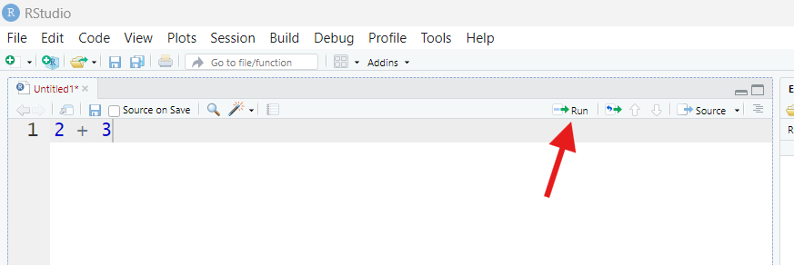

::: objectives
-   Recognize many of the panes found in RStudio and explain what each
    does.
-   Write complete, grammatical R commands.
-   Develop a catalog of R's operators (symbols).
-   Transition from communicating with R at the Console to communicating
    with R via script files.
-   Define what an R object is and explain how to assign a name to one
    (and why you'd want to).
-   List several common R object forms and data types.
-   Define what an R function is and explain how to use (call) one to
    accomplish a specific task.
-   Install and turn on new R packages.
-   Define a working directory.
-   Be able to save and load files.
-   Create an R Project folder.
:::

::: questions
-   Why bother learning R?
-   What is RStudio? Why use it instead of "base R?"
-   What am I looking at when I open RStudio?
-   How do I "talk to" R and ask it to do things?
-   What things can I make R *build*? What things can I make R *do*?
-   How do I speak "grammatically correct" R? What are its rules and
    punctuation marks?
-   How do I perform typical "project management" tasks in R, such as
    creating a project folder, saving and loading files, and managing
    packages?
:::

## Preface

**Important**: This course assumes you have **downloaded** *and*
**installed** the latest version of R ([go to this page and select one
of the three links near the top-center of the page, according to your
operating
system](https://cran.rstudio.com/ "The CRAN website has download links for the latest version of R by operating system")).
I also assume you've **downloaded** *and* **installed** the latest
version of RStudio ([go to this page and scroll down until you see a
table of links. Select the one that matches your operating
system](https://posit.co/download/rstudio-desktop/ "Posit's website contains a set of links to download the latest version of RStudio according to your operating system")).
I[f you've not completed these tasks, stop and do so now]{.underline}.

RStudio is not strictly required for this series of lessons. That said,
while you *can* use R without RStudio, it'd be a lot like trying to
write a novel with quill and ink. You *can* do it, but it's
**definitely** not easier than the available alternative, so why would
you?

As such, this course assumes you're using RStudio and references its
interface throughout. If you choose not to use RStudio, you do so at
your own risk!

By contrast, this course does **not** assume you have *any* experience
with coding in *any* programming language, including R. So, while having
prior exposure to R or another programming language would give you a
head start, it's not expected. Our goal is to take you from "R Zero" to
"R Hero" as quickly but as carefully as possible!

## Why R?

Every R instructor will give a different answer. Presumably, you're here
because you *already* have reasons to learn R (hopefully someone is
forcing you to do it!), and you don't need more. But in case you do,
here are a few:

-   R is one of the most powerful statistics and data science platforms
    in existence. Unlike many others, though, it's free and open-source;
    anyone can add more cool stuff to it at any time.

-   R is HUGE. There are more than 10,000 add-on packages (think
    "expansions" or "sequels" or "fan-fiction") for R that add
    unbelievable volumes of extra features and content, and more come
    out every week (and they're also free!).

-   R has a massive, global community of hundreds of millions of users.
    There are forums, guides, user groups, and more you can tap into to
    level up your R skills.

-   R experience is massively in demand in the current job market.
    Knowing R isn't just cool; it's lucrative!

-   If you need to make publication-quality graphs, or do research
    collaboratively with others, or talk with other programming
    languages, R has got you covered in all these respects and more.

Those are the more "boilerplate" reasons to learn R that just about
anyone could give you, and they're all good! But here are the two
reasons that are most personal to me:

-   R *changed my life*. I mean that literally! Until I got real
    exposure to R in my schooling (as a Ph.D. student), I'd ***never***
    have said I had ***any*** interest in programming or data science,
    let alone an interest in them as a ***career***. Be on the computer
    all day? *Never*! I'm an *ecologist*! I study *plants*–I'm meant to
    be *outside*! But, fast forward ten years, and here I am—I'm a
    quantitative ecologist who uses R *every day*, who can't imagine
    *not* using R every day, and doesn't *want* to imagine not using R
    every day! Thanks to R, I discovered a passion I never would've
    known I had, and I'd have missed out on the best job I could imagine
    having (even better, it turns out, than the job I'd trained for my
    whole professional life for!).

-   R makes me feel *powerful*. This isn't a macho or petty thing; it's
    earnest. I *still* remember the first time I had R do something for
    me that I didn't want to do myself (because it'd have taken me hours
    to do by hand in Microsoft Excel). Putting a computer to work for
    you and having it achieve something awesome for you, perfectly, in a
    fraction of the time is an *incredible* feeling. Try it—you just
    might like it as much as I do!

I really do owe a great deal to R. More than I feel I can easily repay.
But these lessons are my way of trying! Hopefully, you'll leave with
some new reasons to be excited about R and, who knows, maybe learning R
will change your life too!

## How we'll roll

I *firmly* believe that learning a programming language (especially if
you're not a programmer by training and have no interest in becoming
one) needs to be treated the same way as learning a *human* language.
Learning human languages is *hard*! It took you many **years** to learn
your first one, and I bet you still sometimes make mistakes!

Granted, most programming languages (R included) are actually simpler
than most human languages, but not by a huge amount. It's this steep
learning curve that scares off so many from learning R. It's also why,
in my opinion, courses that teach R *plus* something else (such as
statistics) generally fail to establish most students as R
users—learning R *by itself* is already hard *enough*! Pair that with
learning something else too and you have a recipe for disaster.

So, in this set of lessons, I'm *only* going to teach you R. I'm not
going to cover any statistics, or graphic design principles, or data
science best practices. You can pick those skills up *after* you feel
confident with speaking R fluently!

We're also not going to focus (much) on general programming skills or
best practices. This is an Introductory set of lessons, and those are,
for the most part, intermediate topics. You can score those in your
*next* R class!

Instead, my focus will be getting you comfortable and confident with R
(and *only* R). This means, among other things, helping you to:

-   Navigate RStudio.

-   Understand R's *vocabulary* (its nouns and verbs and terminology).

-   Understand R's *grammar* and *syntax* (what symbols to use and when,
    what is and isn't allowed, and what a correct "sentence" in R looks
    like).

-   Work with *data* within R (R, as a programming language, is
    *designed* around data work—much more so than other languages like
    Python. So, I'll assume you're here because you want to work with
    data!).

And I'm going to teach you all of this stuff one baby step at a time.
Speaking of which...

## (Section #1) Baby steps

When you started to learn your first human language, you began by simply
acting and observing what happened. You accumulated bits of
understanding one by one like this until they started to fit together.

We're going to take a similar approach: In this set of lessons, we're
often going to just *do* something and see what happens. Then, we'll
step back and discuss why it happens. Each time we do this, you'll be
one step closer to being not just someone who *uses* R but someone who
*understands* R!

The first thing I want you to do is find a panel called the
"**Console**" in RStudio. It's often in the lower-left portion of your
screen (but it could be somewhere else, and when you first open RStudio,
it might be taking up the entire left-hand side of your screen).


You will know you've found the Console if you see a `>` symbol at the
bottom and, when you click near it, a **cursor** (a blinking vertical
line) appears next to the `>`.

Click near the `>` to receive a cursor. Then, type exactly this:


``` r
2 + 3
```

Then, hit enter (or return) on your keyboard. What happens?

You should receive something looking like this:


``` output
[1] 5
```

We can infer that R took the values `2` and `3` and added them to get
`5` because that's what R sent back to us. So, that means `+` is the
symbol (programmers would call it an **operator**) that R uses for
"add."

We've written our first R "sentence!" In programming, a complete,
functional sentence is called a **command** because, generally, it is us
*commanding* the computer to do something—here, add two values.

::: challenge
Next, type exactly `2+3` into the Console and hit enter. Then, type
exactly `2+ 3` and hit enter. What happens in each case? What does this
tell us?

::: solution
Nothing new happens, hopefully! We should get `5` again both times.


``` r
2+3
```

``` output
[1] 5
```

``` r
2+ 3
```

``` output
[1] 5
```

This tells us our first R grammar rule (or "non-rule")—[*spaces*
(generally) don't matter in R]{.underline}. Whether we put spaces in
between parts in our commands or not, R will run (or **execute**) them
the same way.

So, what good are spaces, then? [Spaces may not help *R* read our
commands, but they do help *humans* read them]{.underline}. Since you
are a human (I assume!), it will probably help *you* to read commands
more easily to separate their bits with spaces, and that's what I'll do
throughout this lesson. Just know that you don't *need* them if you'd
prefer to skip them, and they *don't* convey any meaning.
:::
:::

### Math: The universal language

Next, I want you to type and run the following three commands at the
Console (hit enter between each):


``` r
2 - 3
2 * 3
2 / 3
```

What do you get? What does that tell us?

Here's what you should have observed:


``` output
[1] -1
```

``` output
[1] 6
```

``` output
[1] 0.6666667
```

What that must mean is that `-`, `*`, and `/` are the R **operators**
for subtraction, multiplication, and division, respectively.

[If nothing else, R is a massively competent (if over-powerful and
over-complicated) calculator]{.underline}, capable of doing pretty much
*any* math you can think of! If you wanted to, you could use it solely
for this purpose.

::: challenge
Next, try typing and running exactly `(2 + 3) * 5`. Then, try typing and
running exactly `2^2 + 3`. What is happening in each of these cases and
why, do you think?

::: solution
In the first case, you'll get `25` (and not 17, as you might or might
not have expected!). That's because parentheses are R's **operators**
for "*order of operations*." Things *inside* parentheses will happen
*before* things *outside* parentheses when it comes to math.

So, `2` and `3` are added *before* any multiplication occurs (try taking
the parentheses to confirm that R's behavior would change).

In the second case, you'll get back `7`, as though `2^2` is really `4`
somehow. This is because the caret operator `^` is used for *exponents*
in R. So, `2` gets raised to the power of `2` before any addition
occurs.

These examples show us that, if you learned about something in your math
classes, you can do it in R!
:::
:::

So far, we've seen what R will do if given *complete* **commands**. What
happens if our command is *incomplete*?

At the Console, type and run exactly this:


``` r
2 +
```

What happens or changes? What do you think R is trying to communicate to
you?

Your Console should now look something like this:


R has replaced the **ready prompt** `>` we normally see in the Console
with a `+` instead. This is R's **waiting prompt**, i.e., it's waiting
for us to finish the previous command.

If we were to type `3` and hit enter from here, we should see R return
its answer and then present the **ready prompt** again.

::: callout
If you ever can't figure out how to finish a command and are "stuck" on
the waiting prompt, hit the "Esc" key on your keyboard *while your
cursor is active in the Console*. This will clear the current command
and restore the ready prompt, though you will lose whatever command you
had started.
:::

### No need to console me

By now, maybe you recognize what the **Console** is: It's like a "chat
window" through which we talk to R and R talks back. If we wanted, we
could interact with R *entirely* through the Console (and, in fact,
"base R" is more or less *just* a Console!).

However, we *probably* shouldn't. Why not? For one thing, [the Console
is an impermanent record of our "chats" with R]{.underline}. If we close
R, the contents of the Console are deleted. If we'd done important work,
that work would get lost!

Sure, we *could* copy-paste the Consoles' contents into another
document, but that'd be a pain, and we might forget to do it sometimes.
Plus, the Console actually has limited space—if we run out of it, R will
delete older stuff to make room. So, we *still* might lose important
work that way.

[In programming, the goal should be to *never* lose important
work!]{.underline} And the Console just isn't designed to prevent work
loss. Thankfully, though, we have a better option...

## Staying on-script

We're going to open something called a **script file** (or "script" for
short). To do this, go to "File" at the top of your RStudio window,
select "New File," then select "R Script File." Alternatively, you can
click the button in the top-left corner of the RStudio window that looks
like a piece of paper with a green plus sign, then select "R Script."


Either way, you should now see a screen that looks like this:


RStudio is now displaying a blank script file. If you're new to
programming, a "script file" might sound scary, but [a script file is
just a text file]{.underline}, like one created in Microsoft Word or
Google Docs, but even more basic in the sense that you can't even format
the text (such as making it bold or changing its size).

Specifically, it's a text file in which we can write **commands** we are
*considering* giving over to R eventually, so it's like writing
preparatory notes in a notepad. Script files let us keep a permanent
record of the commands we are crafting, plus whatever else we're
thinking about, so we can reference those notes in the future.

You might be wondering: "Why not just have a Word file open with my code
in it, then? Why bother with a *special, basic* text file for that?" The
answer is simple: [In RStudio, script files are "plugged into" R,
allowing us to pass commands from our script **directly** to the Console
**without** any copy-pasting]{.underline}.

Let's see that. In your **script file**, type exactly the following,
then hit enter on your keyboard:


``` r
2 + 3
```

What happens in the *Console*?

The answer, you should discover, is nothing! Nothing new should be
there. In our script, meanwhile, our cursor will have moved to a new
line, just like in would have in a word processor like Word. This shows
us that [the "enter" key puts our cursor on a new line in a script file;
it *doesn't* trigger code to run, like it would at the
Console]{.underline}.

Put your cursor back on the same line as `2 + 3` by clicking anywhere on
that line, then find the button that says "Run" in the upper-right
corner of your Script pane (it looks like a piece of paper with a green
arrow pointing right).



Once you find that button, click it. What happens?

This time, we can observe our command and R's response in the Console,
as though we'd typed and ran it there (but we *didn't*!). When we hit
the "Run" button, R copied our command from our script file to the
Console for us, then ran it.

This is the magic of script files—they help us keep a permanent record
of our code, but they also give us a place to "tinker" because we get to
decide if and when we run any code we put there. Half the code in a
script file could be "experimental junk" and that's ok, so long as that
doesn't get confusing for you!

Plus, when our commands start getting longer (and they will!), it'll be
easier to format them for human readability in a script file than at the
Console.

So, relatively few R users code exclusively at the Console anymore.
Instead, most code in script files and let R "teleport" the relevant
commands to the Console when they're ready. As such, we encourage you to
code entirely from a script for the rest of these lessons.

### Leaving a legacy

You may have noticed that, when you typed in your script file for the
first time, its name (found in the tab above it), turned red and got an
asterisk next to it:


This means our script file has changed since the last time it was saved.
To fix that, go to "File", then select "Save." Or you can hit Control+S
on your keyboard, or hit the blue "disk" button in the top-left corner
of the Script pane (which is just below the arrow in the picture above).

If your script file already has a name, doing any of the above will save
the file. If it doesn't have a name yet, we'll be prompted to give our
file a name when we go to save it. [R script files will get the file
extension ".R" to indicate that they are "special" and not just regular
old text files.]

::: callout
[One of programming's cardinal rules is "save often!"]{.underline} Your
script file is only a permanent record of your work if you remember to
save it!
:::

::: challenge
Script files are great because they are a permanent record of the R code
you're writing. But not everything in a script file needs to be *code*.

Type and run the following exactly from a script file: `# 2 + 5`.

What happens in the Console? What does this tell us?

::: solution
R will show your command, but it won't produce any *output*. That is
because `#` is R's **comment operator**. A comment is considered
anything that follows a `#` in the same line of code. [When R encounters
a comment while executing code, it skips it.]{.underline}

This means that, by writing comments, you can leave yourself notes that
R will ignore when executing commands, even if these comments are next
to commands!
:::
:::

::: callout
Writing comments that explain your code (what it's for, how it works,
what it requires, *etc*.) is called **annotating**. [Annotating your
code is a **really** good idea]{.underline}! It helps you and others
understand your code, which is *particularly* valuable when you're
learning. As we proceed through this set of lessons, I **highly**
recommend that you leave as many helpful comments for yourself behind as
you can—it'll make your script a learning resource in addition to a
permanent record of what you've done!
:::

## (Section #2) Objects of our affection

At this point, we know several fundamental R concepts:

-   Spaces don't (generally) matter.

-   Line breaks (made with the enter key) *do* matter, if they make a
    command *incomplete*.

-   Commands can be "complete" or "incomplete." If we run an incomplete
    command, R expects us to finish it before moving on.

-   R has a number of symbols (**operators**) that have meanings, such
    as `#` and `*`.

-   R will ignore **comments** (anything on a line following a `#`), and
    **annotating** our code with comments is a good practice.

-   Writing our code in **script files** is also a good practice.

We've taken our first steps towards R fluency! But, just as it would be
for a human language, the next step we must take is a big one: We need
to start learning R's *nouns*.

### Assignment and our environment

In your script, type and run `5` [besides hitting the "Run" button, you
can press control/command+enter on your keyboard to run commands from a
script file].


``` r
5
```

``` output
[1] 5
```

R repeats `5` back to us. Why? Because we didn't tell R to *do* anything
with `5`; it could only assume we wanted `5` returned back to us.

**Important:** This is, in a nutshell, how our relationship with R
always works—it assumes we are giving **commands** ("orders") and that
we will provide the **inputs** R should use to carry out those "orders"
(in this case, the input we gave was `5`). R will then *execute* those
commands by doing some work and returning some **outputs** (in this
case, the output was also `5`).

In broad strokes, any single input we give R or any single output we
receive from R is a "noun" in the R language—these nouns are called
**objects** (or, sometimes, **variables**).

The `5`s we've just seen are "temporary" or *unnamed* objects. They
exist only as long as it takes R to work with or produce them. After
that, R promptly forgets they exist (it's like R has *extreme*
short-term memory loss!).

However, if we don't want that forgetting to happen, we can prevent it.
In your script, type and run the following:


``` r
x = 5
```

What happens in the Console this time? Do you notice anything else
different or new in your RStudio window?

At first, it might seem like nothing has happened; R won't report
anything back to us in the Console besides our command, just like when
we ran a comment.

However, find the pane labeled "Environment" (it's most likely to be in
the upper-right portion of the RStudio window, though it could be
somewhere else).


Before now, this pane may have said "Environment is empty." Now, it
should instead list something with the Name `x`, a Value of `5`, a
Length of `1`, and a Type of `numeric`. What's all this about??

Let's experiment. In your script, type and run the following:


``` r
x + 4
```

R should return:


``` output
[1] 9
```

This is interesting. In English, adding `4` to a letter is non-sensical.
However, R not only does it, but we get a very specific answer back, in
this case. It's as if R now knows, when it sees `x`, that what it should
think is `5`. And `5 + 4` is `9`.

**Important:** That's exactly what's happening. Earlier, with our
`x = 5` command, we effectively taught R a new "word," `x`, by
**assigning** a value of `5` to a new **object** by that name (`=` is
R's **assignment operator**). Now, whenever R sees `x`, it assumes we
mean `5` and will substitute `5` in for `x` *before* doing any further
operations.

`x` is now something called a **named object**. When we create named
objects, they go into something called our **Global Environment** (or
"environment" for short).

To understand what our *environment* is, I want you to imagine that,
when you start up R, it creates a completely empty room. As we create or
load objects and assign them names, R starts filling this room with bins
and shelves and crates full of our stuff, each labeled with the names we
gave those things when we had R create them.

At any time, we can view this "room" and all the named objects in it:
That's what RStudio's **Environment pane** is for.

Once we have named an object, that object will exist in our Environment
and will be recognized by R as a "word" until we either:

-   Remove it, which we could do using the `rm()` function (more on
    functions later) or by using the "clear objects" button in the
    Environment pane (it looks like a little broom).

-   We close R ([R erases our environment every time we exit, by
    default]{.underline}).

The fact that our entire environment is lost every time you close R may
sound undesirable (and, when you're learning, it often is), but the
alternative would be your "room" (environment) just getting ever more
clogged with stuff. That would create problems too!

::: callout
Besides, the point of working in a script is that we can keep all the
code we need to *remake* all the objects we need, so we should never be
starting over from scratch anyhow!
:::

Instead of looking at your environment, if you ever want to see the
contents of an object, you can have R show you the contents by asking it
to *print* the contents in the Console. You can do this using the
`print()` function or simply by typing only the object's name and
hitting "Run:"


``` r
print(x)
```

``` output
[1] 5
```

``` r
x
```

``` output
[1] 5
```

### Naming rules and conventions

Let's talk about *naming objects* (*assignment*) in more detail.

In your script file, type the following, but don't run it yet:


``` r
y = 8 + 5
```

Try to guess what R will do when you run this command. Try it and see if
you were right!

After you run the command, you should see `y` appear in your
environment. What "Value" does it have? Is that what you thought it
would be?


``` r
y = 8 + 5
y
```

``` output
[1] 13
```

We get back a Value of `13` for `y`. What this tells us is that, when R
executed our command, it did so in a particular way:

1.  It *first* did the stuff we've asked it to do on the right-hand side
    of the `=` operator (it added two numbers).

2.  *Then* it created an object called `y` that contained the *result*
    of that operation. This is why our `y` has a value of `13` and not
    `8 + 5`.

This may seem strange, but, [at least when it comes to assignment, R
actually *kind of* reads from right to left]{.underline} like this. It
assumes we want to store the *result* of operations in our objects and
not the operations themselves.

Time for our next experiment. Type and run the following:


``` r
y = 100
```

What happens to `y`, according to your Environment pane? Is that what
you expected?


``` r
y
```

``` output
[1] 100
```

If you look in your environment, there will still be one (and only one)
object named `y`, but it's Value will have changed from `13` to `100`.
This demonstrates two things about how assignment works in R:

-   [Object names in R must be unique]{.underline}—you can have only one
    object by a given name at a time.

-   If you try to provide the same name to two different objects, you
    will *overwrite* the first object by that name with the second
    object, and the first will be lost.

Next, type and run the following:


``` r
Y = 47
```

What does the Environment pane report now? Is that what you expected?


``` r
Y
```

``` output
[1] 47
```

You should see a new object called `Y` appear in your environment. What
gives—didn't I just say that names had to be unique?

Well, they do have to be! But [R is a case-sensitive programming
language.]{.underline} This means that, to R, Y is different from y. So,
`Y` and `y` are completely different "words," as far as R is concerned!

::: callout
[For beginning programmers, forgetting about case sensitivity is the
number-one source of errors and frustration!]{.underline} If you
concentrate on learning few other things from these lessons, concentrate
on learning that you can't be "casual" about upper- versus lowercase
letters when you program!
:::

Let's continue experimenting. Type and run the following two commands:


``` r
z1 = 2
1z = 4
```

What happens in each instance, and what does each instance teach us?

The first command runs fine—we get a new object named `z1` in our
environment. This teaches us that [including numbers in object names in
R is ok]{.underline}.

#### I am error

However, the second command does *not* result in a new object called
`1z`. Instead, R returns an **error** message in the Console. Uh oh!
[Error messages are signs that we've done something
incorrectly]{.underline}, at least from R's point of view.

To be frank, R's error messages are generally *profoundly* unhelpful
when you're still learning the language. This one, for example, says
`Error: unexpected symbol in "1z"` . What the heck does that even mean?!

Well, it's just R's way of saying that while numbers *are* allowed in
object names, your [object names can't *start* with
numbers]{.underline}. So, the `1` at the beginning is an "unexpected
symbol."

When you get error messages in R, you will probably get frustrated
because you will know you did *something* wrong but you may not be able
to understand **what** that something was. Just know that this situation
will improve with time.

::: callout
In the meantime, though, here are two things you should *always* try
when you get an R error message you don't understand:

1.  **Check for typos**. [95% of R error messages are just R's way of
    saying "I'm not 100% sure that I know which object(s) you're
    referring to."]{.underline} For example, as we saw earlier,
    `variable1` would be a different word than `Variable1` or even
    `varible1`, so start troubleshooting by making sure you didn't mix
    up capital and lowercase letters.

2.  Try Googling the exact error message you got. It's very likely that
    one of the first few results will have a reasonably understandable
    explanation of what may cause that particular error. (An even better
    option these days might be asking a program like ChatGPT to explain
    the error to you, while providing the code that caused it!)
:::

As you use R, you will also encounter **warnings**. Warnings are also
messages that R will print in the Console when you run certain commands.
It's important to stress, though, that [warnings are **not**
errors]{.underline}. [An error means R knew it couldn't perform the
operation you asked it to, so it gave up; a warning means R *did*
perform *an* operation, but it's unsure if it did the *right* thing, and
it wants you to check its work.]{.underline}

A quick way to produce a warning, just so we can see what one looks
like, is to try to do "illogical math," like taking the log of a
negative number:


``` r
log(-1)
```

``` warning
Warning in log(-1): NaNs produced
```

``` output
[1] NaN
```

Here, R did *something*, but it might not have been the something we
*wanted* [`NaN` is a special value meaning "not a number," which is R's
way of saying "the math you just had me do doesn't really make sense!"].

#### Going back to our "room"

Anyhow, back to objects: Let's try running the following two commands:


``` r
object_1 = 50
object 2 = 45
```

What happens in each instance, and what does each teach us?

The first command runs fine, and we see `object_1` appear in our
environment. This tells us that *some* symbols must be allowed in R
object names. Specifically, [the two allowable symbols in object names
are underscores `_` and periods `.`]{.underline}.

The second command returns an **error**, though. This tells us that
[spaces are **not** allowed in R object names.]{.underline}

Here's the last experiment I want us to run in this section. Type the
following commands, consider what each one will do, then run them:


``` r
x = 10
y = 2
z = x * y
y = -1000
z
```

``` output
[1] 20
```

What is the object `z`'s Value when these five commands have been run?
What did you *expect* it to be? What does this teach us?

Here, we created an object called `z` in the third command by using two
other objects, `x` and `y`. We then *overwrote* the previous `y` with a
new value of `-1000`. However, `z` is still equal to `20`, just as it
was before we overwrote `y`:


``` r
z
```

``` output
[1] 20
```

**Important:** This example shows us that, [in R, making objects using
other objects **doesn't** "link" those objects together]{.underline}.
That is, just because we made `z` using `y` doesn't mean `z` and `y` are
now "linked" and `z` will automatically change when `y` does. If we
change `y` and want `z` to change too, we have to *re-run* any commands
used to create `z`. [This actually makes R somewhat different than many
other programming languages (*e.g.* JavaScript), wherein objects are
sometimes linked together.]

#### What's in a name?

That's pretty much everything we can/can't do when it comes to naming
objects in R! Which brings us to what we *should/shouldn't* do.

[In programming, it's good practice to adopt a **naming
convention**.]{.underline} This means that, whenever you name objects,
you do it systematically by using the same approach every time.

Why? Well, among other reasons, it:

1.  Prevents mistakes and saves time because we'll be less likely to
    mistype, mix up, or forget names.

2.  Makes your code more readable, digestible, and sharable.

[Our goal should be to create variable names that are unique,
descriptive, and not easily confused with one another but, at the same
time, also aren't a chore to type or inconsistent in their usage of
symbols, numbers, or upper- vs. lowercase letters.]{.underline}

So, by this logic, `y` is a *terrible* object name! It doesn't tell us
anything about what this object is storing, so we're *very* likely to
accidentally overwrite it or confuse it with other objects.

However, `rainfall_Amounts_in_centimetersPerYear.2018x` is also a
*terrible* object name. Sure, it's descriptive and unique, and we
wouldn't easily mix it up with any other object, but what a mess that
would be to type! And with all the inconsistencies in symbols and
capital letters, we'd get it subtly wrong a lot, which might lead to a
lot of mistakes and frustration.

Thus, a naming convention might include rules like the following:

-   All object names consist of two to three human "words" (or
    abbreviations).

-   All are either in all caps `LIKETHIS` or all lowercase `likethis`,
    or if capital letters are used at all, they are only used in
    specific, predictable circumstances (such as for proper nouns).

-   Words are somehow separated to make the names easier to read. Some
    options here include so-called **snake_case**, where words are
    separated by underscores, **dot.case**, which is the same using
    periods, or **camelCase**, where capital letters are used right
    after where spaces should have been.

-   Numbers are only used when they convey meaning (such as in a year
    like 2008) and not used to "serially number" variables like `data1`,
    `data2` , `data3`, *etc.* (such names are too easy to confuse and
    aren't really descriptive).

-   Abbreviations are only used when they're well-known, such as `wgt`
    for "weight."

Making mistakes in *any* language is frustrating, but they can be even
more frustrating when you're learning a programming language! It may
seem like a hassle, but using a naming convention will prevent you from
making a *lot* of frustrating mistakes!

::: discussion
Pause here and jot down several rules your own personal **naming
convention** will follow.

::: solution
There are no "right answers" here. Instead, I'll give you a couple of
rules from my own personal naming convention.

First, generally speaking, column names in data sets are written in
ALLCAPS. If I need to separate words, I do so using underscores.

Meanwhile, I only use numbers at the ends of names, and I never use
periods.

Lastly, I use snake_case for function names (more on functions in a
bit), but I use camelCase for regular object names.
:::
:::

One last thing about assignment: R actually has a *second* assignment
operator, called the arrow `<-`. If you use this in place of the `=`
operator in an assignment command, it'll work exactly the same way! In
fact, `<-` is the original assignment operator; the `=` operator was
added more recently (to make R a bit more like many other programming
languages).

This is why, in help documents and tutorials, you will more often see
`<-`—it's what a lot of long-time R users are used to using. Also,
technically, `=` is used for not one but several other tasks in R (we'll
see some of these!), so some find it confusing to use it for assignment
also.

However, I don't *personally* find it confusing to use `=`. Plus, `=` is
one fewer keystroke, and I'm lazy! So, throughout, I will use `=`. But
it's important to recognize `<-` for when you try to read R code from
other sources.

### Just typical

Earlier, we saw that, when we made our object called `x` and assigned it
`5` as a value, R reported its Type as `numeric` in our environment.
What was that all about?

Computers, when they store objects in their "heads," have particular
ways of doing so, usually based on how detailed the info being stored is
and what this info might later be used for.

*Numeric data* (numbers that can have decimals) are actually quite
detailed, and they can be used for math. As such, R stores these data in
a specific way that acknowledges these two facts.

Let's see what other ways of storing data exist in R. In your script
file, type and run the following two commands, paying close attention to
punctuation and capitalization:


``` r
wordString = "I'm words"
logicalVal = FALSE
```

You should get two new objects in your environment. The first should
have a Type of `character`. This is how R stores *text data*.

::: discussion
You'll note that we had to wrap our text data in quotes **operators**
`" "` in the code above. [Text data are *always* quoted in
R]{.underline} in this way. Why? What would happen if we tried to run
`x = data` instead of `x = "data"`, for example?

::: solution
As we have seen, [R thinks unquoted text must be an object
name]{.underline}. So, to make it clear to R that we are writing a chunk
of text and not an object name, we quote it.

In our hypothetical example here, if we tried to run `x = "data"`, we'd
store the value of `"data"` in an object called `x`. If, instead, we ran
`x = data`, R would go looking for an object by the name of `data`
instead. If one exists, it would store a copy of it inside an object
called `x`. But, if no such object existed, R would instead return an
error.

Forgetting to quote text is an *extremely* common mistake when learning
R, so pay close attention to when I use quotes in this lesson!
:::
:::

Text data can also be quite detailed but they *can't* be used for math,
unlike numeric data, so it makes sense R uses a different Type to store
text.

The second object we made above (`logicalVal`) has a Type of `logical`.
Logical data are simply "Yes/No" data. Instead of storing these data as
"Yes" or "No," though, a computer stores them as `TRUE` or `FALSE` (or,
behind the scenes, as `1` or `0`) instead because those values makes
more sense to a computer. These data are not very detailed, compared to
the other two we've seen, so it makes sense there's yet another type for
storing them. We'll see what logical data are for and where they come
from a bit later.

::: challenge
Let's check our understanding. Try running the following two commands:


``` r
7 + 4
"7" + 4
```

Why does the first command work but the second command fails?

::: solution
By putting quotes around `7` in the second command, we have told R that
`7` is really text, not a number. R knows it shouldn't do math with
text, even when that text looks like a number, so it rejects our attempt
to do so.

This shows us that types matter! They influence not only how much space
in our "room" our objects take up, but they also regulate what R will
and won't do with them.
:::
:::

There are several more Types of objects we need to meet, but to do so,
we need to take our next big step: we need to learn about R's *verbs*.

## (Section #3) Function junction

Earlier, I said that our relationship with R is one in which we provide
R with inputs (**objects**) and **commands** ("orders") and it responds
by doing things (**operations**) and producing **outputs** (more
objects). But how does R "*do* things?"

Just as with a human language, when we're talking actions, we're talking
*verbs*. R's verbs are called **functions**. Functions are bundles of
one (or more) pre-programmed commands R will perform using whatever
inputs it's given.

We've actually met an (unusual) R function already: `+`. This symbol
tells R to add two values (those on either side of it). So, a command
like `2 + 2` is really a bundling together of our inputs (`2` and `2`)
and an R verb ("add").

Most R verbs take a different form, though. In your script, type and run
the following:


``` r
sum(2, 5)
```

What did R do? What does this teach us?

We've just used our first "normal" R function! `sum()` is R's more
conventional and general verb for "add this stuff," and it is a good
example of how functions generally work in R:

-   Every function has a name that goes first, such as `sum`.

-   Then, every function gets a set of parentheses `( )`. [Yes, this is
    a second, *different* use of parentheses in R!]

-   Then, every function is given any **inputs** inside of its
    parentheses. Here, the inputs we gave were `2` and `5`. Because we
    wanted to provide two inputs and not just one, we had to separate
    them into distinct "slots" using commas `,`.

If we omit or mess up *any* of those three parts of a function, we might
get a different result than we expect, or we might trigger an error!
Just like any language, [R has **firm** rules, and if we don't follow
them, we won't get the outcome we want]{.underline}.

I'll pause here to note that using a function in programming is referred
to as *calling* that function, as if it's a friend you're calling on the
phone. So, we might say that the command `sum(2, 5)` included a *call*
to the `sum()` function.

::: challenge
As we've already seen, R is a powerful calculator. As such, it has many
functions for doing math, such as `log()`, `sqrt()`, `abs()`, `sin()`,
and `round()`. Try each of these out and see what they do!

::: solution
`log()` takes the logarithm of a number:


``` r
log(45)
```

``` output
[1] 3.806662
```

`sqrt()` takes the square root of a number:


``` r
sqrt(65)
```

``` output
[1] 8.062258
```

`abs()` determines the absolute value of a number:


``` r
abs(-64)
```

``` output
[1] 64
```

`sin()` calculates the sine of a value:


``` r
sin(80)
```

``` output
[1] -0.9938887
```

If you don't remember trigonometry, though, that might not mean much to
you!

`round()` rounds a number to the nearest whole number:


``` r
round(4.24)
```

``` output
[1] 4
```
:::
:::

### Pro to types

R also has several functions designed for making objects, including
object types we haven't met yet! Type and run the following command:


``` r
justANumber = as.integer(42.4)
```

This command produces an object of Type `integer`, which is like a
number except it can't have decimals, so any data after any decimal
point is lost. That is why this new object's Value is `42`, not `42.2`.

Next, type and run the following:


``` r
numberSet = c(3, 4, 5)
```

This produces an object containing three Values (`3`, `4`, and `5`) and
is of Type `numeric`, so it maybe doesn't look all that special at
first.

However, what the `c()` function does is combine (or *concatenate*)
separate values into a unified thing called a **vector**. [A vector is a
set of values grouped together into one object.]{.underline} We can
confirm R thinks `numberSet` is a vector-type object by running the
following command:


``` r
is.vector(numberSet)
```

``` output
[1] TRUE
```

To which R responds `TRUE` (which means "Yes" in R-speak).

If a single value (also called a *scalar*) is like a single point in
space (it has "zero dimensions"), then a vector is like a line in space
(it has "one dimension)". So, in fact, our vector *is* different than
any other object we've made up til now!

One way that vectors are different from other objects we've seen is that
many functions in R are *vectorized*, meaning they operate on every
entry in a vector separately.

To see what I mean, type and run the following:


``` r
numberSet - 3
```

``` output
[1] 0 1 2
```

R returns a vector of the same length as our `numberSet` vector, but
this one contains the values `0`, `1`, and `2`, which are the values
you'd get when you subtracted `3` from each entry in `numberSet`
separately. That's vectorization in action!

Some functions can take or even expect vectors as their *inputs*. A good
example of the latter is `mean()`, which takes the average of all the
values it's given as inputs. Yes, you *could* take the average of just
one value, but that'd be pretty pointless! So it makes sense that this
function expects to be given a vector, not a scalar, as an input.

Let's try it. Type and run:


``` r
mean(numberSet)
```

``` output
[1] 4
```

Vectors can hold non-numeric values too. For example, type and run the
following, watching the punctuation and capitalization carefully:


``` r
charSet = c("A", "B", "B", "C")
```

This will create a *character vector* this time. If we check our
environment, we will notice it has a Length of `4`, due to its four
entries.

#### Timeout for factors

We can use this vector to demonstrate another, special R object Type.
Type and run:


``` r
factorSet = as.factor(charSet)
```

Now, if you check your environment, you'll see we've made something of
Type `factor`. What the heck is that?

[Factors are R's special way of storing **categorical
data**]{.underline} (data that belong to different, discrete categories
that cannot be represented meaningfully with numbers, such as "male",
"female", and "neuter").

To create a factor, R:

1.  Figures out all the unique categories that exist (here, that's `A`,
    `B`, and `C`).

2.  It figures out what the "first" category should be. By default, it
    does this alphanumerically, so `A` is "first."

3.  It makes each category, starting with the first, a "level" and
    assigns it an integer starting at `1`. So, `A` becomes level `1`,
    `B` becomes level `2`, and so on.

This means that, under the hood, R is actually now storing these text
data as numbers, not text. However, it is *also* storing what category
goes with what level number. That way, at any time, it can "translate"
between the number values it's storing and the text values in the
original data. This means that, whenever we need to treat these data as
text, R can do that, and whenever we need it to treat these data as
"numbers," R can do that too!

We can see these numbers R is storing. To do that, type and run:


``` r
as.numeric(factorSet)
```

``` output
[1] 1 2 2 3
```

This will show that R now thinks of our `A, B, B, C` data as
`1, 2, 2, 3`.

For certain operations, like making graphs, this setup is actually
*very* convenient for R. Part of why R became so beloved by
statisticians was that its factor Type exists!

However, if you think factors are a bit weird, you're right—they are. If
you don't want to use them, you don't have to; they are kind of falling
out of favor these days, truth be told. However, it's important to know
what they are anyhow.

#### 2D or not 2D

Moving on, we have two more types of objects I want us to meet:
**Matrices** and **data frames**. Type (carefully) and run the
following:


``` r
smallMatrix = matrix(c(1, 2, "3", "4"))
```

**Important:** This command demonstrates another fundamental concept:
[In R, you can stuff functions calls inside other function
calls]{.underline}. This is called *nesting*. [When we nest, R will read
our command from the "inside out."]{.underline}

So, here, R *first* creates a vector containing the values `1`, `2`,
`"3"`, and `"4"`. It *then* provides that vector as inputs to the
`matrix()` function, which expects a vector of values that it can
arrange into a matrix.

As such, we don't *have* to stop and name every object we want to use if
we don't want to—we can skip straight to using an unnamed object, if we
aren't going to reuse it later!

However, for a beginner, reading nested code can be tricky. If you'd
prefer, you can always do commands one at a time; it'll take more time
and space, but many find it more readable. For example, here you could
have instead done:


``` r
smallMatrixVec = c(1, 2, "3", "4")
smallMatrix = matrix(smallMatrixVec)
```

To accomplish the same thing in two commands instead of one.

Anyhow, we can see our matrix by typing and running just its name:
`smallMatrix`. When we do that, we see something that looks like this:


``` r
smallMatrix
```

``` output
     [,1]
[1,] "1" 
[2,] "2" 
[3,] "3" 
[4,] "4" 
```

If a vector is a one-dimensional set of values, then [a matrix is a
two-dimensional set of values, arranged in rows and
columns]{.underline}. Here, we created a matrix with one column (marked
at the top with `[,1]`) and four rows (marked along the left side with
`[1,]`, `[2,]`, and so on).

What if we would have rather arranged our input data in some other
configuration, such as in two rows and two columns? We could easily have
done that—type and run:


``` r
smallMatrix = matrix(c(1, 2, "3", "4"), 2)
```

Follow that with `smallMatrix` again to see what we've created. This
time, you'll receive something that looks like this:


``` r
smallMatrix
```

``` output
     [,1] [,2]
[1,] "1"  "3" 
[2,] "2"  "4" 
```

We actually did something **really** cool and important just there, but
we'll come back to it.

::: discussion
Instead, I want you to notice that all the values in our matrix are now
text (they are surrounded by `"`s), even the `1` and `2` we originally
put in as numbers. Why do you think that happens?

::: solution
[Vectors and matrices in R can only hold values of a single
Type]{.underline}. If we try to put multiple value types into one
object, R will change (or *coerce*) the more complex types into the
simpler types. In this case, it turned our numeric data into character
data.

Why does it do this? Well, remember—many operations in R are
*vectorized*, meaning they happen to *all* values in an object
simultaneously and separately. This means we could run a command like
`smallMatrix + 4` to try to add `4` to *all* values in our matrix at
once. This would make sense for our numbers but not for our text!

Rather than even permitting us the opportunity to make mistakes like
that one, R "reduces" all values in an object to the simplest type so
that we never try to do "more" with that object's values than we should
be able to.
:::
:::

Still, you might find *data coercion* annoying sometimes! If so, R has
you covered if you are willing to store your data in a slightly
different object Type. Type and run the following:


``` r
smallDF = data.frame(c(1,2), c("3", "4"))
```

Follow this with `smallDF` to see the result:


``` r
smallDF
```

``` output
  c.1..2. c..3....4..
1       1           3
2       2           4
```

This time, we get an object with the type `data.frame`. This is another
special R object type! [Like a matrix, a data frame is a 2D arrangement
of values]{.underline}, so it has rows and columns (represented a little
differently than those in our matrix).

However, this time, when we look in the Console at our new data frame,
it *looks* like R has done the opposite—it looks like it has turned our
text into numbers!

But, actually, it hasn't. To prove it, we can use the structure
function, `str()`, to look under the hood at `smallDF`. Type and run the
following: `str(smallDF)`.


``` r
str(smallDF)
```

You should get output that looks like this:


``` output
'data.frame':	2 obs. of  2 variables:
 $ c.1..2.    : num  1 2
 $ c..3....4..: chr  "3" "4"
```

On the left-hand side is a list of all the columns in our data frame and
what their names are (here, those are weird because of how we made our
data frame!).

On the right-hand side is a list of the Types of each column and the
first few values in each one. Here, we see that, actually, the first
column is of Type `numeric` ("num" for short) and the second is still of
Type `character` ("chr" for short).

This is the special thing about data frames and what makes them so
useful—[different columns in a data frame are allowed to be of different
Types]{.underline}. This means you can have categorical *and*
quantitative data in the same object, for example.

However, note that [every column can still only contain a single data
type]{.underline}, so you can't mix text and numbers in the same column
without coercion happening.

Because R is used so heavily for data manipulation and analysis, and
because data typically exist in a 2D "rectangle," with rows and columns,
most R users will interact with data frames *a lot*. We'll circle back
to learning about data frames in later lessons.

One other object type regular R users will encounter often is a
**list**. Lists are useful but also quite weird; we're not going to
cover them in this set of lessons, but, if you're curious, [you can
check out this resource to become better acquainted with them when
you're
ready](https://rstudio.github.io/r-manuals/r-intro/Lists-and-data-frames.html "Lists are a useful object type but they are tricky to learn and teach, so we're going to skip them for now unless you want to use this other resource to learn about them now").

### For argument's sake

We're about to discuss something about how functions work in R (and most
other programming languages) that confused me for the first four years I
was learning R (true story!).

It *didn't* confuse me because it is all that complicated, though—it
confused me simply because it was never explained to me in a way I
understood! Let's ensure you that have a different learning experience
than the one I had.

Earlier, I noted that functions get inputs inside their parentheses
`( )` and, if we are giving them multiple inputs, we separate those from
each other using commas `,`. This helps R know when one input is done
and a new one is beginning (this is important because vectors or whole
data frames might be just a single "input!").

In separating inputs in this way, it's as if we are creating little
"slots" for our inputs to go in. These "slots" are actually formal
things. When a programmer creates a function, they need to ensure that
the user knows what inputs they are expected to provide (so we're not
providing illogical types of inputs or an inadequate number of them).
Additionally, R needs to know what it's supposed to do with those
inputs, so it needs to be able to keep our inputs straight.

The programmer solves these programs by designing each function to have
a certain number of input slots (these are formally called
**parameters**). Each slot is meant to receive a specific type of input
(formally called an **argument**), and each slot has its own *name* so R
knows which input (*argument*) goes with which slot (*parameter*).

This will make more much sense with an example, I promise! Let's
re-consider the function `round()`. Type and run the following:


``` r
round(4.243)
```

``` output
[1] 4
```

We get back the answer `4`. So, by default, `round()` is rounding our
input to the nearest whole number.

But what if we didn't want to round out input quite that aggressively?
What if we instead just wanted to round it to the nearest tenth?

Well, `round()`, like many R functions, has more than one input slot
(*parameter*), meaning that we can give it not only numbers to round but
instructions on how to do so. Its first slot (named `x`) is the
number(s) to be rounded—that's the slot we've already been engaging
with.

Its second slot (named `digits`), though, can receive a number
corresponding to the number of decimal places to round our inputs to. By
default, this *parameter* is pre-programmed to equal `0` (i.e., don't
round to any decimal place; just give back a whole number).

However, we can change that default value if we want. Type and run the
following:


``` r
round(4.243, 1)
```

``` output
[1] 4.2
```

What happens? By placing a `1` in the second slot, we've asked R to
round our first input to the first decimal place instead.

::: challenge
We can learn even more about how functions work by experimenting with
this example. Type the following into your script, but don't run it just
yet:


``` r
round(1, 4.243)
```

Consider: This is the exact same set of inputs we gave `round()` as in
last example, just flip-flopped. Do you think you will get the same
answer when you run this, or a different one? Why? Try it and observe
what you get.

::: solution

``` r
round(1, 4.243)
```

``` output
[1] 1
```

You get back `1`, which is not the same answer as we got before. Why?

What we did here is essentially ask R to round `1` to `4.243` decimal
places. Since that doesn't really make sense, R assumes we meant "round
to 4 decimal places." However, since `1` is already fully rounded,
there's no need to round it further.
:::
:::

The experiment in the exercise above shows us that, [for R functions,
the order of inputs matters]{.underline}. That is, specific slots for
inputs are in specific places inside a function's parentheses, and you
can't just put inputs into functions randomly! [This is what I was doing
for most of my first four years of using R! Oof.]

...Or maybe you *can* put inputs in "randomly," if you're a little more
thoughtful about it! Try this instead:


``` r
round(digits = 1, x = 4.243)
```

Do you get the same answer as the first time, or as the second time?

This time, you should get back `4.2`, like we did the first time.


``` output
[1] 4.2
```

This is because we have formally matched up our inputs (the things we're
placing to the right of the `=`s) to the specific slots we want them to
go into by using those slots' names (the things we're placing to the
left of the `=`s).

So, even though we provided the inputs in the "wrong" order, as far as
the slots inside `round()` were programmed, we gave R enough information
that it could reorder them for us *before* doing any work on them.

**Important:** As such, when in doubt, [always "name" your function
inputs]{.underline} in this way, and you'll never have to fear placing
them into the wrong slots!

Note that we've just seen a different use for the `=` operator than the
other one we've seen so far. Until now, we've only used `=` to create
new *named* *objects* (**assignment**). Here, we're matching up inputs
to the corresponding input slots using pre-defined names for those
slots—we're not *creating* anything.

I mentioned earlier that the `=` symbol has multiple different uses in
R, and this is one of them.

::: challenge
I also mentioned that some may find these different purposes for `=` to
be confusing, especially while they are learning. Let's see if you might
be one of those people. Consider the following command:


``` r
newVar = round(x = 4.243, digits = 4)
```

Can you explain what this command is asking R to do?

::: solution
First, note that the above command is the same as this one:


``` r
newVar <- round(x = 4.243, digits = 4)
```

We are asking R to create a new *named object* called `newVar`, and that
new object will contain the result of a *call* to `round()`. This
assignment task is being facilitated by the `=` operator.

For that call, we've provided two inputs, an `x` (aka a value to round)
and a number of `digits` to round that value to. We've ensured R knows
which input is which by associating those inputs with the names of the
slots we want them to go into. This input-slot matching process is being
facilitated by use of the `=` operator also, but it's fulfilling a
different role here than one of *assignment*.

If it feels like it would be harder to learn to read R commands using
`=` for two different purposes, that's ok! I'd recommend switching to
`<-` for assignment in that case. That's especially true when we
consider that, very soon, we're going to learn of yet more uses for the
`=` symbol in R...
:::
:::

Next, notice that we can *call* `round()` with or without giving it an
input for its `digits` *parameter*. It's as though that slot is
"optional."

That's because it is! [Some input slots have default values that the
programmer gave them when they created the function]{.underline}. If
we're ok with those default values, it's optional whether we provide
new, different inputs to those slots or not.

By contrast, try running this command:


``` r
round(digits = 2)
```

You'll get an error when you try this. What is this error trying to tell
you, do you think?

The error will say `Error: argument "x" is missing, with no default.`
This is actually a pretty informative error message, for a change! We
know, now, that the number(s) that we want to have rounded go into a
slot named `x`. In the example above, we know we didn't provide any
inputs to `x`, so our `x` input is indeed "missing."

It makes sense that this would be a problem, furthermore, because
`round()` has no default value for `x`. How could it? Are we expecting R
to somehow guess what value(s) we are hoping it will round, out of all
the possible values in the universe?? That would be an **insane**
expectation!

So, [while *some* inputs to functions might be optional, others are
required]{.underline}. If you try to *call* a function *without*
specifying *all* its required inputs, this will usually trigger an
error.

Next, let's try this command:


``` r
round(x = "Yay!")
```

This will also trigger an error, and it's another error message that
should hopefully make some sense to you!

The error message says
`Error in round: non-numeric argument to mathematical function`.
Basically, that's saying "Hey! You just tried to get me to do math on
something that is *clearly* not a number!"

This example shows that [each input to a function may need to take a
specific form or be of a specific Type]{.underline}. This ensures that R
won't try to do anything "illogical" with the inputs we're giving it.

#### Getting help

By this point, you might be wondering: "But how would I know what input
slots a function has? Or what types or forms of inputs I should be
providing? Or what what those slots are named? Or what order those slots
are in?"

These are all **super** good and important questions! Thankfully,
there's an easy answer to them—we can look these things up! Type and run
the following command:


``` r
?round #You can run this with or without ()s
```

This command should trigger your RStudio to show the **Help pane**,
which is generally found in the bottom-right corner of the screen
(though it could be somewhere else).


The `?` operator, when used in front of a function's name, will bring up
the **help page** for that function.

Fair warning: These are **not** the easiest pages to read when you're
just learning! In general, these are pages written *by* programmers
*for* programmers, and it shows.

However, already, you *might* discover that you understand more of this
page's contents than you might have guessed! Here's what to look for
when reading one of these pages:

-   The function's name is at the top, and the *package* it comes in is
    also there in braces `{ }`. `round` is in the `base` package, which
    means it comes with "base R."

-   The `Description` section describes (hopefully clearly!) what the
    function's purpose is, at a general level. If a number of related
    functions are sharing the same help page (as is the case here),
    those other functions may be listed and described here as well.

-   [The `Usage` and `Arguments` sections show you the input slots that
    exist for this function, their names, and the order they are
    in]{.underline}. You should see, in the `Usage` section, that `x`
    and `digits` are the first and second inputs for `round()`.

-   In the `Arguments` section, you can read more about what each input
    slot is for (they are also listed in order here). If there are any
    requirements for an input (such needing to be an integer, e.g.),
    those will (hopefully) be noted here as well.

-   The `Details` section is one you can often skip; it holds technical
    details, such as any weird edge cases an experienced user might want
    to know about. But, if a function seems to be misbehaving, it's
    possible the `Details` section will explain why.

-   At the very bottom, the `Examples` section will show some code you
    could try running that "shows off" the function and its features and
    typical behaviors. These often are technical in nature, but they are
    sometimes fun little experiments. For example, you might find it
    interesting to consider the very first example listed for `round()`.
    See if you can guess why it produces the results it does.

[The help page for a function should hopefully contain all the answers
to your basic function-usage questions and more]{.underline}. It just
might take practice to extract that information successfully.

But, if you're just starting out, how would you even know what functions
*exist*? That's a good question! One without a single, easy answer, but
here are four ideas to get you started:

-   If you have a goal, search online for an example of how someone else
    has accomplished a similar goal. When you find one, note which
    functions were used (you should be able to recognize functions
    now!).

-   You can also search online for a **Cheat Sheet** for a given
    *package* or task in R. Many fantastic Cheat Sheets exist,
    [including this one for base
    R](https://iqss.github.io/dss-workshops/R/Rintro/base-r-cheat-sheet.pdf "Cheat sheets are an incredible resource to pin up at your desk as they tend to cover all of the common use cases for a set of tools in a very svelte format"),
    which covers everything this lesson also covers (and more!), so
    it'll be a great resource for you.

-   **Vignettes** are pre-built examples and workflows that come with R
    packages. You can browse all the Vignettes available for packages
    you've installed using the `browseVignettes()` function (which
    doesn't require any inputs).

-   You can use the `help.search()` function to look for a specific
    keyword across all the help pages of all functions across all
    packages you have. For example, `help.search("rounding of numbers")`
    will bring up a list that includes the help page for `ceiling()`,
    which is a sister function of `round()` (they share the same help
    page). You may need to try several different search terms to find
    exactly what you are looking for, though, as matches need to be
    exact.

#### Missing out

By now, we know *almost* everything we need to know about functions.
However, for the next concept I want to demonstrate, we need a toy
object with a specific characteristic to work with. Type and run the
following:


``` r
testVector = c(1, 8, 10, NA) #Make sure to type this exactly!
```

`NA` is a special value in R, just like `TRUE` and `FALSE` we met
earlier. It means "not applicable," which is a fancy way of saying "this
data point is *missing*."

When we load data sets into R, any empty cells will automatically get
filled with `NA`s, and `NA`s can get created in many other ways as well,
so regular R users encounter `NA` a *lot*.

Let's see what happens when we do encounter it. Type and run:


``` r
mean(testVector)
```

The `mean()` function should return the average (mathematical mean) of a
set of numbers. What does it return when used on our `testVector`?


``` output
[1] NA
```

Hmm. It returns `NA`. This actually makes sense, if you think about it.
R was asked to take the mean of a set of values that includes a value
that essentially is "who even knows?" That's just as **insane** a
request as telling it to round "who knows?"!

Additionally, R might wonder if you even knew, beforehand, that you're
missing some data. By returning `NA` here, R is letting you know both
that you're missing data *and* that it doesn't know how to do what
you've asked.

But what if you *did* know you were missing data and you just wanted R
to calculate the average of the non-missing data you gave it?

Maybe there's an option for that; let's check by typing and running
`?mean` to pull up the function's help page:


``` r
?mean
```

When we do that, we might discover that `mean()` has an optional input,
`na.rm`, that defaults to `FALSE`, which here means "don't remove NAs."


If we set this parameter to `TRUE` instead, `mean()` will do exactly
what we want—it will strip out the `NA` values *before* trying to
calculate the average.

However, if we try to do that like this, we'll get an error:


``` r
mean(testVector, TRUE)
```

Why doesn't that command work?

We get an error that discusses something called `trim`. What even is
that?!

If we re-consult the help page, we might also discover that, actually,
`mean()` has *three* input slots, and `na.rm` is the *third* one; the
*second* one is one named `trim`.

Because we only provided two inputs to `mean()` above, R assumed we
wanted those two inputs to go into the *first two* input slots. So, we
provided our `na.rm` input to the `trim` parameter by mistake!

To avoid this, we *could* provide a suitable value for `trim` too, like
this:


``` r
mean(testVector, 0, TRUE)
```

...Or, preferably, we could just match up our inputs with their target
slots using the slots' names, as we learned to do earlier:


``` r
mean(x = testVector, na.rm = TRUE)
```

Doing this allows us to skip over `trim` entirely (since it's an
optional input)!

::: callout
This is another good reason to *always* name your function inputs. Some
functions have a *dozen* or more input slots. If you only want to use
the last few, *e.g.*, referencing them by name would save you a LOT of
pointless typing that would be needed to "appease" all the input slots
in between the ones you actually want to engage with!
:::

There's one last thing I want to show you about functions. Type and run:


``` r
typeof(mean)
```

You'll see that `mean()` is of Type `closure`. This is a computer-y way
of saying "this is a function." If types are the "adjectives" of R, and
if a function has a type, then that means `mean()` is a verb but *also*
a noun!

Yes, even R *functions* are *objects*—they too are just bundles of
stuff, with a name, sitting in our R "room." This is a *little* trippy,
but it explains how it's possible that we, as R users, can make our
*own* functions; something we'll dabble with in a much later lesson.

## (Section #4) Preparing for takeoff

By this point, we've covered the basics of R's verbs, nouns, adjectives,
rules, and punctuation marks! You have *almost* all the knowledge you
need to graduate from Level 1 (R Beginner) to Level 2 (R Novice). This
last section will cover just a couple more things you'll want to know if
you plan to use R regularly.

### Sequences

Perhaps surprisingly, regular R users often find themselves needing to
make *sequences*, which are vectors containing values in a specific
pattern.

If all we want is a simple sequence, from some number to some number
counting by one, we can use the `:` **operator** to create one:


``` r
-3:7
```

``` output
 [1] -3 -2 -1  0  1  2  3  4  5  6  7
```

If, instead, we want to repeat a value multiple times, we can use the
`rep()` function:


``` r
rep(x = 3, times = 5)
```

``` output
[1] 3 3 3 3 3
```

If we want to create a more complicated sequence, we can use the `seq()`
function:


``` r
seq(from = 8, to = 438, by = 52)
```

``` output
[1]   8  60 112 164 216 268 320 372 424
```

::: challenge
Both `rep()` and `seq()` have some interesting parameters and features
to play with!

For example, what happens if you provide a vector (such as `c(1, 5)`) to
`rep()` for `x`? What happens if you provide such a vector to `x` *and*,
instead of setting `times` to `5`, you set the `each` parameter to `5`?
Try it and find out!

Meanwhile, for `seq()`, instead of using `by`, assign an integer to a
parameter named `length.out`. What changes?

::: solution
When we provide a vector as an input to `rep()`, we repeat the whole
vector:


``` r
rep(x = c(1,5), times = 5)
```

``` output
 [1] 1 5 1 5 1 5 1 5 1 5
```

However, if we switch to using `each` instead of `times`, we instead
repeat each value inside that vector that many times *before* moving on
to the next value, which may or may not be what you were expecting to
get the first time:


``` r
rep(x = c(1,5), each = 5)
```

``` output
 [1] 1 1 1 1 1 5 5 5 5 5
```

For `seq()`, when we specify a `by`, we are telling R how large the gap
should be between each new entry. When our next entry would go past our
`to` value, we stop, and that determines the length of our output.

When we switch to using `length.out` instead, we are telling R to divide
the gap between our `from` and our `to` into that many slices and find
the exact values that divide that gap:


``` r
seq(from = 100, to = 150, length.out = 12)
```

``` output
 [1] 100.0000 104.5455 109.0909 113.6364 118.1818 122.7273 127.2727 131.8182
 [9] 136.3636 140.9091 145.4545 150.0000
```

This results in an equally spaced sequence, but the numbers may often be
decimals. Using `by`, however, may cause our last interval to be shorter
than all the others, if the gap could not be evenly divided by our `by`
value.
:::
:::

### Logical tests

Just like a human language, R has sentences that are actually
*questions*. We call these commands *logical tests*. For example, type
and run:


``` r
x = 5 # Create x and set its value
x == 5 #Is x exactly equal to 5?
```

``` output
[1] TRUE
```

Above, we create an object called `x` and set its value to `5`. We then
ask R, using the **logical operator** `==`, if `x` is "exactly equal" to
`5`? It responds with yes (`TRUE`), which we know to be correct.

Yes, this a third, distinct use case for the `=` symbol in R (although,
here, we have to use two in a row; **one won't work**!).

There are several other logical operators we can use to ask different or
more complicated questions. Let's create a more interesting object to
use them on first:


``` r
logicVec = c(-100, 0.1, 0, 50.5, 2000)
```

::: challenge
Then, try each of the following commands one at a time. Based on the
answers you receive, what questions do you think we've asked R to
answer?


``` r
logicVec != 0
logicVec > 0.1
logicVec <= 50.5
logicVec %in% c(-100, 2000)
```

::: solution
First, let's see the answers we receive:


``` r
logicVec != 0
```

``` output
[1]  TRUE  TRUE FALSE  TRUE  TRUE
```

``` r
logicVec > 0.1
```

``` output
[1] FALSE FALSE FALSE  TRUE  TRUE
```

``` r
logicVec <= 50.5
```

``` output
[1]  TRUE  TRUE  TRUE  TRUE FALSE
```

``` r
logicVec %in% c(-100, 2000)
```

``` output
[1]  TRUE FALSE FALSE FALSE  TRUE
```

As you can see, **logical tests** are *vectorized* operations, meaning
we ask each question for each individual entry in our vector separately.

For the first test of `logicVec != 0`, we get back only one `FALSE`, for
the third entry. Why? Well, that's the only entry whose value is `0`.
So, if `==` is the **logical operator** for "is equal to," `!=` must be
the **logical operator** is "is **not** equal to."

For the second test of `logicVec > 0.1`, we get back four `TRUE`s. This
one hopefully makes intuitive sense; we've asked which values are
strictly greater than `0.1`, and since all but `-100` are, we get four
"yeses."

For the third test of `logicVec <= 50.5`, we get back four "yeses" as
well because four values are either less than (`<)` or equal to (`=)` a
value of `50.5`.

As you might guess, `<` and `>=` are also **logical operators**, just
ones we didn't use here!

The last example is a bit of a weird one. The `%in%` **logical
operator** is also called the **match operator**. It asks "is each thing
on the left also found in the thing on the right?" That is, it is
looking for matches between the left and right inputs and, when it finds
one, we get `TRUE`.

Here, we get back two matches, for the first and last entries in
`logicVec`, which makes sense because `-100` and `2000` are indeed found
in both vectors we've provided.
:::
:::

We can also ask R "multi-part" questions. For example, type and run the
following:


``` r
logicVec > 0 & logicVec < 50
```

The `&` operator is the **"and" logical operator**. So, here, we've
asked R *two* questions and, to get back a "yes" for a given entry, we
need *both* answers to be yes for that entry. Only two of our five
entries satisfy *both* questions we've posed, so we get back only two
`TRUE`s.

Note that *both questions need to be complete commands on their own*!
You can't write, for example, just `logicVec >0 & < 50`, even though
this would seem both logical and tempting to do. Unfortunately, that's
against the "rules" in R.

Also, note that there is also an operator for "or": `|`. That's the
"pipe" character, located over by your enter key. If you connect two
**logical tests** with `|`, so long as *either* test passes for an
entry, that entry will return `TRUE`.

It may not be *immediately* clear what logical tests are good for, but I
promise we will discover their usefulness in later lessons!

### Installing and loading packages

At the beginning of this lesson, I noted there are thousands of add-on
packages available for R. Because there are so many, it makes sense that
R does not come with all these installed. That would be a lot of extra
files!

So, if we want to use them, we'll have to download and install them
first. This is, thankfully, very easy, assuming we know the name of the
package we want.

In a later lesson, for example, we'll use the `dplyr` (pronounced
"Dee-Plier", or "Dee-Ply-Ar", or "Dipply-Er") package. This package
contains an *amazing* set of tools for cleaning and manipulating data
sets; I use it *every single day*. Let's use `dplyr` as our example
here.

First, we have to download and install `dplyr`. Type and run:


``` r
install.packages("dplyr")
```

In just a few moments, you should get confirmation that the package has
been installed (assuming you have an internet connection, which is
**required** for this step)!

However, [by default, R does not assume you want to actually *use* all
the packages you have installed]{.underline}. Thinking back to our
"room" analogy, if we had hundreds of packages turned on, each full of a
bunch of tools and stuff, dumping all that stuff into our "room" would
make it *very* cluttered!

So, [every time we start up R, we have to manually turn on any packages
we actually want to use]{.underline}. To do this, we can run a command
like the following:


``` r
library(dplyr)
```

This will turn on `dplyr` and make all its tools and stuff accessible to
us! Note that we needed to *quote* `"dplyr"` in `install.packages()`,
but we didn't in `library()`. There's not really a good reason for this
difference—it's just a quirk R folks get used to!

Later, if we decide we want to turn a package back off, we can use the
`detach()` function like this:


``` r
detach(dplyr)
```

We can also check to see if a package is on, install or update packages,
or turn packages on or off on the Packages pane, which is typically
found in the lower-right portion of the RStudio screen (though it could
be somewhere else).


Here, you can use the "Install" and "Update" buttons at the top to
install or update packages by name.

In the table on this pane, meanwhile, you will find a list of every
package you have installed (in alphabetical order). If the checkbox next
to a package's name is checked, that means that package is currently
"on." Checking the corresponding checkbox will turn a package on;
unchecking it will turn the package off. For many beginners, especially,
this is an easier way to deal with packages than using function calls.

::: callout
Note that while you have to turn packages on every time you open R, [you
only have to *install* a package if you don't already have
it]{.underline}! So, it's something you should only ever have to do once
(or every time you reinstall R). For this reason, [I don't include
`install.package()`*calls* in my scripts]{.underline}; they are almost
always unnecessary, and sometimes, they take a long time to run!
:::

::: challenge
To practice managing packages some more, download and install the other
three packages we'll need for this series of lessons: `gapminder`,
`ggplot2`, and `tidyr`, then turn them on.

::: solution
Here's how you'd do this. First, you'd use `install.packages()` to
download and install each package. We can actually put all the packages
into a single call if we want, so long as we separate them with commas.
We also have to quote each package name to mark it as text:


``` r
install.packages("gapminder", "ggplot2", "tidyr")
```

Then, we use the `library()` function to turn each package on. Unlike
with installation, we don't have to *quote* the package names, but we
also can't stuff all the packages into a single *call* either, so
turning on multiple packages is a *little* tedious:


``` r
library(gapminder)
library(ggplot2)
library(tidyr)
```

We could just as easily do all this with the Packages pane instead, if
we'd prefer, but that's harder for me to show here.
:::
:::

### Managing your working directory

In the *next* section, we're going to talk about loading files into R
and saving files out of R. Those are things you'll probably do very
often, if you use R regularly!

*Before* we can cover that, though, we need to explain a quirky concept:
**working directories**.

Whenever you start up R, R will assume that, for that session, there is
a "home base" on your computer it should be interacting with. This "home
base" is called your **working directory** (a "directory" is another
name for a "folder").

To figure out what your **working directory** currently is, we can use
the `getwd()` function:


``` r
getwd()
```

We can also see our current working directory by clicking the little
"right arrow" button at the top of our Console:


Clicking this button will open our **working directory** in the Files
pane, which is typically found in the bottom-right portion of the
RStudio window (though it could be somewhere else).


[If we try to load a file into R, unless we specify otherwise, R will
assume that file is in our **working directory**. If we save any files
out of R, unless we specify otherwise, R will assume it should save
those files into our **working directory**]{.underline}. So, it matters
which folder this is!

If we want to change our **working directory**, we can specify a new
directory by providing a *file path* as an input to the `setwd()`
function:


``` r
setwd("some/new/path/to/a/folder")
```

However, for beginners, file paths can be tricky...

Thankfully, there's an easier way. Find "Session" at the top of your
RStudio screen. In the "Session" menu, select "Set Working Directory."
Then, select "Choose Directory...".

This will bring up a "file picker" widget on your computer, allowing you
to navigate to the folder you want to choose as your current working
directory. Much easier!

### Loading and saving files

How exactly you load or save files in R depends on what exactly you are
trying to load or save, understandably!

However, [*in general*, you will use some kind of `read` function to
load files into R.]{.underline} For example, `read.csv()` will read data
stored in a .csv ("comma-separated values") format. `readRDS()` will
read in files in an .rds ("R data structure") format (this is a way to
store R objects and share them with people!). Other packages add
additional options; for example, the `readxl` package adds the
`read_excel()` function for loading Microsoft Excel files.

To demonstrate how to load files into R, we first need a file we can
load! So, let's first make an object we can save to demonstrate how
saving works. Type and run:


``` r
#Thoughtfully placed line breaks can help us see the separations between inputs in our function calls!
sampleData = data.frame(x = c(1, 2, 3), 
                        y = c("A", "B", "C"))
```

This command will create a simple **data frame** with two columns (`x`
and `y`), each containing three values, so the result will have three
rows. [Sidenote: We have yet another use of `=` here! Here, we're using
it to give *names* to the columns we're creating. This is a job of `=`
inside of some functions like `data.frame`. We'll see the importance of
columns having names in a later lesson.]

Once we have this **data frame**, we can save it as a simple and
easy-to-read .csv file using `write.csv()`, which needs two inputs:

1.  The R *object* we want to save as a .csv file (this input should be
    a *2D object* of some kind!).

2.  The name we want to give the file, which should end in ".csv".
    Because a file name is text, this input must be *quoted*.

So, type and run:


``` r
write.csv(x = sampleData,
          file = "sample.csv")
```

So long as the above command worked for you, you should be able to go to
your Files pane and see your new file (you may need to "Refresh" the
pane first, which you can do using the circular arrow button in the
pane's top-right corner).

Now that we have that file, we can read it back into R using
`read.csv()`, which takes just one required input: the name (or path) of
the file we're trying to load.

However, if we simply type and run `read.csv("sample.csv")`, what do you
anticipate will happen? Try it and find out.

R will *read* the contents of the CSV file and print them in the
Console, but that's it. If we want to work with the contents of this
file, we need to formally put those contents into our "room" *by
assigning them a name*.

So, a typical `read.csv()` command should instead look something like
this:


``` r
sample_data = read.csv("sample.csv")
```

That is to say that we are almost always going to pair a `read` function
with an *assignment command* to save what we are reading as a *named
object* so we can work with that data further.

However, RStudio does offer a second way to load in data that some may
find easier, though it is a little hard to explain. In your Environment
pane, find the "Import Dataset" button. If the data you are trying to
import are in .csv format, select either of the "From text..." options
in the menu that appears; if your data are in Excel format, select the
"From Excel..." option.

A large window will open up when you make a selection:


This window allows you to select the file you want to load using a file
picker (towards the top). A preview of the data you're loading is then
provided in the center area.

At the bottom-left, you'll see some options that will allow you to
adjust which rows you want to import and specify whether the top row
should be treated as column names or not. You also name your data set
*object* here. If you're curious, the code needed to achieve the same
outcome will be displayed in the bottom-right. When you're satisfied,
hit the "Import" button to proceed.

### Creating an R Project folder

We've now seen that, when working in R regularly, managing your
**environment** is important, managing your **working directory** is
important, and loading and saving files is important. All three of these
things are made easier by having an **R Project folder**.

When you make one of these, you are creating a folder on your computer
containing a .rproj file. When you launch R by opening this .rproj file,
or when you use the "File" menu to open this file or this project, *R
will use the contents of this .rproj file to restore your environment,
package statuses, and open files to whatever they were the last time you
worked on your project.*

This means that, for large projects, you can "save your progress"
between R sessions in a way that isn't easy any other way! Furthermore,
R will assume your **working directory** should be your project folder,
which means saving and loading project files will be much easier
(assuming you always store them in your project folder, which you should
be doing anyhow)!

To make an R Project folder, go to "File," then select "New Project." A
menu will pop up. On it, select "New Directory," then select "New
Project." On the next screen, use the file picker to select a location
for your new project folder on your computer, then give your project
folder a name. Also, check the box that says "Open in New Session." When
you're ready, press "Create Project."

Doing this will open a new session or RStudio centered around your new
Project. If you had a real-life project you were working on for school
or work, from that point onward, you should launch R using the .rproj
file inside your new Project folder to work on that project, or use the
"File" menu to open this project. That way, you can save your progress
and keep all your project files neatly organized in one place.

::: keypoints
-   R is an incredibly powerful tool and knowing how to use it is an
    incredibly valuable skill to have.
-   R is a very capable calculator, so we can use it to do math.
-   R, like human languages, has punctuation marks (operators) that have
    specific meanings and usage rules.
-   R "sentences" are called commands. They include inputs as well as
    instructions for operations we hope R will carry out for us.
-   Script files are text files that allow us to write and store code
    and annotations and then "move" this code over to the Console when
    we are ready.
-   "Nouns" in R are called objects. These are impermanent until we use
    assignment commands to name them, in which case they will persist
    until we overwrite them or close R.
-   Our environment is everything we have named since starting the
    current session of R (except for anything we've deleted).
-   There are rules about what we can and can't (and should and
    shouldn't) name objects in R.
-   R is a case-sensitive language, meaning capital and lowercase
    letters are viewed as distinct.
-   It's good practice to have a naming convention you use to name
    objects.
-   Objects in R take many different shapes, and the values they store
    can be of many different types.
-   In R, "verbs" are called functions. Functions take inputs, perform
    operations, and produce outputs. Some functions are used to do math,
    while others can be used to create new objects.
-   Functions have slots for specific inputs. These slots are called
    parameters, and they have names. The inputs we provide to these
    slots are called arguments. Arguments should be given in a specific
    order, and they should be of specific types.
-   If we want help with a function, we can use the `?` operator.
-   The `=` symbol actually has many different uses in R, which can be
    confusing for R learners. As such, consider using `<-` for
    assignment instead.
-   Logical tests are like "questions" in the R language. There are many
    different logical operators we can use to ask a variety of
    questions.
-   Installing packages is necessary to have access to them, but even
    then, packages must be turned on to be able to use their features.
-   Your working directory is the folder that R assumes it should be
    interacting with when loading or saving files.
-   R Project folders are a handy way to keep yourself organized when
    conducting a real-life analysis.
-   Loading files in R typically requires using a `read` function, and
    saving files typically requires using a `write` function.
:::
